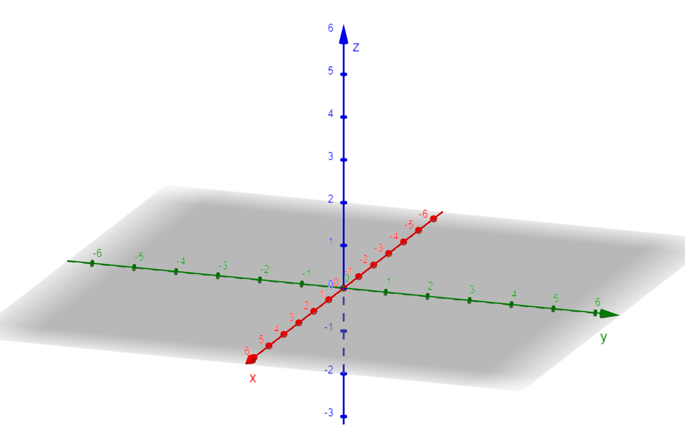
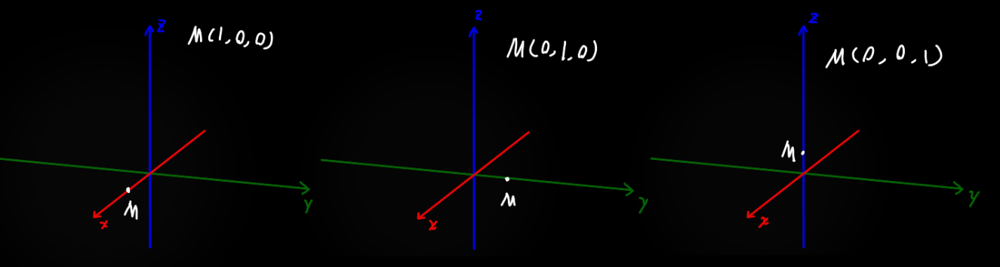
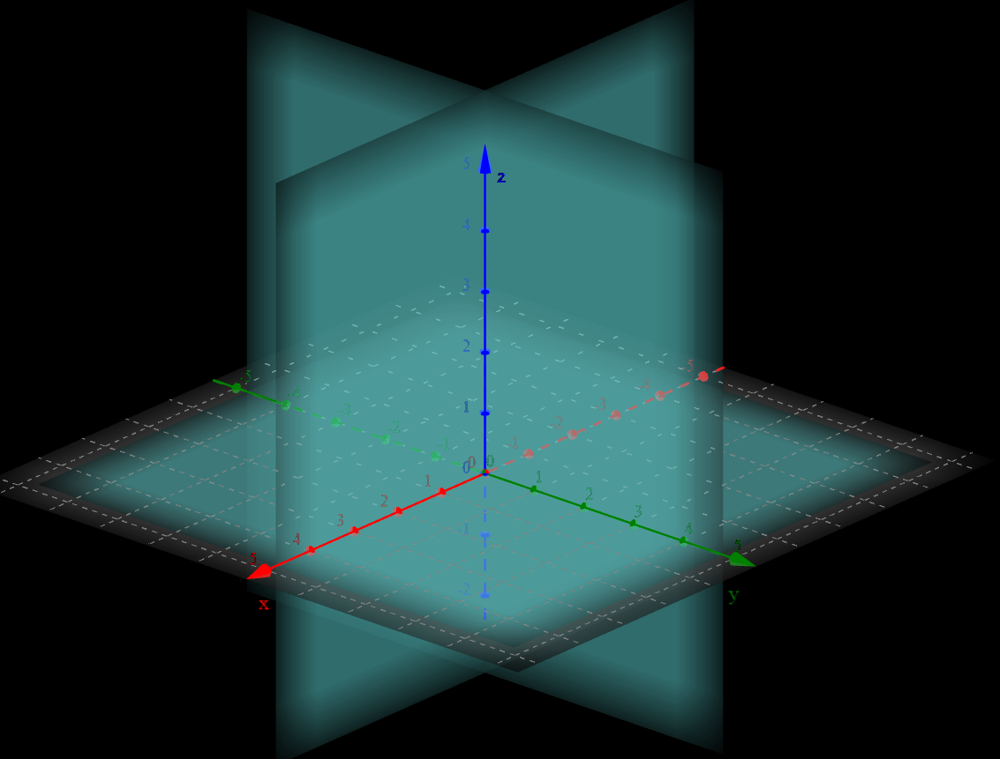
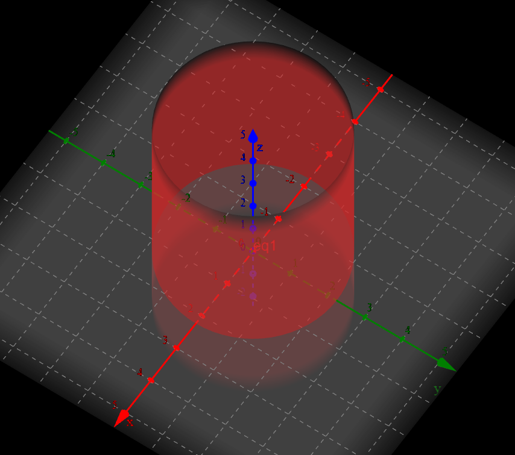

# 空间解析几何

* 三维坐标系，必须要这么画，$x$ 朝向自己，上面是 $z$，剩下的一条是 $y$，跟二维坐标平面象限对应的，是八个`卦限`

* 点的三维坐标：

* 三维空间中两点距离
  $$
  设有两点M(x_1,y_1,z_1),N(x_2,y_2,z_2)，它间的距离为\\
  |MN|=\sqrt{(x_1-x_2)^2+(y_1-y_2)^2+(z_1-z_2)^2}
  $$
  
* 在二维平面上假设有一个函数，$y=f(x)$，符合这个等式的点在平面上形成一条`曲线`

​		在三维空间中假设也有一个函数 $z=f(x,y)$ 或一个方程 $F(x,y,z)=0$ ，符合这个等式的点在空间中形成一个`曲面`

------

常见三维坐标系方程：

1. $xOy$平面的方程：$z=0$，$yOz$平面的方程：$x=0$，$xOz$平面的方程：$y=0$

2. ☆☆☆==任意平面==的方程：$Ax+By+Cz+D=0$，其中 $A,B,C不全为0$

3. 平面中`圆`的定义：到定点距离等于定长的所有点的集合；那三维空间中`球面`的定义：到给定点的距离等于定长的所有点的集合。(对，从文字上来讲定义是相同的)

   ==二维空间中==`圆`的方程为：
   $$
   \sqrt{(x-x_0)^2+(y-y_0)^2}=r
   $$
   ==二维空间中==`圆面`的方程为：
   $$
   \sqrt{(x-x_0)^2+(y-y_0)^2}\le r
   $$
   ==三维空间中==`球面`的方程为：
   $$
   \sqrt{(x-x_0)^2+(y-y_0)^2+(z-z_0)^2}=r
   $$
   ==三维空间中==`球体`的方程为：
   $$
   \sqrt{(x-x_0)^2+(y-y_0)^2+(z-z_0)^2}\le r
   $$
   当==二维==空间中的`圆`方程放到==三维==空间中会怎么样：变成`圆柱面`，因为没给 $z$ 轴数据，因此取什么值都可以。

   其实任意一个二维坐标系中的方程强行搬到三维坐标系后形成的形状统称为`柱面`，而原本二维坐标系中的形状称为`准线`，正常情况下是沿着z轴进行移动形成的平面，此时z轴称为`母线`

   
   
   当==二维==空间中的`圆`方程放到==三维==空间中会怎么样：变成`圆柱`，因为没给 $z$ 轴数据，因此取什么值都可以
