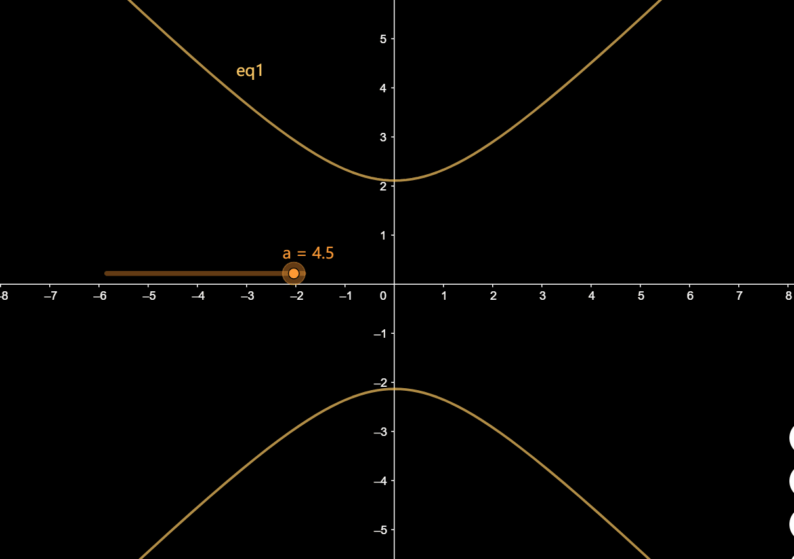

## 旋转抛物面

$$
怎么画出z=x^2+y^2的图像?\\
首先可以看出z肯定是\ge0的\\
先令z=1,此时是一个半径为1的圆方程，这个圆浮在z=1处\\
然后令z=2,此时是一个半径为\sqrt2的圆方程，这个圆浮动在z=2处...\\
最后画出一个这样的图像
$$

------

上述图像若从水平方向切片，得到的是一些圆，若从垂直方向切片，得到的是抛物线，所以称之为`旋转抛物面`

## 双曲抛物面

$$
怎么画出z=y^2-x^2的图像?\\
跟刚才的方法一样，还是先求出当z=1时的图像\\
y^2-x^2=1,这在高中的时候学过，是双曲线的图像\\
之后随着z的变化，双曲线位置也发生改变
$$

------

$$
那为什么叫双曲抛物面呢?\\
因为沿xOy平面(>0白色,<0蓝色)切有抛物线，沿着xOz平面(红色)切也有抛物线，沿yOz平面切的抛物线就略了(...
$$

$$
沿xOy平面切可理解为是设z为定值，此时y^2-x^2=a是双曲函数\\
随着a的改变，呈现的二维图像其实也就代表着双曲抛物面在z=a处剖面\\
$$

$$
沿xOz切可理解为是设y为定值，此时z=a-x^2，是个标准的二次函数，因此红色曲线不是成对出现的
$$

## 上球面

$$
怎么画出z=\sqrt{1-x^2-y^2}
$$

