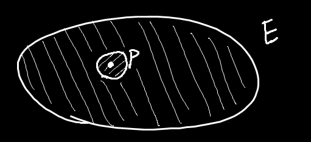
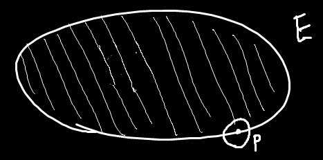

## 邻域概念

领域 $U(P_0,\delta)$ 表示以 $P_0$ 为圆心，到它的距离==不超过== $\delta$ 的所有点组成的集合

$U(P_0,\delta)=\{(x,y)|\sqrt{(x-x_0)^2+(y-y_0)^2}<\delta\}$

领域 $\mathring{U}(P_0,\delta)$ 表示以 $P_0$ 为圆心，到它的距离==不超过== $\delta$ 的所有点但不包括 $P_0$ 组成的集合

$\mathring{U}(P_0,\delta)=\{(x,y)|0<\sqrt{(x-x_0)^2+(y-y_0)^2}<\delta\}$

## 内点&边界点概念

#### 内点:

P是平面上一点，如果最少能找到一个P的某一邻域，使得这个邻域包含于E，就叫内点

比如有个点，离边界的距离不管有多小，比如只有 $0.001$，那仍然可以找到一个 $\delta=0.0003$ 的邻域，让邻域包含在E中

#### 边界点:

P是平面上一点，如果不管邻域取多小，都是邻域的一部分在E里面，一部分在E外面，就叫外点

## 开集&闭集

==开集==：如果给你一个集合，里面所有的点都是`内点`，就叫`开集`，如 $1< x^2+y^2<4$

==闭集==：如果给你一个集合，里面有些点是`内点`，有些点是`边界点`，就叫`闭集`，如 $1< x^2+y^2\le4$

