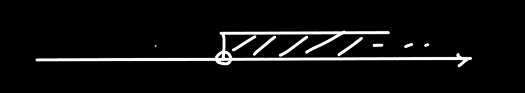
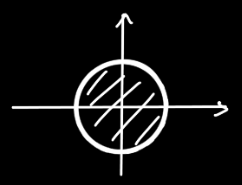
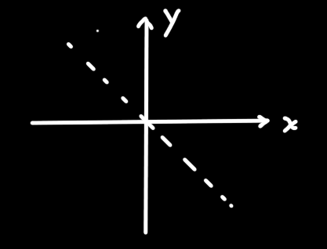
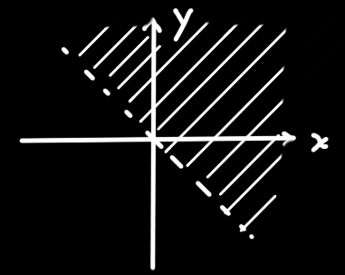
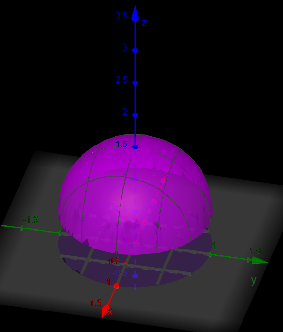
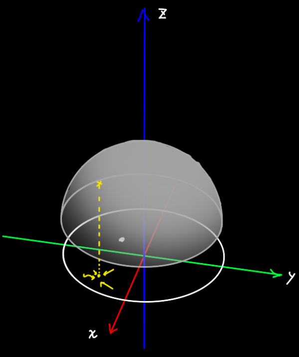

## 二元函数的定义域

首先看一元函数的定义域，对于某个 $f(x)$，会说它的定义域是 $x>0$ 啊 $1<x\le 7$ 啊之类的东西，如果用图像表达，那就是一个数轴，一维的，

二元函数的定义域描述方法跟一维的差不多，只不过维度+1了

------

#### 例1：

比如有一个函数 $z=\sqrt{R^2-x^2-y^2}$，根号中的内容肯定要 $\ge0$

$\therefore R^2-x^2-y^2\ge0$，$\therefore x^2+y^2\le R^2$，化简到这里就可以了

* 定义域的图像表达：

因为 $x^2+y^2\le R^2$ 是我们学过（《基础-1.三维坐标系》）的圆面不等方程，因此可以直接把这个方程的图形画出来

那就长这样，从一维数轴扩展为了二维平面，因为用到的是 $\ge0$ ，所以圆环是用实线画的，如果是 $>0$，那就用虚线画。

上面这个定义域用文字来表达是`有界`且`闭集`。

> 一元函数的定义域是个不等式，那么二元函数的定义域就是==x跟y一起组成的不等式方程==
>
> 原本一维数轴起始点的==空心==或==实心== 在 二维平面中体现为图形边界是==虚线==或==实线==。

#### 例2：

比如有一个函数 $\ln(x+y)$ ，由于 $\ln$ 函数中的内容必须大于0

$\therefore x+y>0$ 

* 定义域的图像表达：

先作 $x+y=0$ 时的图像，这看似是一个方程，但是可以转换为一次函数 $y=-x$，这里不要着急画成实线，因为原不等式是 $>0$ 而不是 $\ge0$  

然后==预想==一下 $x+y=1$ 的图像，可以转换为 $y=-x+1=-(x-1)$ ，根据`左增右减`原则，这个图像相当于上面的往右平移1个单位长度，那么 $x+y=2$ 的图像就是原图往右平移2个单位长度得到的、

以此类推 $x+y=n$ 的图像集合，或者说 $x+y>n$ 的图像是往右`无限延伸`的，如下：

上面这个定义域用文字来表达就是`无界`且`开集`

------

#### 定义域的几何意义：

☆二元函数的定义域就是：函数在三维空间的图像在 $xOy$ 平面上的==投影==。 

## 二元函数的极限

* 对于二元函数，以==任何形式、方向==向一个点逼近时，极限值都必须存在且相等

> 反之
>
> 1. 当以<u>某种特殊的形式</u>向一个点逼近时，虽然趋于常数a，但我们也不能判断它的极限值是否存在
> 2. 当以<u>某种特殊的形式</u>向一个点逼近时，极限值不存在，那可以==肯定==它的极限值不存在
> 3. 当以<u>不同形式</u>向一个点逼近时，如果它的函数值趋近于<u>不同的值</u>，那可以==肯定==它的极限值不存在
