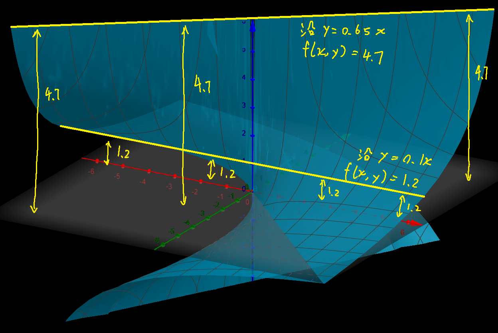

## 证明函数在某点极限不存在

:medal_military: 一般解题方式都是找到两个特殊的逼近方式，这两种逼近方式得出的极限值不一样

☆这个逼近方式 $y=f(x)$ 不能瞎取的，一定要经过要求的极限点 $P(a,b)$ ！

> 假设我们准备从 $y=f_1(x)方向和y=f_2(x)方向$ 朝 $P(a,b)$ 处逼近
>
> 将$y=f_1(x)和y=f_2(x)分别带入z=f(x,y)$，得到一个两个关于 $x$ 的函数（只不过下面两个例题中的是常值函数）
>
> 在不正常情况下（$P(a,b)$处**无**极限），$\lim_{x\to 0}f(x,f_1(x)) \neq \lim_{x\to 0}f(x,f_2(x))$
>
> 正常情况下（$P(a,b)$处**有**极限），$\lim_{x\to 0}f(x,f_1(x)) = \lim_{x\to 0}f(x,f_2(x))$

$$
f(x,y)=\left\{\begin{aligned}
\dfrac{xy}{x^2+y^2},x^2+y^2\neq0\\
0,x^2+y^2=0
\end{aligned}\right.\\
问当(x,y)趋近于(0,0)时极限是否存在\\
1.沿x轴方向朝(0,0)逼近，f(x,y)=0\\
\lim_{x\to 0}得f(x,y)=0\\
2.沿y=x方向朝(0,0)逼近，f(x,y)=\dfrac{x^2}{x^2+x^2}=\dfrac12\\
\lim_{x\to 0}得f(x,y)=\dfrac12\\
极限不等，因此极限不存在
$$

------

$$
f(x,y)=\dfrac{x+y}{x-y}\\
问当(x,y)趋近于(0,0)时极限是否存在\\
1.沿x轴方向朝(0,0)逼近，y=0,f(x,y)=1\\
2.沿y轴方向朝(0,0)逼近，x=0,f(x,y)=-1\\
——————————\\
其实证明极限不存在有很多种方法\\
1.沿y=2x，f(x,y)=\dfrac{3x}{-x}=-3\\
\lim_{x\to 0}得f(x,y)=-3\\
2.沿y=4x，f(x,y)=\dfrac{5x}{-3x}=-\dfrac53\\
\lim_{x\to 0}得f(x,y)=-\dfrac53\\
——————————\\
\text{p.s.这道题偶然在任意位置处的切面都是过原点的直线}\\
\text{因此沿任意过原点直线逼近(0,0)都会得到一个不一样的常数}
$$

> :question:是不是一个函数，若在任意 至少2种高度处的水平剖面线 $y=f_1(x)与y=f_2(x)$ 都经过某个点$P(a,b)$（比如上图函数任意高度处的黄色剖面线中总经过(0,0)）, 则在该点处==不存在极限==

