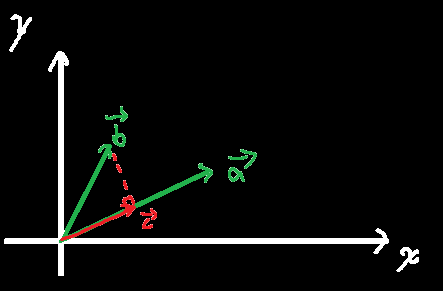

# 平面直角坐标系中的向量

## 定义

平面直角坐标系中

或者说，可以用一个有序数对来**表示**任意向量

## 基本运算法则

$$
\left( \text{点积，或称数量积，乘出来是一个数} \right) \vec{a}\cdot \vec{b}=\left( x_a,y_a \right) \times \left( x_b,y_b \right) =x_ax_b+y_ay_b=\left| \vec{a} \right|×\left| \vec{b} \right|\cos \left< \vec{a},\vec{b} \right> \left( \text{即向量}a\text{与}b\text{间的夹角，0~}180 \right)
$$
$$
\vec{a}+\vec{b}=\left( x_a,y_a \right) +\left( x_b,y_b \right) =\left( x_a+x_b,y_a+y_b \right)
$$
$$
\left| \vec{a} \right|=\left| \left( x_a,y_a \right) \right|=\sqrt{x_a^2+y_a^2}
$$
$$
\left| \vec{a} \right|^2=\left( \vec{a} \right) ^2
$$
$$
\left| \vec{a}+\vec{b} \right|^2=\left( \vec{a}+\vec{b} \right) ^2
$$

## 单位向量

定义：单位向量a~0~为与非零向量a同方向且==模长为1==的向量

计算：
$$
\vec{a}_0=\frac{\vec{a}}{\left| \vec{a} \right|}
$$

## 投影

此时称`向量c`为`向量b`在`向量a`上的<u>投影</u>

`向量c`的长度称为`向量b`在`向量a`上的<u>数量投影</u>（就是一个数，跟向量无关）

投影：
$$
\vec{c}=|\vec{b}|\cos \left< \vec{a},\vec{b} \right> \vec{a}_0=\frac{|\vec{b}|\cos \left< \vec{a},\vec{b} \right> \vec{a}}{\left| \vec{a} \right|}
$$
数量投影：
$$
|\vec{c}|=|\vec{b}|\cos \left< \vec{a},\vec{b} \right>
$$
