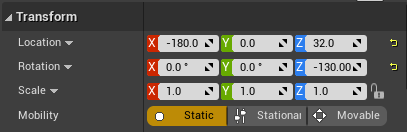
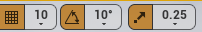

## 视口导航

* 方式1：鼠标

  右键转头，左键移动

* 方式2：鼠标+键盘

  按下==右键==，WASD移动，QE升降，ZC调整视距

* 方式3：围绕物体

  点击物体再按F，或直接双击在World outline中的物体 以聚焦

  alt+左键围绕它旋转，alt+右键缩放

这个按钮时用来调速的：

ctrl+0/ctrl+数字保存视角位置

## 处理变换

当单击了一个物体时，就会出现它的坐标系和坐标原点

1. 可以直接按住坐标系箭头来移动，或者按`w`来切换为移动模式
2. 按`e`切换为旋转模式
3. 按`r`切换为缩放模式，按住中间白色的中心拖动可进行所有轴的等比例缩放

上面那种手动变化可能会不是很精准，因此单击物体后，也可以在细节面板Details中用数值操作

 

#### 全局坐标轴与局部坐标轴：

全局坐标轴永远都是水平的，局部坐标轴会随跟着物体的旋转而旋转

#### 网格对齐：

可以允许我们一次 移动 / 旋转 的距离比较大

 

#### 解决坐标轴偏移：

有时建模没注意设置坐标轴中心，导致坐标原点离模型比较远，除了可以在建模软件中修正外，在虚幻引擎中

点击物品-->w模式下-->按住鼠标中键移动 白色的 坐标原点 到合适的位置-->右键物体-->Pivot支点-->set as Pivot offset设置支点偏移量

* 此方法只在当前关卡生效

#### 框选物体：

ctrl+alt+左键

#### 复制物体：

当点击物品后，在==移动模式==下按下alt键，再拖拽其中的一个轴，则在复制的同时平移物体

当点击物品后，在==旋转模式==下按下alt键，再拖拽其中的一个轴，则在复制的同时旋转物体