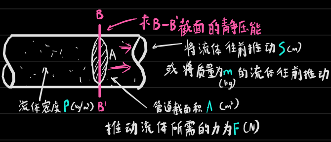
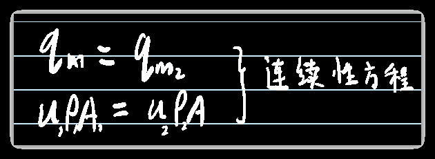

# 伯努利、连续性衡算方程

## 伯努利方程的本质

就是表达一个系统中的流体<u>能量</u>守恒

那包含哪些能量呢？

------

1. 位能，也称势能，在重力场中自基准面 

$$
\text{流体的位能}=\text{mgZ}\left( \text{J} \right)
$$
$$
\text{单位质量流体的位能}=\text{gZ}\left( \text{J/kg} \right)
$$

​	m——流体的质量

​	g——9.8N/kg

​	Z——高度

------

2. 内能 （与温度有关，由于压强的影响可忽略）（一般可忽略内能）  

------

3. 动能，就是熟知的那个动能

$$
\text{流体的动能}=\frac{\text{mu}^2}{2}\left( \text{J} \right)
$$
$$
\text{单位质量流体动能}=\frac{\text{u}^2}{2}\left( \text{J/kg} \right)
$$

​	m——流体的质量

​	u——体积流速

------

4. 静压能， （流动功）通过某截面的流体具有的用于克服压力功的能量 ，或者说是赶走管中的流体的物质所需要的能量

$$
\text{流体通过截面静压能}=\text{F}\cdot \text{S}=\text{p}\cdot \text{A}\cdot \frac{\text{V}}{\text{A}}=\text{pV}=\frac{\text{pm}}{\rho }\left( \text{J} \right)
$$
$$
\text{单位质量流体通过截面静压能}=\frac{\text{p}}{\rho}\left( \text{J/kg} \right)
$$

## 伯努利方程

$$
\text{E}_{\text{e}}+\text{gZ}_1+\frac{\text{u}_1^2}{2}+\frac{\text{p}_1}{\rho }=\sum{\text{h}_{\text{f}}+\text{gZ}_2+\frac{\text{u}_2^2}{2}+\frac{\text{p}_2}{\rho }}
$$

代表1kg理想流体在一个系统中两个截面的总机械能相等

Ee——外加功(泵等)，单位为J/Kg，注意如果求的是泵的功率，不能直接使用Ee，需要乘上q~m~才是功率

hf——流动阻力，单位也为J/Kg

hf=Hf*g

Hf——流动阻力，单位为m（我觉得严格地讲是J/N?就像1J/m=1N）代表1N的流体所具有的能量

## 连续性方程

 实质是物料衡算方程

