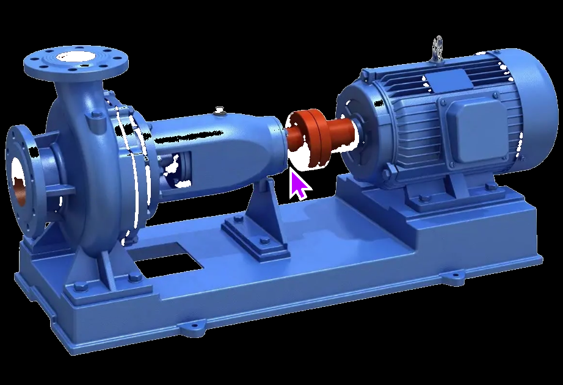
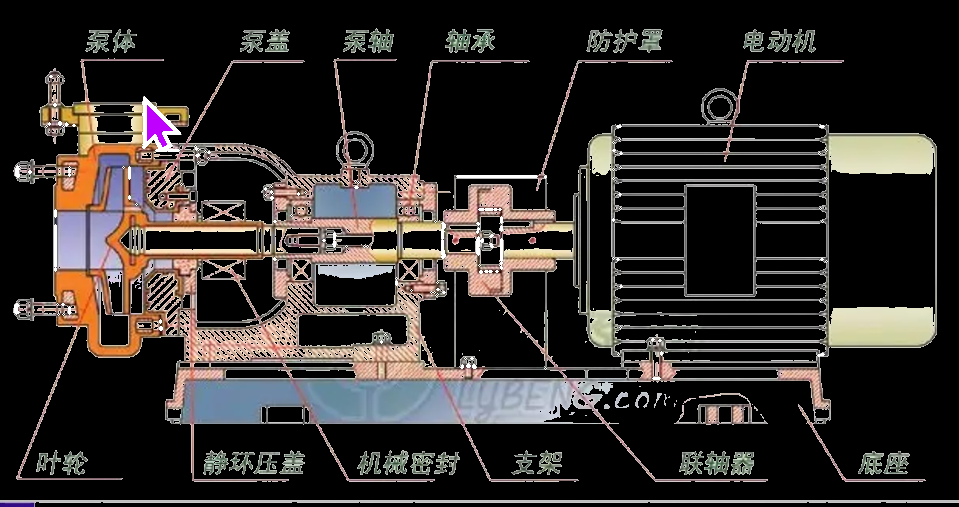
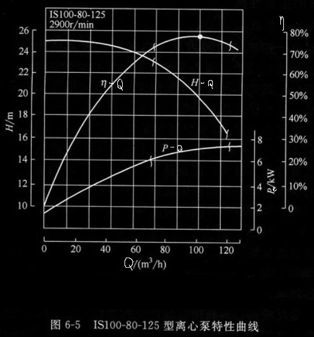
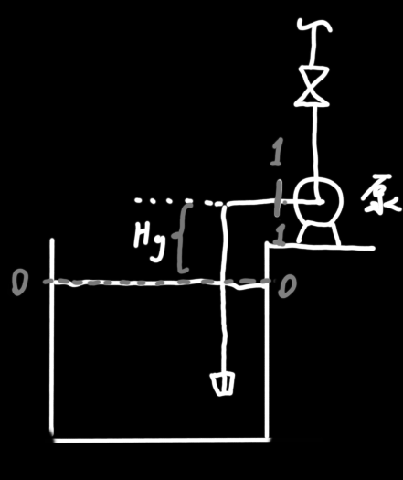
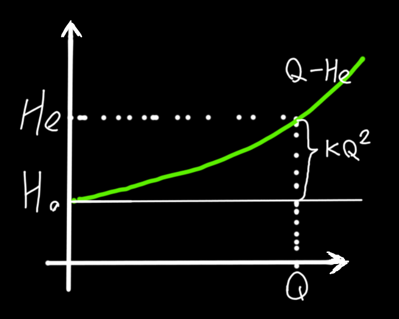
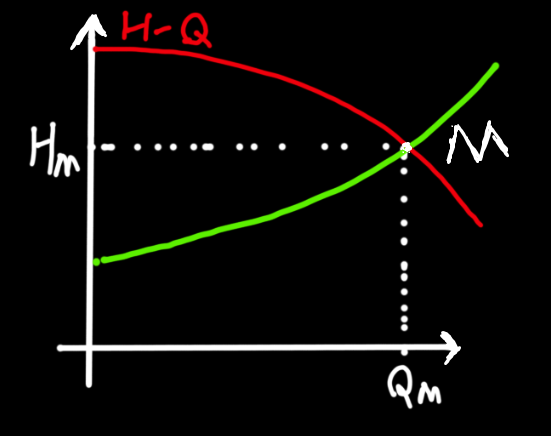

## 离心泵主要性能参数

1. 送液能力/生产力/流量：指单位时间内从泵内排出的液体体积，用Q表示，单位m^3^/s。与离心泵结构尺寸、转速有关。

   离心泵的铭牌上写的流量是离心泵在<u>最高效率下</u>的流量

2. 扬程/压头：指离心泵对1N液体所做的功，代表==泵做功的能力==，用H表示，单位m（等于J/N?）。与离心泵的结构尺寸、转速、流量有关。

   通常，==流量越大，扬程越小==。铭牌上的扬程是在<u>最高效率时</u>的扬程。注：扬程与被输送液体的升扬高度不是一码事，升扬高度指的是由输送任务决定的几何高度，而非做功能力。

   这里所说的扬程就可以被用在伯努利方程里的H~f~上，H~f~=h~f~\*g

3. 有效功率：P~e~，指单位时间内离心泵对流体所做的功，可以根据扬程和流量计算：
   $$
   P_e=HQ\rho g
   $$
   轴功率：P，就是电机输出轴的功率。由于电机也有电磁损耗，会发热，所以轴功率会比电功率小。
   $$
   轴功率=输入功率\times电机效率\times传动效率
   $$

4. 效率：$\eta$ ，反映离心泵的能量利用情况，不是常值。离心泵上列出的效率是一定转速一定情况下的==最高效率==。
   $$
   \eta=\dfrac{P_e}{P}
   $$
   

## 离心泵的特性曲线

理论及实验均表明，离心泵的扬程、功率及效率等主要性能均与==流量==有关。为了便于使用者更好地了解，常把它们与流量（Q）之间的关系用图表示（==转速、液体密度、温度、气压固定！==）出来，即

​	（1）H-Q曲线：扬程随流量的增多而减少

​	（2）P-Q曲线：轴功率随流量的增加而增加

​	（3）$\eta$-Q曲线：效率随流量的增加而增加，但当流量增加到某一数值后，再增加，效率==反而会下降==。通常把最高效率点称为泵的 `设计点/额定状态`，对应的性能参数称为`最佳工况参数`，铭牌上标注的参数就是最佳工况参数。当然实际上最佳工况不好达到，应尽量维持在高效区（不低于最高效率的92%的区域），特性曲线上用波浪号标出该区域

* 离心泵的特性曲线是由厂家提供的，是在293K和98.1kPa下以清水为介质测定的，当实际液体与此情况相差甚大时，需要校准曲线

## 影响离心泵性能的主要因素

> 注：下列所指的功率为泵电机的输入功率，不是有效功率P~e~

1. 流体`密度`对离心泵的影响：

   密度对流量Q、扬程H和效率 $\eta$ 没有影响，根据有效功率和效率的计算公式，可得对轴功率有影响（对有效功率也有影响？）
   $$
   \dfrac{P_1}{P_2}=\dfrac{QH\rho_1g/\eta}{QH\rho_2g/\eta}=\dfrac{\rho_1}{\rho_2}
   $$

2. 液体`粘度`对离心泵的影响：

   当液体粘度增加时，液体在泵内运动时的能量损失也会增加，从而导致泵的流量、扬程和效率均下降（什么叫均下降？特性曲线上的所有变量都根据校正公式重新映射？）。当液体的运动粘度>2.0*10^-6^(m^2^/s)时
   $$
   Q_1=c_QQ\ \ \ H_1=c_HH\ \ \ \eta_1=c_{\eta}\eta\\
   $$

   式中c~Q~ c~Q~ $c_\eta$分别为流量、扬程、效率的校正系数，需==查表==

3. 离心泵`转速`对离心泵性能的影响：

   当效率变化不大时，转速变化影起的流量、压头和功率变化符合切割规律
   $$
   \dfrac{Q_1}{Q_2}=\dfrac{n_1}{n_2}\\
   \dfrac{H_1}{H_2}=(\dfrac{n_1}{n_2})^2\\
   \dfrac{P_1}{P_2}=(\dfrac{n_1}{n_2})^2\\
   $$

4. `叶轮直径`对离心泵性能的影响：

   在转速相同时，叶轮直径改变也将导致性能的改变。若叶轮切削率<20%，则叶轮直径变化引起的流量、压头和功率变化符合切割规律，即
   $$
   \dfrac{Q_1}{Q_2}=\dfrac{D_1}{D_2}\\
   \dfrac{H_1}{H_2}=(\dfrac{D_1}{D_2})^2\\
   \dfrac{P_1}{P_2}=(\dfrac{D_1}{D_2})^2\\
   $$
   

总结：

如要==改变泵的特性曲线==需改变 `泵的转速` 和 ` 叶轮直径` 。一般采用改变 ` 出口阀门开度` 的方法==调节流量==。

在其他条件不变时，被输送流体密度变大，扬程不变 ；黏度变大，扬程越小；离心泵转速变大，扬程增大；叶轮直径变大，扬程增大 

## 汽蚀现象

当离心泵的进口压力小于环境温度下的液体的饱和蒸气压时，液体中有大量蒸汽逸出，并与气体混合形成许多小气泡。当气体到达高压区时，蒸汽凝结，气泡破裂，气泡的消失导致产生局部真空，液体质点快速冲向气泡中心，质点相互碰撞，产生很高的局部压力。如果气泡在金属表面如叶片上破裂凝结，则会以较大的力打击叶片金属表面，使其遭到破坏，并产生震动，这种现象称为“汽蚀现象”。

#### 最大允许安装高度的计算：

因为引起汽蚀现象的最根本原因是泵入口处的压力过低（吸入口处的压力==小于==被输送液体的饱和蒸汽压）

$$
\text{E}_{\text{e}}+\text{gZ}_0+\frac{\text{u}_0^2}{2}+\frac{\text{p}_0}{\rho }=\sum{\text{h}_{\text{f}}+\text{gZ}_1+\frac{\text{u}_1^2}{2}+\frac{\text{p}_1}{\rho }}\\
\text{E}_e=0,Z_0=0,Z_1=H_g,u_0=0\\
同时，再对上式两边同时除去g，得\\
H_g=\dfrac{p_{0}-p_{1min}}{\rho g}-\dfrac{u_1^2}{2}-\sum{H_{f_{0-1}}}
$$
从(8)式可以看出，允许安装高度与：

吸入液面上方的压力p~0~，吸入口最低压力p~1~，液体密度 $\rho$ ，吸入管的动能和阻力(因此要简化、增粗吸入管)有关。除此以外，流量的增加也会导致动能和阻力的增加，需要减小最大允许安装高度。

上面的计算方法有点原始且麻烦，所以在实际应用中，需用到泵上的铭牌中标出的“`允许汽蚀余量`”，即代表该泵的抗汽蚀性能。然后我们再根据这个常量，结合实际运行中的气压等变量，计算出安装高度。

------

汽蚀余量：NPSH(net positive suction head)，表示吸入口处动能与静压能之和 比 被输送液体饱和蒸气压头==高出的数值==。即是指在泵吸入口处单位重量液体所具有的超过汽化压力的富余能量，单位用米标注。

而`允许汽蚀余量`则是"高出数值"的最低允许值，即☆吸入液体的能量太低会导致汽蚀，(NPSH)~r~的定义为：
$$
(\text{NPSH})_r=\dfrac{p_1}{\rho g}+\dfrac{u_1^2}{2g}-\dfrac{p_v}{\rho g}\\
$$

$$
(个人感觉\text{NPSH}的定义换成这样写更直观)\\
\dfrac{P_1}{\rho g}+\dfrac{u_1^2}{2g}=(\text{NPSH})_r+\dfrac{p_v}{\rho g}\\
之前讲过被输送液体在\ \ 泵的入口处的压力一定要大于\ \ 饱和蒸汽压\\
(?)但其实这个结论可以被泛化，即液体若在泵入口处的能量不够时就会发生汽蚀\\
那么上面的式子就可以被翻译为:\\
被输送液体在\ \ 泵的入口处的能量(即等号左边)一定要大于\ \ 液体处于饱和蒸汽压时的能量\\
而且大一点不行，要大很多，具体要大多少？就是\text{NPSH}的值\\\\
注:既然等式左边代表的是液体的能量，那为什么不包含位能?\\
因为位能是相对，而这个关于汽蚀的问题跟水在多高的地方流没有一点关系\\
(但是在接下来带入伯努利方程的时候需要用到位能是因为它代表的是两个截面的总能量是相等的\\
而两个截面高度不同，那肯定要涉及到位能)\\\\
而越好的泵\text{NPSH}值越低，即我们可以更任性地把入水管拉的比较长。
$$

------

$$
由式(8)可知:\\
H_g+\dfrac{P_1}{\rho g}+\dfrac{u_1^2}{2g}+\sum H=\dfrac{P_0}{\rho g}\ \ (就是E_e=0等\ 值带入伯努利方程时得到的式子)\\
将(10)式带入上式的伯努利方程可得\\
H_g+(\text{NPSH})_r+\dfrac{p_v}{\rho g}+\sum H=\dfrac{P_0}{\rho g}\\
即H_g=\dfrac{p_0}{\rho g}-\dfrac{p_v}{\rho g}-(\text{NPSH})_r-\sum{H_{f_{0-1}}}
$$

## 管路的特性曲线

正如离心泵的流量与压头之间存在一定的关系一样（流量越大，能提供的压头越小），对于给定的管路，其输送任务（流量）与完成任务所需要的压头之间也存在一定的关系，这种关系就称为`管路特性`，表示在压头与流量的关系图上，称为`管路的特性曲线`。

对一个封闭体系，我们可以列出伯努利方程：
$$
\text{E}_{\text{e}}+\text{gZ}_1+\frac{\text{u}_1^2}{2}+\frac{\text{p}_1}{\rho }=\sum{\text{h}_{\text{f}}+\text{gZ}_2+\frac{\text{u}_2^2}{2}+\frac{\text{p}_2}{\rho }}
$$
同除g
$$
H_e+z_0+\dfrac{p_0}{g\rho}+\dfrac{u_0^2}{2g}=\sum H_f+z_1+\dfrac{p_1}{g\rho}+\dfrac{u_1^2}{2g}
$$
式中 $H_e——输送任务为Q时，需要对管路输入的\ [外加]\ 压头\\\sum H_f——输送任务为Q时，管路的总损失压头$

令 $H_0=(z_1-z_0)+\dfrac{p_1-p_0}{g\rho}+\dfrac{u_1^2-u_0^2}{2g}$ (即1-1截面液体的能量比0-0截面的高了多少)

则此时
$$
H_e = H_0 + \sum H_f
$$
已知阻力计算公式：
$$
\sum H_f=\lambda\dfrac{l+\sum l_e}{d}\times\dfrac{u^2}{2}\\
假设管路用的就是普通直管，则\\
u=\dfrac{Q}{横截面积}=\dfrac{Q}{\pi\dfrac{d^2}{2^2}}\\
即\sum H_f=8\lambda(l+\sum l_e)Q^2/(\pi^2gd^5)
$$
上式中，若把 $\lambda$ 看做常数（因为其值跟管道的物理属性有关，只要管道不变值就不变），则 $8\lambda(l+\sum l_e)/(\pi^2gd^5)$ 也为常数。

令其值为K，则
$$
H_e=H_0+KQ^2
$$
式(16)称为管路特性方程，以流量Q为横坐标，压头H~e~为纵坐标，可将此式绘制为曲线，即 `管路的特性曲线` 。

## 离心泵的工作点

如前所述，离心泵的流量与压头之间存在着一定的关系，这由泵的特性曲线决定。而对于给定的管路其输送任务（流量）与完成任务所需要的压头之间也存在着一定的关系。这由管路的特性决定。显然，当泵安装在指定的管路中时，流量与压头之间的关系既==要满足泵的特性==，==也要满足管路的特性==。

如果这两种关系均用方程来表示，这流量与压头要同时满足这两个方程，或者说流量、压头的值是这个方程组的解。也就是说在性能曲线图上，应为泵的H-Q特性曲线与管路特性曲线放在一张图中后，两个曲线的交点。这个交点一般叫`稳定工作点M`，对应的流量与压头则是H~M~与Q~M~。

点M的意义就是，在转速、液体密度、温度、气压等条件固定后，整个系统中的流量会先波动，然后最后稳定在M的横坐标(Q~m~)处，此时的泵提供的能量/管路消耗的能量也都为M的纵坐标(H~m~处)。

如果不在M点工作，就会出现提供供给管路的能量与管路所需要的能量不平衡的现象，此时系统会自动调节，直到达到平衡，会到稳定工作点。

> 如泵刚启动的时候，Q很小，因此管路的损耗很小，因此管路需要的能量很少，但是泵能提供的能量又太多，出现能量过剩。
>
> 注意：伯努利方程是用于描述稳定系统的能量衡算的！上述的情况就属于能量不平衡，故不能用伯努利方程计算！只有在M点时是能量平衡的，能用伯努利

------

### 离心泵的流量调节

如果泵在工作点时的送液能力与生产任务不一致时，就需要调整`泵的特性曲线`形状或调整`管路的特性曲线`的形状，这样两条线的交点M位置才会不一样。

在《影响离心泵性能的主要因素》中提到：影响泵的特性曲线的因素有转速、叶轮直径、液体粘度、液体密度等，液体粘度和密度是我们改不了的，叶轮也是固定的，因此主要通过修改==转速==来调整特性曲线。

不过修改转速还是有点麻烦，得添加转速调整的电路或机械变速箱，得增加成本，因此实际生产中，是在改变`管路的特性曲线`而不是`泵的特性曲线`

而改变管路特性曲线主要还是靠改变管路上的`阀门开度`，即改变K值，K值的改变能导致`管路的特性方程`改变，即改变`管路特性曲线`。

> 严格计算到底阀门开多少很麻烦，所以一般就是关小一点，然后看流量是不是最后==稳定==在所需要的Q，如果没有，就再开小/开大一点。

# 总之

根据生产任务->得需要的流量/流速->选择在此流量/流速下效率最高的泵型号->查得此泵在此流量下的扬程->若管路在该流量下的阻力小于扬程，则实际稳定工作点会偏移，导致实际的流量增大，泵效率下降->关小阀门，如果阀门需要被关的程度很大，则要重新设计管路/选择电机/被输送液体的粘度密度等来让`泵特性曲线`与`管路特性曲线`重合。

即主要看：电机工作在高效率下 且 最好此效率下的扬程也符合需要
