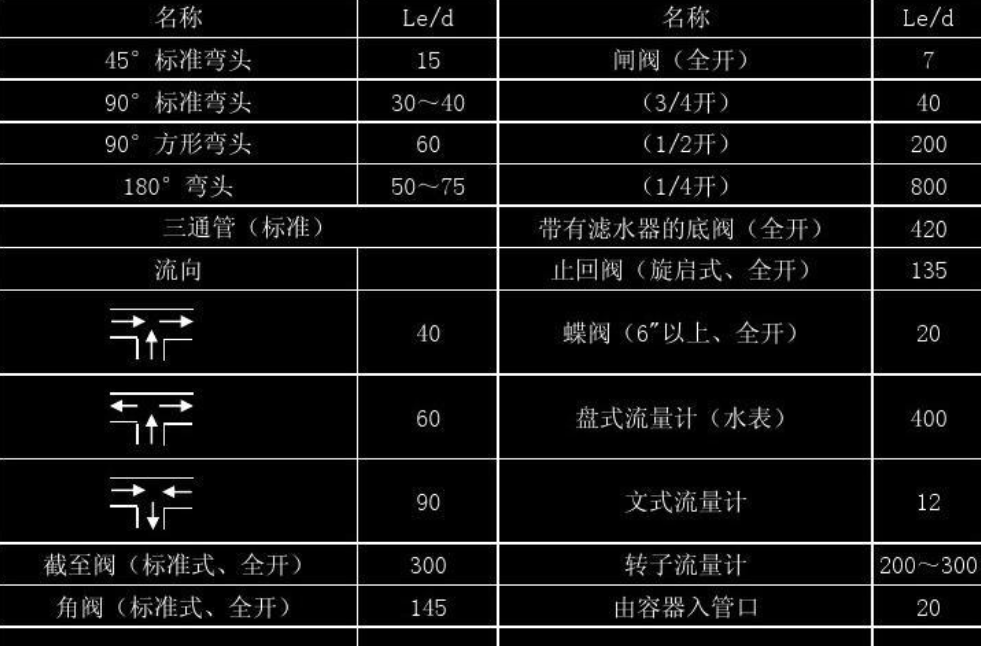

## 定义

局部阻力为进口、出口、弯头、阀门、突然扩大缩小时流动受到干扰时产生的流动阻力

有两种计算方法：`阻力系数法` 与 `当量长度法`

## 阻力系数法

克服局部阻力所引起的能量损失，可以表示为动能u^2^/2的一个倍数，即按下式进行计算
$$
\text{h'}_{\text{f}}=\zeta\frac{\text{u}^2}{2}
$$
在特殊元件（如进口、出口、弯头、阀门）中，这个阻力系数需要<u>查表得到</u>；但在`直管`中，阻力系数可以使用下列公式得到。（因此可以发现范宁公式就是这两个公式合并出来的）
$$
\zeta=\lambda\frac{1}{\text{d}}
$$
此外，管道突然扩大或突然变小时的阻力也可通过查表得到；

| 器件名称                                                     | ζ值                                 |
| ------------------------------------------------------------ | ----------------------------------- |
| 突然扩大 | ζ=(1-A~1~/A~2~)^2^  h~f~=ζu~1~^2^/2 |
| 突然缩小 | ζ=0.5(1-A~2~/A~1~)  h~f~=ζu~1~^2^/2 |
| 排出到管外空间 或 流体自管子流进容器                         | ζ=1                                 |

则使用此方法的总阻力为：
$$
(\lambda \dfrac{l}{d}+\sum \zeta)\dfrac{u^2}{2}
$$

## 当量长度法

$$
\text{h'}_{\text{f}}=\lambda\frac{\text{l}_{\text{e}}}{\text{d}}\times \frac{\text{u}^2}{2}
$$

其中一种参照表是直接给出l~e~/d的比值

------

还有一种是d按真实的写，然后根据管具种类+真实直径查得l~e~，一般在==湍流==时使用下面这种表

先于图片==左侧的垂直线==上找出与所求管件或阀门的相应的点，再于==右图==的标尺上定出与管内径相同的一点，而后将上述两点连成一线，此直线与==图中间==的标尺相交，交点在标尺上的读数即为l~e~

------

如果纯用第二种表，则使用此方法的总阻力为：
$$
\lambda\dfrac{l+\sum l_e}{d}\times\dfrac{u^2}{2}
$$
