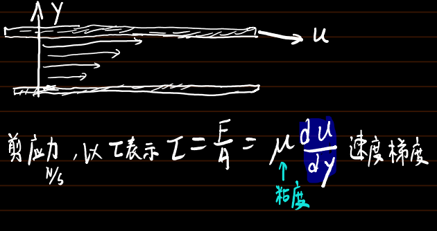
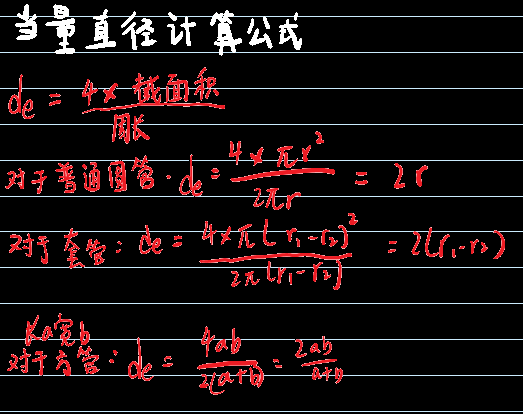
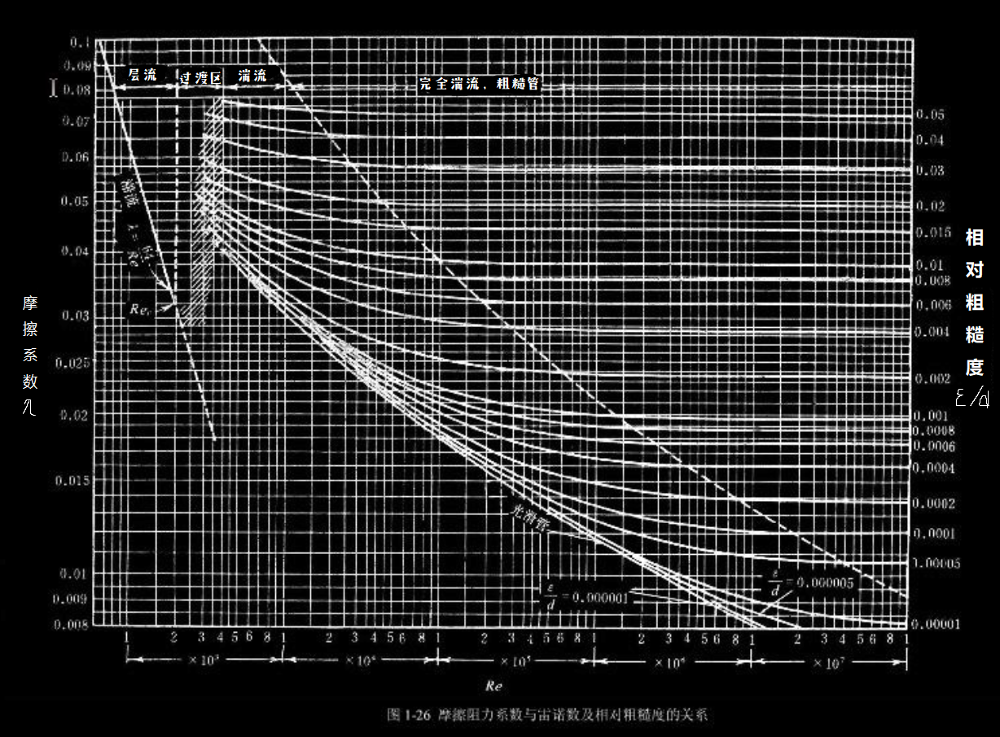

## 阻力

剪应力像是与流动方向平行的压强，运动着的流体内部相邻的两流体层间的作用力。
剪应力×面积就是，摩擦力，摩擦导致流体发热，产生能量损失 

 牛顿液体的粘度随温度升高而减小
 牛顿气体的粘度随温度升高而增大  

## 直管流动阻力计算步骤

### 直管阻力——与管壁摩擦所产生的阻力

1. ##### 计算雷诺数Re

$$
\text{Re}=\frac{d_eu\rho}{\mu}=\frac{\left( m \right) \cdot \left( m/s \right) \cdot \left( kg/m^3 \right)}{\left( Pa\cdot s \right)}
$$

d~e~——当量直径（具体计算见下）

u——体积流速

ρ——流体密度（查询得到）

μ——流体粘度（查询得到）

 两种流动形态--层流/滞流 和 湍流/絮流，通过雷诺实验可观察 

 用雷诺数Re（无单位的纲量）判断流动形态 ——Re≤2000滞流  2000<Re<4000过渡区 Re>4000湍流

2. ##### 计算摩擦系数

若流动形态为层流/滞流，λ=64/Re

若流动形态为湍流/絮流 或 过渡层，λ需查找摩擦系数表（根据管的`相对粗糙程度`选择曲线，再根据雷诺数确定摩擦系数）

管壁的粗糙程度可用`绝对粗糙度`和`相对粗糙度`来描述

`绝对粗糙度`（ε）表示管壁突出部分的平均高度

`相对粗糙度`（ε/d）指管道绝对粗糙度与管道内径的比值

  

3. ##### 带入范宁公式

$$
\text{h}_{\text{f}}=\lambda \frac{\text{l}}{\text{d}}\times \frac{\text{u}^2}{2}
$$

h~f~——阻力，注意是带g的，单位J/kg

λ——刚才算的摩擦系数，纲量

l——直管长度，m

d——直管内径，m

u——流体的流速，m/s