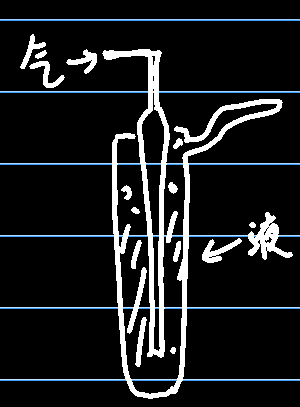

# 直接采样法

1. 注射器采样，用100mL的注射器，多用于有机蒸汽样品采样
2. 塑料袋采样，不能与待测物反应，也不能产生附着，因此有内衬铂金金属膜
3. 采样管采样，容积100-600mL，采气量为采集管容积的6倍（就是要多通一些试样气体，来完全把原来的气体挤出去）
4. 真空瓶采样，材质为耐压玻璃，采样前后监测瓶内压力

# 间接采样法

1. 溶液吸收法，常用吸收液为水、水溶液、有机溶剂，分为溶解性和化学反应系的系数，因此一般选择带有化学反应的吸收液

上图为气泡式吸收管，适用于气态和蒸汽态物质，不宜于气溶胶

冲击式适合气溶胶，不适合气态合蒸汽态

多空筛板型全适用

2. 填充柱阻留法，分为吸附型（活性炭，硅胶，用于气体和蒸汽）（脱附效果好），分配型（表面涂有高沸点有机溶剂，用于蒸汽和气溶胶），反应型（脱附效果差）

测量日平均等长时间采样时用固体阻留法，需要放置一段时间再测定的样本用固体阻留法

溶液吸收法采集快，测定也方便，固体阻留法麻烦一些，采集完还要脱附

# 气体样品需要记录的信息

采样地点：				日期：				气温：				气压：				相对湿度：				风速：

| 项目 | 点位 | 编号 | 采样时间 | 采样流量(L/min) | 浓度(mg/m^3^) | 仪器名称及编号 |
| ---- | ---- | ---- | -------- | --------------- | ------------- | -------------- |
|      |      |      |          |                 |               |                |
|      |      |      |          |                 |               |                |
|      |      |      |          |                 |               |                |

# 采样方法

等速采样，移动采样，定点采样，间断采样

采样管吸收效率=c1/(c1+c2+c3)>90%