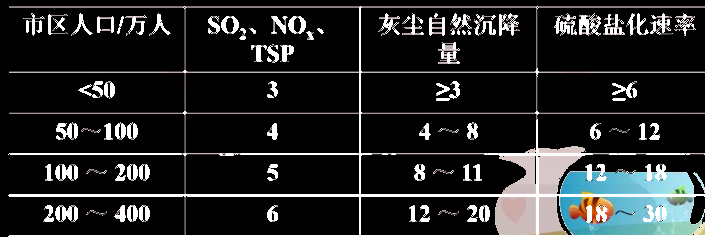
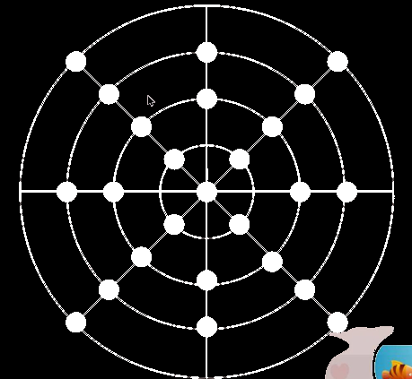
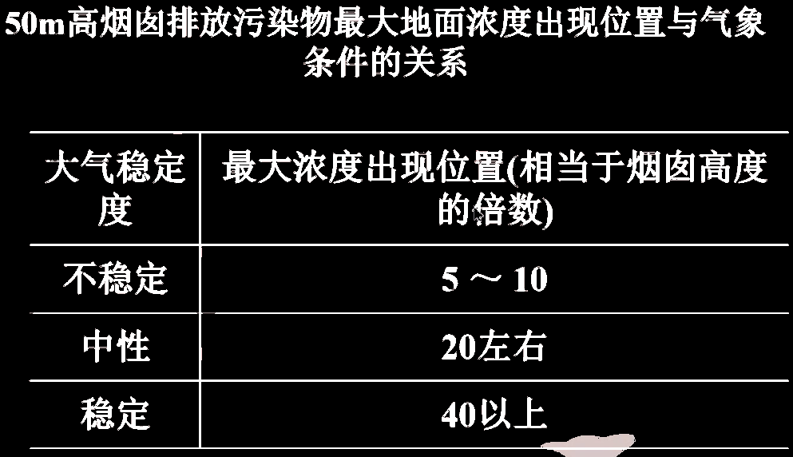

## 采样点布设

* 基本原则：根据污染物浓度、人口密度、超标情况、监测类型、污染源、工业分布

* 采样点应设置在整个监测区域 **高、中、低** 三种不同污染物浓度的地方
* 在污染源比较集中，主导风向明显的情况下，应将污染源的**下风向**作为主要监测范围，布设较多的采样点；上风向布设少量作为**参照**
* 采样点周围应开阔，采样口水平线与周围建筑物高度的夹角不大于30°，测定点周围无局地污染源，并应避开**树木及吸附能力较强的建筑物**。
* 交通密集地区的采样点应设在距人行道边缘至少1.5m处
* 各采样点布设应**一致或标准化**使得检测数据具有可比性
* 采样高度根据监测项目而定

​		研究大气污染对人体的危害时，采样点应在离地面1.5~2m处

​		研究大气污染对植物或器物的影响，采样口应**与植物或器物高度相近**

​		连续采样例行监测采样口高度应距地面3~15m；若置于**屋顶采样**，采样口应与基础面有1.5m以上的相对高度，以**减小扬尘**的影响。特殊地形可视实际情况选择采样高度。

## 采样点数目确定

在一个监测区域内，采样点设置数目应根据监测范围大小、污染物的空间分布特征、**人口分布密度**、气象、地形及经济条件等因素综合考虑确定。

## 网格布点法

适用于多个污染源，且污染源**分布均匀**的地区

* 布点方法：

1. 将监测区域划分成若干均匀网状方格，采样点设在两条直线的交点处或方格中心

* 优点：

1. 随机性强，能较好地反映污染物的时空分布

2. 得到的数据对今后的布点有效，并可为面源扩散模式提供合理的数据

## 同心圆布点法

主要用于**多个污染源**构成的污染群，且**大污染源比较集中**的地区

* 布点方法：

1. 找出污染源中心，以此为圆心画同心圆
2. 从同心圆列出若干条放射线，射线与圆的交叉点为采样点位置（射线至少五条）
3. 同心圆的半径分别为4、10、20、40km，每个圆上再分别设4、8、8、4个采样点（可视上风下风而灵活设定）

* 优点：

## 扇形布点法

适用于**孤立的高架点源**，且主导风向明显的地区

* 布点方法：

1. 以点源位置为顶点
2. 以烟云方向为轴线
3. 布点范围呈扇形面积
4. 扇形夹角**45-60°（小于90°）**
5. 近密远疏
6. 每条弧线上设3-4个点，相邻夹角10-20°

* 优点：

## MISC

