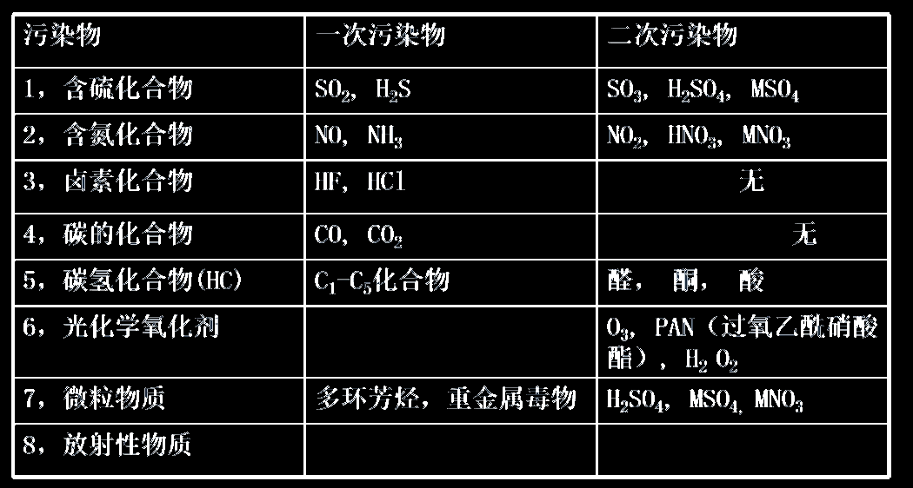
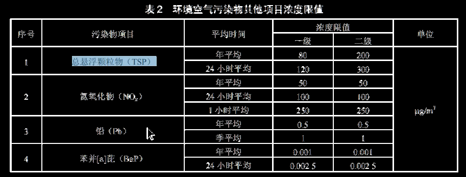
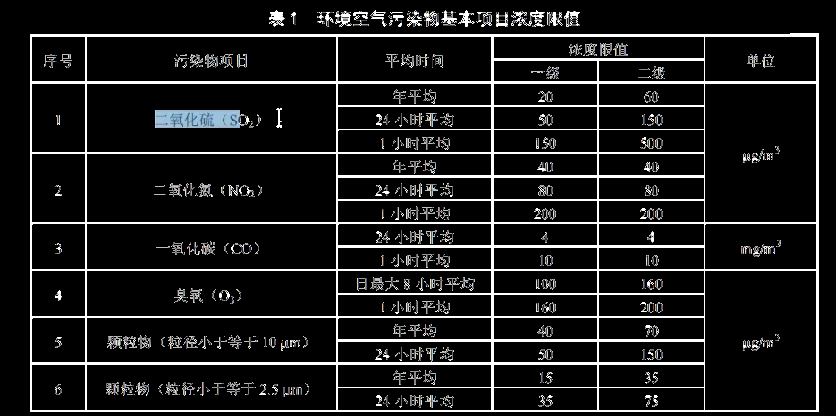
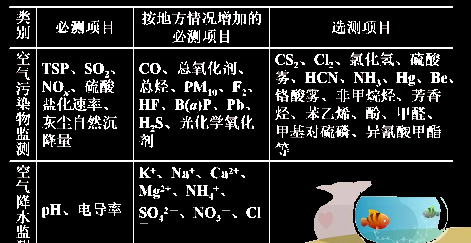
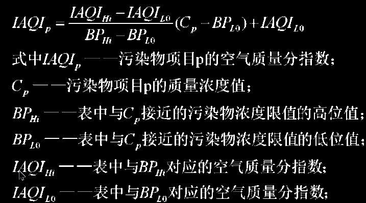
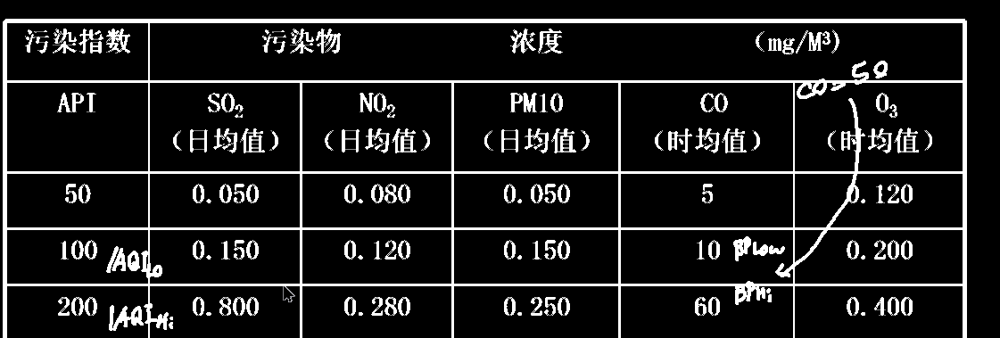
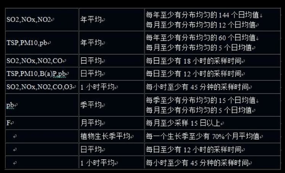

# 大气污染监测

## 受污染大气所含的成分

CO、SO~2~、NO~x~、H~2~S、NH~3~、Cl~2~、HCl和碳氢化合物（如CH~4~，C~10~H~16~）、过氧乙酰硝酸脂类

## 大气污染物按形成过程分类可分为`一次污染物`和`二次污染物`

`一次污染物`：直接从各种污染源排放到大气中的有害物质

`二次污染物`：进入大气的一次污染物在大气中相互作用，或与大气中正常组分发生化学反应，以及在太阳辐射的参与下，引起光化学反应而产生于一次污染物物理、化学性质不同的物质

  

## 大气污染物按形成过程分类可分为`分子状污染物`和`二次污染物`

`分子状污染物`沸点低，气体分子形式存在，并以分子状态进入大气，或者常温下液体，但挥发性强，受热时易以蒸汽进入大气中

特点：**扩散情况与自身比重有关，并受气象条件影响**

`粒子状污染物`，0.01~100μm之间，复杂的非均匀体系，

直径>10μm为降尘，直径<10μm为飘尘或可吸入颗粒物，又名气溶胶

总悬浮颗粒物`TSP`是直径小于100μm颗粒物的总称

## 污染物浓度表示方法

1. 单位体积质量浓度(mg/m^3^)对任何状态的污染物都适用
2. 体积比浓度(ppm或ppb；ml/m^3^)，仅适用于气态或蒸汽态物质

$$
V_0=V_t\times \frac{273}{273+t}\times \frac{P}{101.325}
$$

> V~0~——标准状况下的采样体积，L或立方米
> V~t~——现场状况下的采样体积，L或立方米
> t——采样时的温度，℃
> P——采样时的大气压，KPa

换算关系：C~v~=22.4×C~m~/M

需要保护的区域为一级区域

一级区域需被设为一级浓度限制值，二级区域需被设为二级浓度限制值

## 必测项目与选测项目：

优先选择危害大，涉及范围广，技术成熟的项目

  

  

## 测出的质量浓度换算为`AQI指数`与`IAQI指数`

##### 特定污染物的空气质量分指数`IAQI`确定方法：

  

  

##### 空气质量指数`AQI`的确定方法：

AQI=max(IAQI1,IAQI2,IAQI3,IAQI4)

IAQI大于100的污染物为该区域或城市空气中的超标污染物

## 根据污染物种类选择平均时段

  

