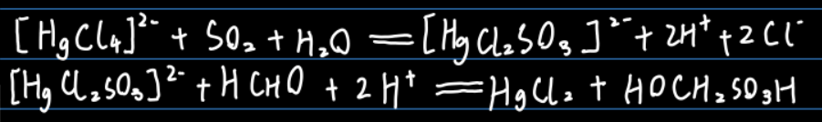
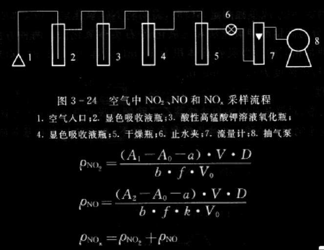

| 污染物质       | 来源                                                         | 采样方法（溶液吸收法、固体阻留法） | 监测方法                                                     |
| -------------- | ------------------------------------------------------------ | ---------------------------------- | ------------------------------------------------------------ |
| 二氧化硫       | 煤和石油等染料的燃烧、含硫矿物质的冶炼、硫酸等化工生产排放废气 | 溶液吸收法                         | 四氯化汞吸收-副玫瑰苯胺分光光度法、甲醛吸收-副玫瑰苯胺分光光度法 |
| 氢氧化物       | 石化燃料高温燃烧和硝化、化肥等生产排放的废气、汽车排气等     | 溶液吸收法                         | 盐酸萘乙二胺分光光度法                                       |
| 一氧化碳       | 石化燃料不完全燃烧和汽车尾气，森林火灾，火山爆发等自然灾害   | 固体阻留法                         | 非色散红外吸收法                                             |
| 臭氧           | 平流层、人类生产和生活活动排放的碳氢化合物经一系列光化学反应而成 | 溶液吸收法                         | 紫外分光光度法                                               |
| 光化学氧化剂   | 指除去NOx以外的能氧化碘化钾的氧化剂                          | 溶液吸收法                         | 硼酸-碘化钾分光光度法                                        |
| 氟化物         | 含氟矿石及含氟煤炭的燃烧                                     | 固体阻留法                         | 滤膜采样-氟离子选择电极法                                    |
| 总烃和非甲烷烃 | 炼焦、化工等生产过程中排放的气体及汽车废气等                 | 溶液吸收法                         | 气相色谱法                                                   |
| 硫酸盐化速率   | 大气中含硫污染物变为硫酸雾和硫酸盐雾的速度                   | 溶液吸收法                         | 二氧化铅-重量法                                              |

## 硫的测定(mg/m^3^):二氧化硫的测定

#### 硫基础性质

* 来源：含硫的燃料，矿石冶炼，化工生产
* 性质：无色，易溶于水，有刺激性气味
* 危害：刺激呼吸道粘膜，引起呼吸道疾病

#### 四氯汞钾缓冲吸收液-盐酸副玫瑰苯胺分光光度法：

* 优缺点：灵敏性好，选择性好，但吸收液毒性大
* 原理简述：利用空气中 SO~2~ 被`四氯汞钾(高毒性)`溶液吸收（由氯化钾和氯化汞配置得到），生成稳定的`二氯亚硫酸`络合物。此物质再与`甲醛`及`盐酸副玫瑰苯胺`作用，生成紫色络合物，其颜色深浅与 SO~2~ 含量成正比

* 测定要点：

  H~3~PO~4~少时，pH1.6±0.1，溶液呈现红紫色，λmax= ==548nm==，试剂的空白值较高，最低检出限度为0.75μg/25mL

  H~3~PO~4~少时，pH1.2±0.1，溶液呈现蓝紫色，λmax= ==575nm==，试剂的空白值较低，最低检出限度为0.4μg/7.5L

* 标准色列的配置：

  以亚硫酸钠标准溶液配置成为标准色列

* 干扰消除：温度，酸度，显色时间等因素影响显色反应；标准溶液和试样溶液操作条件应保持一致。

  温度，酸度，显色时间等因素影响显色反应；标准溶液和试样溶液操作条件应保持一致。

* 计算：（当分光光度标准曲线的横轴是`质量`时）注：浓度记作$c$或者$\rho$都行

$$
A_校是校正过的吸光度，A_校=A-A_0\\
m_样是做分光光度的那个小试管里的二氧化硫质量，m_样=A_较\times B_s\\
c_样是做分光光度的那个小试管里的二氧化硫浓度，c_样=m_样\div V_a\\
c_总是整管吸收液中二氧化硫的浓度，c_总=c_样\\
m_总是整管吸收液中二氧化硫的质量，m_总=c_总\times V_t\\
m_气是采样的气体中二氧化硫的质量m_气=m_总\\
c_样是采样的气体中二氧化硫浓度，c_样=m_气\div V_s\\
c(SO_2,mg/m^3)又与大气的二氧化硫浓度相同，故整理得\\
$$

$$
c(SO_2,mg/m^3)=\dfrac{(A-A_0)B_s}{V_s}\times\dfrac{V_t}{V_a}
$$

​	式中：

​	$A$——样品溶液的吸光度

​	$A_0$——试剂空白溶液的吸光度

​	$B_s$——校正因子，μg/吸光度（就是回归方程的系数的==倒数==，假设回归方程为y=0.002x+0.056为不过原点的直线，则B~s~=(1-0.056)/0.002）

​	$V_t$——测定时所取样品总体积

​	$V_a$——单样品溶液体积

​	$V_s$——换算成标准状态下（0℃，101.325kPa）的采样体积（L）

------

* 计算：（当分光光度标准曲线的横轴是`浓度`时）注：浓度记作$c$或者$\rho$都行

$$
c(SO_2,mg/m^3)=c*V_t/V_n
$$

​	$V_t$——测定时所取样品总体积

​	$V_n$——换算成标准状态下（0℃，101.325kPa）的采样体积（L）

​	

#### 甲醛缓冲吸收液-盐酸副玫瑰苯胺分光光度法：

* 优缺点：吸收液毒性小
* 原理简述：气样中的SO~2~被`甲醛`缓冲溶液吸收后，生成稳定的`羟基甲基磺酸`加成化合物，加入`氢氧化钠`溶液使加成化合物分解，释放出SO2与`盐酸副玫瑰苯胺`反应，生成紫红色络合物，其最大吸收波长为==577nm==，用分光光度法测定。

* 适用对象：当用10mL吸收液采气10L时，最低检出浓度为（2.5-500mg/m^3^）

#### 钍试剂分光光度法：

* 优缺点：吸收液毒性较小

* 原理简述：SO~2~用`双氧水`溶液吸收并氧化成`硫酸` , `硫酸根`与过量但量已知的`高氯酸钡`反应，生成`硫酸钡`, 剩余的`钡离子`与`钍试剂`反应生成紫红色络合物，据颜色深浅，间接测定。紫红色络合物最大吸收波长 ==520nm== 
* 适用对象：由于灵敏度较低该法最低检出限为0.4 µg/mL（30-5000mg/m^3^），适合测定`日平均浓度`
* 干扰消除：钍试剂能与多种金属离子(Ca, Mg, Fe, Al 等)络合，采样装置前应安装颗粒物过滤器。

## 氮氧化物NO~x~(mg/m^3^)：二氧化氮的测定

氮氧化物以N~2~O、NO、N~2~O~3~、NO~2~、N~2~O~4~、N~2~O~5~，NO~3~^-^等形式存在。

主要来源于：燃料燃烧，硝酸、化肥等生产以及汽车尾气。

NO为无色、无臭、微溶于水的气体，易在空气中被氧化为NO~2~ 。 NO~2~ 为棕红色具有强刺激性臭味的气体，**毒性比NO高4倍**。

#### 盐酸萘乙二胺分光光度法：

* 原理简述：空气中的二氧化氮与吸收液（冰乙酸+对氨基苯磺酸+盐酸萘乙二胺）中的`对氨基苯磺酸`进行重氮化反应，==再与==N-(1-萘基)乙二胺盐酸盐作用，生成粉红色的偶氮染料，于波长==540\~545nm==之间用分光光度计测定其吸光度

* NO不与吸收液发生反应，因此测定NO~x~总量时，需在显色吸收液瓶前接一内装`三氧化铬—石英砂`(氧化剂)管，当用空气采样器采样时，气样中的NO在先氧化管内被氧化成NO2，然后和气样中的NO2一起进入吸收瓶，与吸收液反应。

  > 因此气样不通过氧化管时测定的是NO~2~的含量，通过时测定的是NO~2~+NO的总量，二者之差为NO的含量
  >
  > NO~2~未完全转换为亚硝酸，需要使用slatzman实验系数f=0.88测定

* 书上给的计算公式：（其实跟前面副玫瑰的是一码事，但是改了一些小地方，真的很烦，为什么一会用 $c$一会用 $\rho$，还有偏置一般用 $b$，系数用 $a$好吧，怎么反过来了。他妈不能有个统一标准吗）
  $$
  \rho_{NO_2}=\dfrac{(A-A_0-a)DV}{bfV_0}
  $$
  式中：

  A——样品溶液的吸光度

	A~0~——空白实验溶液的吸光度
	
	b——标准曲线的斜率，mL/μg
	
	a——标准曲线的截距
	
	D——稀释液的稀释倍数（就假设它稀释了两倍吧，则 $\dfrac{(A-A_0-a)}{b}$算出来就是浓度只有一半的样品溶液，想要恢复至原本的浓度，则要乘2）
	
	V——采用的全部吸收液的体积
	
	V~0~——换算成标准状态下（0℃，101.325kPa）的采样体积（L）
	
	f——saltzman实验系数，0.88（当空气中的二氧化氮浓度高于0.72mg/m^3^时，f=0.77）
	
	

#### 除了使用石英砂氧化，还可以使用酸性高锰酸钾溶液氧化法：

## 一氧化碳CO(mg/m^3^)：一氧化碳的测定

* 来源：　　

  自然源——火山爆发，森林火灾，矿坑爆炸，地震　　

  人为源——汽车废气，吸烟，采暖等

* 毒性：　　

  与人体血液中的血红蛋白结合，形成碳氧血红蛋白，降低血液送氧的能力，造成缺氧症。

* 测定方法：

  气相色谱法

  间接冷原子吸收法（汞置换法) 

  非分散红外吸收法

## 臭氧O^3^(mg/m^3^)：臭氧的测定

#### 臭氧的基本性质  

臭氧是最强的氧化剂之一，它是大气中的氧在==太阳紫外线==的照射下或受雷击形成的。高空的臭氧层防止紫外线直接照射地球表面。目前由于碳氢化合物污染大气破坏了臭氧层，紫外线直接照射地球表面增大，皮肤病人增多。臭氧与紫外线混合，与==烃类和氮氧化物==发生光化学反应形成`光化学烟雾`，臭氧有强烈的氧化作用，可以起消毒作用。但量大时又会==刺激黏膜和损害中枢神经系统==，引起支气管炎和头痛等症状。

* 测定方法：

  臭氧的测定的方法有`硼酸碘化钾分光光度法`、`靛蓝二磺酸钠分光光度法`、`化学发光法和紫外线吸收法等`

## 光化学氧化剂的测定

#### 定义

总氧化剂：是指大气中能`氧化碘化钾析出碘`的物质，主要包括臭氧、过氧乙酰硝酸酯和NO~x~等。

光化学氧化剂：指==除去NO~x~==以外的能`氧化碘化钾`的氧化剂

光化学氧化剂 = 总氧化剂 - 0.269×氮氧化物

#### 硼酸-碘化钾分光光度法：

硼酸－碘化钾吸收空气中的臭氧及其他氧化剂

​      O~3~+2I^-^+2 H^+^= I~2~ + O~2~ + H~2~O

I~2~ 与总氧化剂有定量关系，用分光光度器测定游离碘的吸光度

先用硼酸碘化钾分光光度法测定气样中的==总氧化剂==浓度，再扣除NO~x~ 参加反应的浓度。方法灵敏、简便可行，检出限为0.19mg /L（按与0.01吸光度相对应的O3浓度计）；当采样体积30L时，最低检出浓度为0.006mg/m^3^

## 硫酸盐化速率的测定

是指大气中==含硫污染物==演变为`硫酸雾`和`硫酸盐雾`的速度。

#### 二氧化铅-重量法

* 原理简述：  大气中的SO2、硫酸雾、硫化氢等与`二氧化铅`反应生成`硫酸铅`，用`碳酸钠`溶液处理，使`硫酸铅`转化为`碳酸铅`，释放出硫酸根离子，再加入`氯化钡`溶液，生成`硫酸钡`沉淀，用重量法测定，结果以每日在100cm^2^ PbO~2~面积上所含==SO~3~，不是SO~4~!==的毫克数表示。最低检出浓度为0.05mg/（100cm2 ·d）。

* PbO~2~采样：将采样管放入百叶箱，注意==采样点不要靠近污染源==。

  30±2天的采样结束后，准确测量采样管内的涂布面积，然后将采样管放在烧杯中，用`碳酸钠`溶液冲洗涂层及采样瓷管。

  洗涤液放置2\~3小时后在沸水浴上加热近沸腾，冷却后倾斜过滤并洗涤，获得样品滤液。然后滴加甲基橙，以及盐酸至溶液变红、稍许过量。在沸水浴上加热，赶除CO~2~，然后滴加BaCl~2~至溶液完全沉淀，再加热30min，然后冷却2h后用G~4~玻璃砂芯坩埚抽气过滤，洗涤至溶液中不存在氯离子。

  最后，在105\~110℃的烘箱内恒重

* 计算：

$$
硫酸盐化速率[mgSO_3/(100cm^2\cdot d)]=\dfrac{m_s-m_0}{S_n}\times\dfrac{M(SO_3)}{M(BaSO_4)}\times100\\
$$

​	式中：

​	m~s~——样品管测得BaSO~4~的质量，mg

​	m~0~——空管测得BaSO~4~的质量，mg

​	S——采样管上PbO~2~涂层面积，cm^2^

​	n——采样天数，准确至0.1d

​	$\dfrac{M(SO_3)}{M(BaSO_4)}$——SO~3~与BaSO~4~相对分子质量的比值(0.343)

## 总挥发性有机物TVOC的测定

> TVOC(total volatile organic compound)，常温常压下，具有高蒸汽压，
>
> ISO：易挥发的有机化学物质（正己烷到正十六烷）
>
> 我国：任何沸点<=250摄氏度的有机化合物就是voc

来源：建筑材料

规定：TVOC 8小时之内均值<0.6mg/L，I类是≤0.5mg/L;

#### 气象色谱法：

吸附管里加Tenax TA(二苯基对苯醚)，采样前要对吸附管活化处理（管内有之前吸收的VOC），然后氮气吹扫，采样完后加热可解吸。

吸附管前要加除湿除尘装置。

采样前关闭门窗==12H==以上

气体外标法：

液体外标法：
