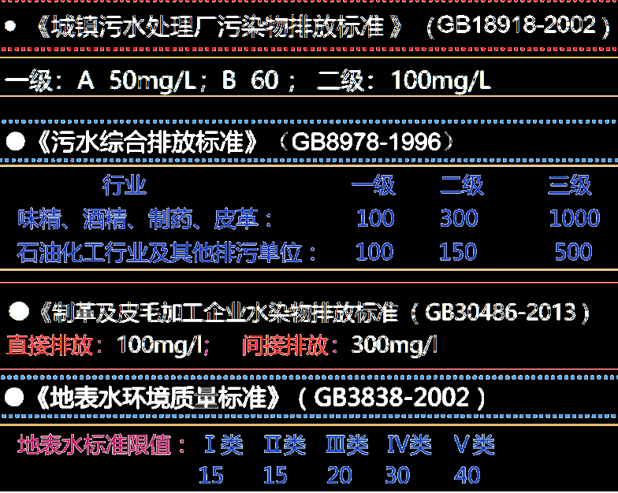
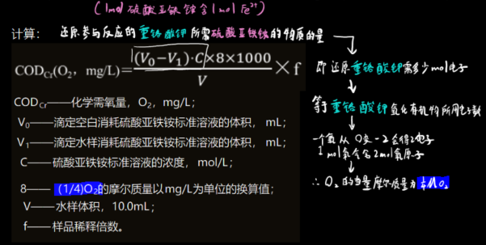

# 一、采样

## 河流监测断面

`背景断面`：（非必须）对一个水系或一条较长河流（完整水体）进行监测时，只设置==一个==，要在河流上游或接近源头处设置，表（==没有受人类活动影响==）的河流背景值

`对照断面`：应设置在河流==进入城市或工业区之前500m左右==处，一般一个河段只设置一个，但是有主要支流时可酌情增加（即支流进入城市或工业区前500m处添加），为**水体中污染物检测即污染程度提供 参比、对照而设**

`控制断面`：（即污染监测断面），设置在排污口下游500~1000m处（500m处重金属浓度出现最高 值），与对照断面比较即可了解河流污染情况

除去在有大量污水排入河流的主要居民区、工业区的下游设置控制断面外，还需在以下位置设置

1. 湖泊，水库，河口的主要入口和出口==处==
2. 城市饮用水源区，水资源集中区域，主要风景游览区，水上娱乐区，重大水利区==中==
3. 鱼类养殖区==中==（鱼类养殖区不必视作污染，这里检测只是为了检测养殖区水质，及外界污染对养殖区水质 的影响）
4. 较大支流汇合处==上游==和与干流充分混合==处==
5. 入海河流河口==处==，受潮汐影响的河段和严重水土流失区==处==

* 控制断面应避开死水区，回水区，排污口处，有急流处，有浅滩处 

* 量选择顺直河段，河床稳定，水流平稳，水面宽阔

`消减断面`：==距离城市或工业区下游1500m处==，用于测量河流被污染后，经过河流自净作用后的结果

## 湖泊的监测断面设置

1. 进出湖、库的河流汇合处设监测断面。

2. 以功能区为中心（如城市和工厂的排污口、饮用水源、风景游览区、排灌站等），在 其辐射线上设置弧形监测断面。
3. 在湖库中心，深、浅水区，滞流区，不同鱼类的回游产卵区，水生生物经济区等设 置监测断面。

## 采样点的布设

| 河面水宽     | ≤50m      | 50~100m                     | 100~1000m | >1500m |
| ------------ | --------- | --------------------------- | --------- | ------ |
| 采样垂线设置 | 1条中泓线 | 左右靠近岸边有水流处设置2条 | 左中右3条 | 5条    |

| 水深       | ≤5m                       | 5~10m                                             | 10~50m                            | >50m       |
| ---------- | ------------------------- | ------------------------------------------------- | --------------------------------- | ---------- |
| 采样点设置 | 距离水面下0.3~0.5m设置1个 | 距离水面下0.3~0.5m设置1个，距离河底0.5m处再来一个 | 同5~10m的设置，不过中间要再来一个 | “酌情增加” |

## 水质要求

I类主要适用于源头水、国家自然保护区； 

Ⅱ类主要适用于集中式生活饮用水地表水源地一级保护区、珍稀水生生物栖息 地、鱼虾类产卵场、仔稚幼鱼的索饵场等；

Ⅲ类主要适用于集中式生活饮用水地表水源地二级保护区、鱼虾类越冬场、洄 游通道、水产养殖区等渔业水域及游泳区； 

IV类主要适用于一般工业用水区及人体非直接接触的娱乐用水区； 

V类主要适用于农业用水区及一般景观要求水域。

# 二、水污染监测

## 电导率(μS/cm):电导率的测定

#### 什么是电导率：

> `电导`（符号为L，单位为S）是`电阻`（符号为R，单位为Ω）的倒数
> `电导率`（符号为K，单位为S/cm，实际一般使用μS/cm）是`电阻率`（符号为ρ，单位是Ω/cm）倒数

> `电导池常数`Q(m^-1^)是电导池的一个**物理属性**，故跟电导池的极板面积A和导电距离l有关，定义式为Q=l/A
>
> 直接带入定义式是计算电导池常数的一种方法，不过极板面积不好准确地测量，
> 所以一般计算是用已知电导率的标准KCl溶液，再测定出R值，根据K=Q/R，得出电极常数数Q

因此电导率K=1/ρ=Q/R，得以下规律

| 盐溶液低浓度 | 盐溶液高浓度 |
| ------------ | ------------ |
| 低电导率     | 高电导率     |
| 高电阻率     | 低电阻率     |

#### 电导率记录规范：

需注意，电导率是会==随着温度变化的==（温度越高，电导率越大），而记录电导率时不会额外记录测定温度，

比如在环境监测报告上写了个电导率为250μS/cm，我怎么知道它是在什么样的温度下测定的。

所以标准规定了：要把任意温度下测得的电导率根据一个转换公式 统统转化为在25℃下的电导率，即
$$
K_s=\dfrac{K_t}{(1+a(t-25))}\\
$$
K~s~——25℃时的电导率

K~t~——温度t时的电导率

a——各种离子的电导率的平均温度转换系数，取0.022

> 电导率仪的测试笔
>
> 

## pH(pH):酸碱的测定

令人安心的是，PH检测不易受到干扰，如颜色，浊度，胶体，氧化剂，还原剂不会产生影响，

#### 测定步骤：

1.聚乙烯瓶装样品

2.使用广泛pH试纸粗测pH值，根据样品pH值选择两种合适的校准用标准溶液“中性酸性或碱性”

3.测定时将电极头浸入溶液，缓慢搅拌，避免产生气泡。具体校准过程略，按照说明书就行了

注：电极头的盖子里是KCl保护溶液，仪器使用时要将上面的橡胶塞拔出

## 浊度(mg/L):浊度的测定

> 名词检索：六氯铂酸、氯铂酸钾、氯化钴

| 水中存在的物质 | 硬水   | Fe^2+^ | Fe^3+^ | 硫化氢 | 硫细菌 | 锰的化合物 | 腐殖酸盐     |
| -------------- | ------ | ------ | ------ | ------ | ------ | ---------- | ------------ |
| 水的颜色       | 浅蓝色 | 灰蓝色 | 黄褐色 | 翠绿   | 红色   | 暗红       | 暗黄或灰黑色 |

色度是衡量水样颜色深浅程度的指标，标准单位为“`度`”：

* 规定每升溶液中含0.5mg`钴`元素【即有2mg `六水合氯化钴` 】 

  和==1mg`铂`==元素【即有2.419mg`氯铂酸钾`(`六氯铂酸`(PtCl6)2-的形 式)】时产生的颜色为1度，其中这1mg的`铂`为重点

------

#### `真色`与`表色`：

色度可分为：`真色`（通过过滤/离心处理后去除悬浮物后水样的颜色）和`表色`（没有处理悬浮物时的水样）

水质分析一般使用`真色`，如果颗粒物过小不易去除则选用`表色`，需在实验报告中注明 PH对颜色有较大的影响，需要在测定色度的==同时测定PH==

------

#### 铂钴比色法：

* 测定对象：轻度污染水体

* 器材准备：备比色管、配置溶液的那些常用玻璃仪器、PH计

* 方法简述：用氯铂酸钾和氯化钴配置成标准色列（50mL比色管），与水样进行目视比色来确定水样的色度

详细步骤：

1. 配置铂钴标准溶液，即500度的溶液。 

   因为1度=1L水里加1mg铂，0.5mg钴；因此500度要加500mg铂，250mg钴。
   500mg铂用(2.419mg/1)500=1.2095g的氯铂酸钾（K2PtCl6）配置 
   250mg钴用(2mg/0.5)250 = 1.000g的六水合氯化钴（CoCl2•6H2O）配置 
   先把这两个试剂溶于100mL水中，然后==加入100mL盐酸==，最后定容至1000mL

2. 标准色列制备

   向一组50mL比色管中分别加入0 , 0.5 , 1 , 1.5 , 2 , 2.5 , 3 , 3.5 , 4 , 4.5 , 5 , 6 , 7mL铂钴标准溶液

   即各管的色度分别为:
$$
\dfrac{\dfrac{500}{1000}mg/mL\times0mL}{0.05L},\dfrac{\dfrac{500}{1000}mg/mL\times0.5mL}{0.05L},\dfrac{\dfrac{500}{1000}mg/mL\times1mL}{0.05L},等
$$

   即色度依次为0、5、10、15、20、25、30、35、40、45、50、60、70度

3. 水样处理

   （水样采集后应在48H内测定，否在应在4℃左右冷藏） 带回实验室后，将水样倒入250mL量筒，==静置15min==（或使用离心机或孔径0.45μm滤膜过滤悬浮物），倾取上 层清液用于测定

4. 测定

   倾取50mL澄清透明水样于比色管中，将水样与标准色列进行目视比较。观测时，将比色管==置于白瓷板或白纸==上，使光线从管底部向上透过液柱，目光自管口垂直向下观察，记录下与水样色度相同的铂钴标准色列的色度。

   

   颜色太深时可进行稀释，C为水样中铂钴的浓度，即色度

$$
c_{稀释}=\dfrac{c_{真实}\times V_{水样}}{0.05L}\\
c_{真实}=c_{稀释}\times \dfrac{0.05L}{V_{水样}}
$$

   C~稀释~即通过比色测量出稀释过水样的浓度(色度)；C~真实~即水样未经稀释，本来的浓度(色度)；V~水样~指比色管内加入了多少原始水样

   比如我从采样点里采出来一些水，色度比较深，所以我从采样出来的原始水样里抽取了10mL到比色管里，然后再加了40mL蒸馏水，正好灌满比色管，那么此时V~水样~就为40mL

------

### 稀释倍数法：

* 测定对象：重度污染水体
* 器材准备：50mL比色管，以及常用玻璃仪器
* 方法简述：将污染严重的地表水或有色工业废水用光学纯水稀释到接近无色，记录稀释倍数，以此表示水样的色度 并用文字辅助描述颜色、色调。透明度等。

当试样的色度>50倍时，每次取最大的稀释倍数
当试样的色度<50倍是，每次稀释倍数取2
当色度很低时，每次稀释倍数小于2

将试样用光学纯水逐级稀释成不同倍数，分别置于具塞比色管中
将具塞比色管放置在白色表面上，**使光线自比色管底部反射通过液柱，垂直向下观察液柱**（同上）
将试样稀释至刚好与纯水无法区分为止
$$
稀释倍数=\dfrac{V_{定容}}{V_{移动}}=\dfrac{C_{移动前}}{C_{移动后}}\\
总稀释倍数=\prod各次稀释倍数
$$

## DO(mg/L):溶解氧的测定

#### 溶解氧太少了会怎么样？

Do(dissolved oxygen): 通常记作Do，用每升水里氧气的毫克数表示。

- 在比较清洁的河流中，溶解氧在7.5mg/L以上
- 大多数鱼类要求4mg/L以上
- 当溶解氧在2mg/L以下时，水体会发臭，导致厌氧菌代谢产生含硫化合物（如H2S）

根据水体O2被消耗后，恢复到初始状态的快慢可知==水体被污染的程度==、==自净能力强弱==

| 标准值分类项目 | 1类              | 2类  | 3类  | 4类  | 5类  |
| -------------- | ---------------- | ---- | ---- | ---- | ---- |
| 溶解氧         | 7.5(或饱和率90%) | 6    | 5    | 3    | 2    |

#### 碘量法：

* 测定对象：DO=0.2~20mg/L且无氧化/还原性物质
* 方法简述：采样时加入硫酸锰以把氧气固定成固体物质，回到实验室后再把固体物质中的氧释放出来，氧将碘化钾氧化为碘单质，再用硫代硫酸钠滴定碘单质

* 器材准备：

| 名称                             | 详情                                                         |
| -------------------------------- | ------------------------------------------------------------ |
| 硫酸锰溶液                       | MnSO4  480g/L                                                |
| 碱性碘化钾                       | NaOH 500g/L，KI  150g/L                                      |
| 硫代硫酸钠                       | 6.2gNa2S2O3•5H2O于==煮沸放冷==的蒸馏水中，加0.2g==无水碳酸钠==，稀释至1L，浓度约为0.025mol/L |
| 重铬酸钾标准溶液                 | c(1/6K2Cr2O7) = 0.025mol/L，即称1.2258gK2Cr2O7，溶于水，定容1L容量瓶 |
| 淀粉溶液                         | 1%                                                           |
| 硫酸（用来溶解四价锰沉淀的）     | 1.84g/mL                                                     |
| 硫酸溶液（用来标定硫代硫酸钠的） | 1+5（1份浓硫酸配5份水，0.8mol/L）                            |

> 解释：
>
> 煮沸放冷是为了除尽水中的CO2
>
> 加入少量碳酸钠也是为了防止硫代硫酸钠与二氧化碳反应，因碳酸钠可与二氧化碳反应生成碳酸氢钠
>
> 重铬酸钾K2Cr2O7，分子质量294.18g/mol，1/6K2Cr2O7指的是若每个重铬分子氧化只得一个电子话，这种理想的重铬酸钾的分子质量，又称当量浓度。重铬酸钾里有两个铬，铬在氧化时6价变成3价，即1个重铬酸钾被氧化会得6个电子，因此理想的重铬酸钾分子质量为294.18÷6g/mol，总之就是为了方便计算产生的东西，不代表任何实际意义
>
> 注意：c(1/6K2Cr2O7) = 6 * c(K2Cr2O7)

* 详细步骤：

用水样冲洗溶解氧瓶，沿瓶壁倾注水样或用虹吸法插入瓶底，注入水样满瓶至溢出瓶容积的1/3~1/2（目的：==为了排尽所有氧气==）

采样后，立即将DO水样固定（+1ml硫酸锰与2ml碱性碘化钾），存于冷暗处，并记录水温，大气压力等，在6小时内测量

固定原理：（水中溶解氧将低价硫酸锰氧化为高价锰，生成四价锰的氢氧化物棕色沉淀）

其实碘化钾是回实验室后下一步反应的反应物之一，但是这个“下一步”的反应条件除了碘化钾还要==酸性==条件，

那么加入==碱性==的碘化钾就肯定不会提前反应了

真正的测定过程：（先加2mL==浓==硫酸1.84g/mL，如果沉淀未完全溶解就再来点）

然后跟标定硫代硫酸钠一样，滴定至淡黄色时加入1mL淀粉，滴定至蓝色刚褪去为无色时停止滴定

#### 修正碘量法：

（当水样中有亚硝酸盐时）

基本原理即用`叠氮化钠`将亚硝酸盐分解后再进行测定，做法是在加碱性碘化钾和硫酸的同时加入叠氮化钠NaN3

Fe3+含量高时，加入KF掩蔽，其余同碘量法

Fe2+含量高时，用`高锰酸钾`将2价铁离子氧化为三价铁离子，然后用`KF`掩蔽，过量的高锰酸钾用`草酸钠`除去，其余同碘量法（草酸钠过量0.5mL以下不会对实验产生影响）

警告：**叠氮化钠剧毒**！

#### 硫代硫酸钠的标定

取250mL洁净的碘量瓶3个-->各加入1g碘化钾(过量),100mL水-->加入10mL重铬酸钾标准溶液-->加入5mL(1+5)硫酸

-->暗处放5min-->用硫代硫酸钠滴定（待溶液变成淡黄色，加1mL淀粉溶液，溶液变蓝，继续滴定至蓝色刚好褪去）

#### 干扰消除

- 若水样含氧化性物质（如游离氯>0.1mg/L），则取两瓶样，

一瓶加1ml硫酸和1gKI（即游离氯与碘离子酸性环境反应，定量生成碘单质），然后用硫代硫酸钠滴定碘单质至蓝色刚好褪去，记录用量

另一瓶水样加同样量硫代硫酸钠（定量地消除那部分氧化性物质），之后按同样步骤测定

- 若水样呈强酸性或强碱性，可用氢氧化钠或硫酸调至中性后测定

## Cr6+(mg/L):六价铬的测定

#### 六价铬太多了会怎么样？

|        | 人   | 鱼   |
| ------ | ---- | ---- |
| 二价铬 | 无害 | 无害 |
| 三价铬 | 轻度 | 重度 |
| 六价铬 | 重度 | 轻度 |

铬的测定可采用二苯碳酰xian二肼jing分光光度法、原子吸收法和硫酸盐亚铁铵滴定法

\>清洁水样用二苯碳酰二肼法（测定总铬时要加高锰酸钾氧化剂，将低价铬全部氧化为六价铬）

所以二苯碳酰二肼法既可以测六价也可以测总铬，只不过测总铬要加一步↑

\>水样含铬量高时，用硫酸亚铁铵滴定法

#### 二苯碳酰二肼法：

* 测定对象：地表水和工业废水中的六价铬，当水样取50ml，用30mm比色皿，测定下限浓度为0.004mg/L，用10mm，测定上限浓度为1.0mg/L
* 方法简述：在酸性环境中，六价铬离子与二苯碳酰二肼反应，生成紫红色络合物，其最大吸收波长为*540nm*，吸光度与浓度符合朗伯比尔定律
* 器材准备：

| 名称             | 详情                                                         |
| ---------------- | ------------------------------------------------------------ |
| 可见光分光光度计 | 以及10mm、30mm比色皿                                         |
| 比色管           | 50ml                                                         |
| 丙酮             |                                                              |
| 磷酸溶液         | 1+1（ρ=1.69g/mL浓磷酸加入到同体积水中）                      |
| 硫酸溶液         | 1+1（ρ=1.84g/mL浓硫酸加入到同体积水中）                      |
| 氢氧化钠溶液     | 0.2%，ρ=4g/L                                                 |
| 尿素溶液         | 200g/L                                                       |
| 亚硝酸钠         | 20g/L                                                        |
| 铬标准贮备液     | 0.1mg/mL六价铬（0.2829g重铬酸钾，定容1000mL容量瓶）  |
| 铬标准溶液       | 1.00μg/mL六价铬                                              |
| 显色剂A          | 0.2g二苯碳酰二肼，溶于50mL丙酮，水稀释到100mL                |

取铬标准液0、0.2、0.5、1、2、4、6、8、10mL于比色管中，加水稀释至50mL然后加(1+1)硫酸，(1+1)磷酸各0.5mL（如果预处理过程中加了硫酸和磷酸后续过程就不需要加了），然后于540nm处测定吸光度

##### Q&A:

*Q1:空白水样和色度补偿水样的区别是什么？*

`空白水样`是为了去除

配置试剂时的蒸馏水中杂质本身的颜色 或 杂质与显色剂反应产生的颜色

- 蒸馏水+磷酸+硫酸+显色剂=空白水样

 

`色度补偿`是为了去除

测试水体本身对颜色测定的影响，如水体本身的颜色 或 水体中有些物质与硫酸和磷酸反应，也会产生干扰的颜色

- 水样+磷酸+硫酸+丙酮 = 色度补偿水样

 

☆普通分光光度水样测出来的吸光度要减去上面两种校正水样的吸光度才是真正吸光度

- 水样+磷酸+硫酸+显色剂=正常分光光度水样

 

*Q2:为什么要去除水中的还原性物质，怎么去除？*

还原性物质（如**二价铁**，**亚硫酸盐**，**硫代硫酸钠**等还原性物质）

会把要测定的六价铬转化为三价铬（我们测试出来的值是代表**新鲜水样**中的六价铬离子含量，不是待会实验室后又变质，成分发生变化的水样。为避免成分发生变化，其中一种方法就是加入**成分固定剂**，另一种方案就是下述的“去除让成分发生变化的物质”，即去除水中氧化剂/还原剂/等等的方案）

去除还原性物质用氧化性盐（**高锰酸盐**），来氧化水中的还原性物质

为什么选用高锰酸盐？(40g/L高锰酸钾)

因为1.高锰酸盐不会氧化水中的三价铬，所以不会对测定结果进行干扰

因为2.高锰酸盐自身不含有六价铬（废话）（所以做六价铬测定实验时不能使用另一种常用氧化剂重铬酸钾，因为重铬酸钾本身就是六价铬）

- 锌盐沉淀法：用氢氧化锌共沉淀剂
- 若沉淀分离法无法去除有机物干扰时，可用高锰酸钾破坏有机物后测定，具体是加入几粒玻璃珠，然后加磷酸和硫酸，一直滴加高锰酸钾直至紫红色不会自动褪去，然后煮沸，过滤，用中速滤纸过滤，然后加入1mL尿素，之后逐滴加入亚硝酸钠，直至紫红色褪去

 

*Q3:什么要去除水中的氧化性物质，怎么去除？*

氧化性物质（如**次氯酸盐**）

会把三价铬氧化成六价铬（具体理由见Q2，是一个道理，为避免运送过程中 水中某些杂质 使 水样中待测物质变质）

去除氧化性物质用还原性盐（尿素 / 亚硝酸钠）

具体过程：先加入加入==1ml尿素==，再逐滴加入亚硝酸钠作为补充反应，再逐滴加入==硫酸和磷酸==（用于去除过量的亚硝酸钠），加到不再产生气泡时即视作完全清除掉了过量的亚硝酸钠

注：硫酸和磷酸不会氧化铬离子，甚至测定铬离子的络合反应就是发生在有硫酸和磷酸配置成的酸性环境中的

`亚硝酸盐`（污水的亚硝酸盐含量高）会产生干扰，要用叠氮化钠消除影响（修正碘量法）

#### 火焰原子吸收法：

1. 一般有机物是还原性质的，测定前需要用强氧化性的强酸进行消解

2. 为安全起见，还可以用微波消解法（按照标准文档的参数设置微波消解仪）

   汞灯：只发射单波长的灯，且这个波长能正好被汞蒸汽吸收

   寻峰步骤测出来的最大吸收波长应该与手册上理论的最大吸收波长应相同，否则需要校准仪器

3. 燃烧室是在灼烧含汞的溶液，汞灯发射的光线被蒸发的汞蒸气吸收

4. 去离子水，即蒸馏水，用于清洗燃烧器和做空白试样

## 氨氮(mg/L):氨氮的测定

#### 纳氏试剂比色法：

* 测定对象：（水样体积50mL，20mm比色皿，测定下限0.1mg/L，测定上限2.0mg/L）

* 水样保存：如需保存水样，需酸化至pH<2，2~5℃

* 方法简述：以游离态的氨或铵离子等形式存在的氨氮与纳氏试剂反应生成淡红棕色络合物

  该络合物的吸光度与氨氮含量成正比，于波长420nm处测量吸光度

* 器材准备：

| 名称         | 详情                                                         |
| ------------ | ------------------------------------------------------------ |
| 无氨水       | 可通过离子交换/蒸馏法/纯水器法制得                           |
| 纳氏试剂     | 购买                                                         |
| 分光光度计   |  |
| 氨氮蒸馏装置 |  |
| 氨氮标液     | 10μg/ml                                                      |

#### 干扰消除

- 余`氯`：加入适量==硫代硫酸钠==溶液去除，然后用淀粉-碘化钾试纸检验是否除尽，可见出去的标准没有测定DO时的高
- `钙镁`等金属离子：在显色时加入适量==酒石酸钾钠==溶液，可消除干扰
- 浑浊或有颜色：可用与蒸馏法或絮凝沉淀法处理
- 絮凝沉淀法：100ml样品加入1ml硫酸锌与氢氧化钠，调节pH约为10.5，混匀，放置使之沉淀，取上层清液分析，必要时用中速滤纸过滤
- 预蒸馏：50ml硼酸入接收瓶，冷凝管出口在硼酸溶液液面下，取250ml样品于烧瓶，加溴百里酚蓝指示剂

必要时，用氢氧化钠或盐酸调整pH至6.0(黄色)~7.4(蓝色)，加入0.25g轻质氧化镁及数粒玻璃珠，立即连接氮球和冷凝管

然后加热蒸馏，使馏出液速率为10ml/min，待馏出液达200ml时，停止蒸馏，加水定容至250ml

## 磷(磷mg/L):磷的测定

> 名词检索：钼酸铵、总磷、正磷酸盐、锑盐、磷钼杂多酸

#### 磷太多了会怎么样？

天然水中磷酸盐的含量不高。化肥、冶炼、合成洗涤剂等工业废水以及生活污水中含量较大
和氮一样，如果水体中含量过高会造成富营养化（>0.2mg/L）

可溶性`正磷酸盐`：水样经过0.45μm滤膜后过滤就直接测定
可溶性`总磷`：水样不仅经过0.45μm滤膜，还要进行氧化消解，即溶解的/颗粒的/有机的/无机的磷

#### `钼酸铵`分光光度法：

* 测定对象：取25mL试料，最低检测浓度为0.01mg/L测定上限为0.6mg/L

* 方法简述：中性条件下用`过硫酸钾`（或硝酸-高氯酸）为氧化剂，将未经过滤的水样`消解`，即将所有种类的磷氧化为正磷酸盐。

  然后在==酸性环境==中，正磷酸盐与钼酸铵反应，在`锑盐`存在的条件下生成`磷钼杂多酸`（此物质为黄色络合物，不稳定，需要跟`抗坏血酸`，把不稳定的黄色络合物（催化）完全还原成蓝色络合物，然后用分光光度测定总磷，于==700nm==波长处进行比色处理）

* 器材准备：

| 成分              | 详情                                                         |
| ----------------- | ------------------------------------------------------------ |
| 硫酸              | （1+1）的硫酸                                                |
| 过硫酸钾          | 50g/L，将5g过硫酸钾溶解于水并稀释至100mL                     |
| 抗坏血酸溶液      | 100g/L，溶解10g抗坏血酸于水中并稀释至100mL，贮藏于==棕色试剂瓶==中 |
| 钼酸铵溶液        | 溶解13g钼酸铵于100mL水中。溶解0.35g==酒石酸锑钾==于100mL水中。  ->在不断搅拌下把钼酸铵溶液徐徐加入300mL的1+1==硫酸中==，加入酒石酸锑钾溶液并混，贮藏于==棕色试剂瓶==中 |
| `浊度-色度补偿液` | 混合两体积1+1硫酸和一体积抗坏血酸溶液。当天配置              |
| 磷标准贮备溶液    | 50μg/mL，称取0.2197g干燥器中放冷的==磷酸二氢钾==，用水溶解并转移至1000mL容量瓶中，加约800mL水、5mL 1+1==硫酸==，水稀释至标线并混匀 |
| 磷标准使用溶液    | 2.0μg/mL将10.0mL的磷标准储备液转移至250mL容量瓶中，用水稀释至标线并混匀 |
| 高压灭菌锅        | 高压の的灭菌锅                                               |
| 分光光度计        | 普通的分光光度计                                             |

* 详细步骤：

1. 过硫酸钾消解：

   如用硫酸保存了水样，进行消解前应先调至中性

   在比色管中加入4mL过硫酸钾，盖好盖子，用纱布和棉线捆好

   在高压灭菌锅（120℃，1.1kg/cm²）中消解

   停止加热后待压力表计数降为0，取出并冷却到室温，然后用水稀释至标线

2. 或用硝酸-高氯酸消解

   在试样中加入硝酸-高氯酸，在电热板上加热回流消解

3. 配置标准色列

|            | 0    | 1    | 2    | 3    | 4    | 5    | 6    |
| ---------- | ---- | ---- | ---- | ---- | ---- | ---- | ---- |
| 磷标液(mL) | 0    | 0.5  | 1    | 3    | 5    | 10   | 15   |
| 磷含量(μg) | 0    | 1    | 2    | 6    | 10   | 20   | 30   |

4. 分别向各份消解液中加入1mL`抗坏血酸`溶液，混匀，30s后加2mL`钼酸盐`溶液，充分混匀

   显色：室温下放置15min后，倒入，30mm比色皿

   

#### 空白水样&色度补偿水样

当水样浑浊或含有色度时需要做带浊度-色度补偿水样，同`六价铬的测定`，最终试料的吸光度 要 扣除色度补偿试料的吸光度

空白水样吸光度和浊度色度补偿吸光度其实在什么时候减都可以，即要么给色列中**每个**标准溶液的吸光度都减去这两个个值，要么在带入测试水样时减去这两个值

* 普通样品：消解后水样+酸+抗坏血酸+钼酸盐

* 浊度-色度补偿样品：消解后水样+***3mL浊度-色度补偿液（已经包含酸了）***

* 空白实验：普通水+酸+抗坏血酸+钼酸盐

#### 干扰消除

砷>2mg/L时，用硫代硫酸钠去除。

硫化物>2mg/L时，通氮气去除

铬>50mg/L时，用亚硫酸钠去除

亚硝酸盐>1mg/L时，用氧化消解或加胺磺酸去除

## COD~Cr~(氧气mg/L):或COD(化学需氧量)

黑臭水体，化学需氧量很高；水质清澈，化学需氧量极低

COD~Cr~，一定程度上反应了水体受到有机物污染的程度，即一定条件下

氧化1L水中还原性物质(主要是有机物)消耗的强氧化剂 重铬酸盐 对应的 氧气 的 质量浓度，结果以O2mg/L来表示

生物需氧量BOD：

利用好氧微生物降解水体中有机物，并测量该过程消耗的氧气

化学需氧量COD:

由于有机物多半是还原性的，用化学氧化剂氧化水中有机物，所消耗的氧化剂剂量

#### 重铬酸盐法：

* 测定对象：不适用于氯化物浓度>1000mg/L的高氯废水，应稀释，或采用氯气校正法测定；取样体积为10mL时，测定16~700mg/L，超过此限需稀释后测定

* 方法简述：在水样中加入**已知量且过量**的重铬酸钾溶液，并在==强酸==介质下以==银==作为催化剂，加热回流2h（让有机物与重铬酸钾充分反应），然后以==试亚铁灵==为指示剂，用==硫酸亚铁铵==标准溶液滴定水样中未被还原的重铬酸钾，由消耗的硫酸亚铁铵标准溶液计算出消耗等量氧的质量浓度

* 需准备：

  | 名称                   | 详情                                                         |
  | ---------------------- | ------------------------------------------------------------ |
  | 重铬酸钾标准溶液       | 0.250mol/L；稀释得到0.0250mol/L                              |
  | 硫酸亚铁铵             | 0.05mol/L当日标定，稀释得到0.005mol/L                        |
  | 硫酸汞                 | 100g/L；10g硫酸汞溶于100ml(1+9)硫酸溶液                      |
  | 硫酸-硫酸银溶液        | 500mL浓硫酸中溶解5g硫酸银（需放置1~2天因为硫酸银溶解挺慢的） |
  | 试亚铁灵               | 买买买                                                       |
  | 防爆沸(剧烈沸腾)玻璃珠 | 去偷几颗小屁孩的弹丸                                         |

* 详细步骤：

计算：

#### 干扰消除

注：**硫酸汞剧毒**

主要干扰物为`氯化物`，可加入`硫酸汞`去除（Cl-能被重铬酸钾氧化，消耗氧化剂；Cl-能与硫酸银反应产生不必要的沉淀，消耗催化剂）

具体操作：提前粗略测定氯离子含量，m硫酸汞：m氯离子 >= 20 : 1，按这个比例加入，即可生成稳定的氯汞配合物，最大加入量为40mg?（原话说是氯离子浓度1000mg/L时，最大加入量为2mL）

#### 精密度控制与`质控样品`

每批样品应至少做两个空白实验

十个样品应至少做一个平行样

质控样品：称取105℃干燥2H的`邻苯二甲酸氢钾`0.4251g溶于水，稀释至1000mL，混匀，按同样的方法测定它的CODcr值，测出来的值应接近500mg/L

## COD~Mn~(氧气mg/L):或高锰酸盐指数(化学需氧量)

高锰酸钾法与重铬酸钾法测COD的异同：

| 同                                                   | 异                                                           |
| ---------------------------------------------------- | ------------------------------------------------------------ |
| 高锰酸盐指数、COD、BOD都是表示水里有机物的条件性指标 | 三者的氧化剂即测定条件不同 ，同一水样测量值COD最大           |
|                                                      | 高锰酸盐测定清洁水体，重铬酸钾测污染过的水体  （浓度越高重铬酸钾法精确度越高） |
|                                                      | 高锰酸盐氧化性较弱，因此实际测出来有机物（还原性物质）只有实际的70% |

#### 高锰酸钾酸性法：

* 测定对象：氯离子含量<300mg/L
* 器材准备：

| 名称             | 详情                    |
| ---------------- | ----------------------- |
| 高锰酸钾贮备液   | 0.1mol/L（1/5KMnO4）    |
| 高锰酸钾标准溶液 | 0.01mol/L（1/5KMnO4）   |
| 草酸钠贮备液     | 0.1mol/L（1/2Na2C2O4）  |
| 草酸钠标准溶液   | 0.01mol/L（1/2Na2C2O4） |
| 硫酸             | 1+3的硫酸               |

* 详细步骤：

> 重点之计算：高锰酸钾溶液校正系数K的测定以及 V~0~空白水样的测定：
>
> 用100mL蒸馏水代替水样，其它操作步骤相同，所消耗的高锰酸钾体积记作V~0~
>
> 把上述滴定后的空白实验溶液中加入10mL，0.01mol/L(1/2草酸钠)溶液，加热至80 摄氏度，用高锰酸钾滴定至刚出现粉红色，并保持30s不褪色，所消耗的高锰酸钾 体积记作V~2~，校正系数K=10mL/V~2~
>
> 因为实验中用的都是当量的摩尔浓度，并且当量的意义就是方便计算，1mol当量 草酸钠正好跟跟1mol重铬酸钾反应，因此这个V~2~理想情况下应该是等于10的， 即K=1，不用校正，如果不等于10，那么就理所当然需要校正了
>
> 

#### 高锰酸钾碱性法：

* 测定对象：氯离子含量>300mg/L，**碱性环境高锰酸氧化性差，氧化不了氯离子，因此碱性环境下就不用担心高锰酸钾把不应该氧化的氯离子氧化了**

其余同上

## BOD5(氧气mg/L):生化需氧量

#### BOD5太高了会怎么样？

BOD5全称五日生化需氧量，反映水样中可以被微生物氧化分解的有机物量

具体指：在溶解氧充足的条件下，20摄氏度，好氧微生物在分解水中有机物的生物化学过程中消耗的O2量，以O2mg/L表示

测定意义：

若**BOD5/COD>0.3**说明**可生化性强**，处理这类废水就选用生物处理法；<0.3则选用物理化学处理法

> 有机物好氧分解两个阶段：
>
> 1. 有机物氧化为二氧化碳和水（5天）
> 
> 2. 含氮有机物在硝化菌的作用下分解为亚硝酸盐和硝酸盐（5~10天后）
> 
> 5天内20°C时好氧分解的耗氧量能达到70%，所以为了减少实验时间，所以选择做BOD5
> 
> 因此BOD5不包含硝化阶段

#### `稀释`与`接种`法：

* 测定对象：普通方法检出下限为0.5mg/L，

   稀释与接种法测定上限为2mg/L，

   非稀释法和非稀释接种法测定上限为6mg/L

   稀释与稀释接种法测定上限为6000mg/L BOD

* 测定原理：（不做稀释也不接种，BOD5<6mg/L）：水样充满完全密闭的溶解氧瓶中，加入营养物质和氧气（见下），在20摄氏度下暗处培养5天(±4H)，分别测定培养前后水样中溶解氧的质量浓度，两者之差即为所培养水样的BOD5值

------

#### 名词解释：

`非稀释法`：用于样品中有机物含量少（估计BOD5<6mg/L），且有足量微生物

`非稀释接种法`：用于样品中有机物含量少（估计BOD5<6mg/L），且无足量微生物（如废水）

`稀释法`：用于样品中有机物含量多（估计BOD5>6mg/L），且有足量微生物

`稀释接种法`：用于样品中有机物含量多（估计BOD5>6mg/L），且无足量微生物

------

`稀释操作`：做BOD时应先测COD或TOC，由于有研究表明COD/TOC和BOD<u>有固定比例关系</u>，测出COD/TOC后按公式算出BOD5期望值，然后根据`期望值`查到稀释倍数，计算加多少稀释液才能==使BOD5小于0.2mg/L==，中性。

用1000mL量筒作为稀释容器，先加入100-200mL的`稀释液`或`接种稀释液`，再按照确定的稀释倍数，用`虹吸管`吸入一定体积的水样，再加稀释液或接种稀释液到刻度，用橡胶棒轻搅动，==避免产生气泡==

\> 需确保培养5天过程中消耗的DO≥2mg/L

\> 需确保5天后样品中剩余DO≥2mg/L 且为刚开始浓度的1/3~2/3

`稀释液`：干净且无机物污染，且要加氯化钙，氯化铁，硫酸镁，磷酸等营养物质且要曝气2-8H，使水中溶解氧到8mg/L，**稀释水的BOD5测定结果不能超过0.5mg/L**!否则不久产生干扰了吗

`接种液`：当水样中有有毒物质时，应引入`驯化`过的微生物。
接收排污口下游适当处的废水然后连续曝气，每天加一点废水，过3-8天后，让能适应的微生物大量繁殖（此过程称为驯化），等有絮状物时（微生物分泌物黏在一起），说明`驯化`过微生物已繁殖，可做接种液。（**也可购买现成的接种液**）

`接种稀释液`：按接种液来源不同，每升稀释液中加入适量接种液，pH值应为7.2，BOD5应小于1.5mg/L，当天配置使用

#### 干扰消除：

用盐酸或氢氧化钠调整pH至6~8；若有余氯，加入适当**亚硫酸钠**（硫为4价，硫酸钠为6价）；若有藻类，BOD5测定会偏高，需用1.6μm的滤膜过滤；若样品含盐量低（电导<125μS/cm）时，需加入同体积的四种营养液，使电导率>125μS/cm

#### 精密度控制与`质控样品`：

质控样品：用``葡萄糖-谷氨酸``标准溶液，每批样品应做一个质控样，将`葡萄糖`和`谷氨酸`于130摄氏度干燥1h，各称取150mg溶于水中，稀释至1000mL容量瓶中，取20ml，再稀释至1000mL，与水样同步测定，结果应在**180~230mg/L**

## TOC(碳mg/L):总有机碳(很小!)

`总有机碳`是指以碳的含量表示水体中`有机物质总量`的综合性指标

#### 燃烧氧化--非色散红外(NDIR)吸收法（包含两种子方法）：

##### 差减法：

- 最低检出浓度：0.5mg/L，样品浓度大于200ppm，用于测定有机物含量较高的废水，且POC含量低，且不易起泡，

核心原理：在900~950摄氏度时，以铂和三氧化钴或三氧化二铬为催化剂，使有机物燃烧裂解为二氧化碳，此时无机的碳酸盐也会分解产生二氧化碳，因此此时测得的二氧化碳是`总碳（TC）`

然后将试样通入低温反应管，这种低温反应管只能使无机碳转化为二氧化碳，因此此时测得的二氧化碳叫`无机碳（TIC）`

TOC浓度表达式：TOC(mg/L) = TC(mg/L) - TIC(mg/L)

 

##### 直接法：

- 适用于TOC含量很低 或 IC含量远高于TOC 的样品

试样经酸化曝气，其中的无机碳转化为二氧化碳被去除，再将试样注入高温燃烧管中，可直接测定总有机碳。

由于酸化曝气会损失`可吹扫有机碳（POC）`，故测得的总有机碳实际上为`不可吹扫有机碳（NPOC）`

POC含量高 即代表 易挥发物质占比比较大

最后，怎么测定产生二氧化碳的浓度浓度呢？

在特定波长下，一定质量浓度范围内的二氧化碳的红外线吸收强度与其质量浓度成正比，由此可进行测量

 

>  干扰物处理：
>  
> 样品浑浊时，必须进行沉淀处理，否则固体颗粒可能会堵住排气管
> 
> 当样品中具有**强酸(腐蚀仪器)**、**强碱(吸收空气中的CO2)**和**高浓度盐(粘附在管壁上无法清洗)**时，不可进行测定

#### 紫外-过硫酸盐氧化-NDIR法：

* 用于测定有机物含量不是特别高的地表水及生活水(0-10000mg/L)

#### 紫外氧化-电导率法：

- 用于测定有机物含量不是特别高的地表水及生活水

核心原理：紫外消解去除无机碳，计算电导率增加量

## TOD(氧气mg/L):总需氧量

总需氧量是指水中能被氧化的物质，主要是有机物质在==燃烧过程==中变成稳定的氧化物时所需要的氧量

TOD值能反映几乎全部有机物质经过燃烧后变成CO2、H2O、NO、SO2所需要的氧气量

因此它比BOD、COD和高锰酸盐指数更接近理论的需氧值

#### TOD仪器法：

* 方法简述：将一定量水样注入装有铂催化剂的石英燃烧管，通入**含已知氧浓度**的载气（氮气）作为原料气，

让水样中的还原性物质在900℃下瞬间燃烧氧化。测定燃烧前后原料气中**氧浓度的减少量**，便可求得水样的总需氧量

#### TOD与COD的比值可知有机物种类

因为1mol碳燃烧消耗2mol氧原子（CO2嘛，一个碳配两个氧），即12g碳消耗32g氧，即1g碳消耗2.67g氧，因此，从理论上来讲==TOD=2.67TOC==

- TOD/TOC在2.67左右，可认为主要是含碳有机物
- TOD/TOC ＞4.0，则水中有较大量含S、P的有机物存在；
- 若TOD/TOC ＜2.6，水样亚硝酸盐可能较大，他们在高温和催化条件下分解放出氧，使TOD测定出现负误差

#### 与氧有关的指标对比

- 污废水或有机物含量较高水样，CODcr=0.9TOD，IMn不可测

水样生化性较好时：TOD>CODcr>BOD20>BOD5>TOC

水样生化性不好时：TOD>CODcr>BOD20>BOD5

同时TOD>CODcr>TOC

- 清洁的地表水，CODcr测定误差较大，IMn=0.7TOD
- 一般水样的可生化性较好：TOD>BOD20>BOD5>IMn

同时TOD>BOD20>BOD5>TOC

## 挥发酚(以苯酚计mg/L):挥发酚

> 水样采集后，应及时检查**有无氧化剂存在**。必要时加入**过量的**`硫酸亚铁`，并立即加`磷酸酸化`至pH值约4.0，并加适量`硫酸铜`（1g/L）以抑制微生物对酚类的==生物氧化==作用，同时应冷藏（5-10 ℃ ）

#### 酚太多了会怎样？

酚属于**高毒性**物质，会导致人和鱼的死亡

酚的主要污染源是炼油、焦化、煤气制造企业以及木材防腐企业、

* 定义：根据酚类能否与水蒸气一起蒸出，分为挥发酚（沸点>230℃）与不挥发酚（沸点<230℃）

* 测定方法：容量法、分光光度法、色谱法、溴化容量法(高浓度)。

#### 4-`氨基安替比林`分光光度法：

* 方法简述：在==pH10.0==±0.2的介质中，有`铁氰化钾`存在下，酚类化合物与4-氨基安替比林（4-AAP）反应，生成==橙红色==的`吲哚酚安替比林`染料，在510nm波长处有最大吸收，用比色法定量。该法所测酚类不是总酚，而只是与4-AAP显色的酚，并以苯酚为标准，结果以苯酚计算含量

> 干扰消除：
> 
> 游离氯加入硫酸亚铁还原
> 
> 硫化物加入硫酸铜使之沉淀，或者在酸性条件下使其以硫化氢形式逸出
> 
> 油类用有机溶剂萃取除去
> 
> 水样中存在氧化剂、还原剂、油类及某些金属离子时，均应设法消除并进行预蒸馏
> 
> > 蒸馏的作用
> > 
> > - 分离出挥发酚
> > - 消除颜色、浑浊和金属离子等的干扰。 

#### 溴化滴定法：

* 方法简述：在含**过量**溴（由溴酸钾和KBr产生，因为是即时产生的，所以可以利用化学平衡起到自动补充的作用）的溶液中，酚与溴反应生成三溴酚，进一步生成溴代三溴酚。

  剩余的溴与KI作用放出游离碘，与此同时，溴代三溴酚也与KI反应生成游离碘，用硫代硫酸钠标准溶液滴定释出的游离碘，并根据其耗量，计算出以苯酚计的挥发酚含量。

KBrO~3~+5KBr+6HCl→3Br~2~+6KCl+3H~2~O

C~6~H~5~OH+3Br~2~ →C~6~H~2~Br~3~OH+3HBr

C~6~H~2~Br~3~OH+Br~2~ → C~6~H~2~Br~3~OBr+HBr

Br~2~ +2KI→2KBr+==I~2~==

C~6~H~2~Br~3~OBr+KI+HCl→C~6~H~2~Br~3~OH+KCl+HBr+(1/2)==I~2~==

2Na~2~S~2~O~3~+I~2~ →2NaI+Na~2~S~4~O~6~

* 计算：

$$
挥发酚 =（V_1-V_2）*C*15.68*1000/V
$$

V1—空白试验滴定时硫代硫酸钠溶液用量，ml

V2—试样滴定时硫代硫酸钠溶液用量，ml

C—硫代硫酸钠溶液的摩尔浓度，mol/L

V—试样体积，ml

15.68—苯酚（1/6C6H5OH）的摩尔质量，g/mol
