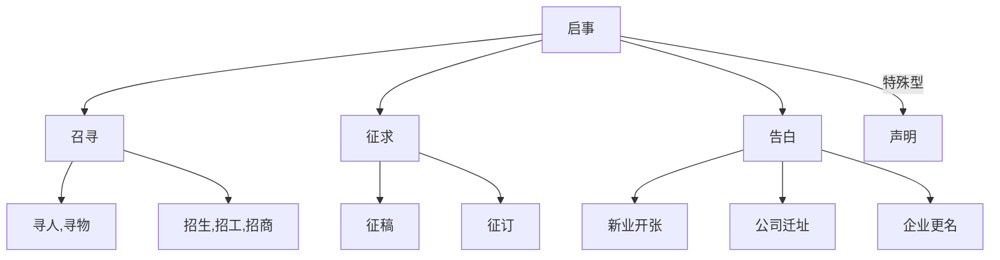
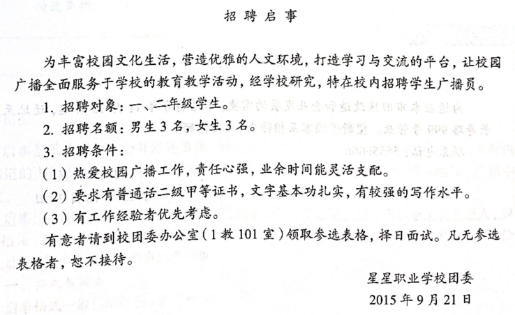
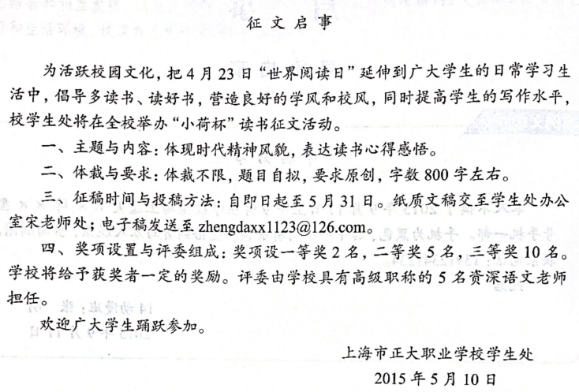

# 启事

* 启事类文章必须写标题。标题可以是简单的启事，如"招聘启事"，也可以加上企业名，如"沃尔玛招聘高阶技术人才启事"

* 正文内容分为两大部分：一是陈述公众需要知道的内容    二是请求公众帮助

  一般包括：目的，意义，形式，要求，最后写明<u>地址</u>，<u>联系方式</u>

* 结束语：==此启==，声明的结束语就是==特此声明==

## 寻物启事

寻物启事 / 招领启事

​		寻人寻物启事要把所寻的人(物)`特征` 和 走失(丢失) 的`时间`写清楚。寻人启事常附上被寻者的照片。然后写上`联系电话`。

​		若是寻物启事，则加==望拾到者与本人联系，当面酬谢==

​		若是招领启事，则只写招领的物品，但具体细节不写，以防冒领

​		此启

身份：姓名

x年x月x日

## 招聘启事

招聘启事

​		开头一般写招聘单位`性质`、`业务范围`及招聘`目的`、`愿望`等

​		1.招聘对象：`xxx`

​		2.招聘名额：`xxx`

​		3.招聘条件：

​		(1) `xxx`（年龄、学历、经历、职称、技术等级、专长、身体条件、户口）

​		(2) `xxx`

​		有意者到`xxx地点`领取表格，择日面试。

团委/人事部

x年x月x日

## 征稿启事

* 包括征文、征集广告语、征集徽标图案等。
* 征稿启事应写清征稿目的、用途，稿件的内容、要求，投稿方法，起止日期，奖励方法等。
* 征集广告语和徽标图案的启事一般开头先做企业的自我简介，以便投稿者把握企业性质、宗旨、特点，更有针对性地设计构思

------

征稿启事

​		为了`目的`，在`什么范围`内举办`什么`。

​		一、主题与内容：

​		二、体裁与要求：

​		三、征稿时间与投稿方法：

​		四、奖项设置与评委组成：

​		==欢迎`谁`踊跃参加==

学生处 / 宣传办

x年x月x日

## 开业启事

开业启事

​		`xx`店将在`xx`时间开业。本店提供`多好的商品/多好的服务`，==热忱欢迎新老顾客光临==

​		营业时间：`xx`

​		本店地址：`xx`

​		此启

xx店

x年x月x日
