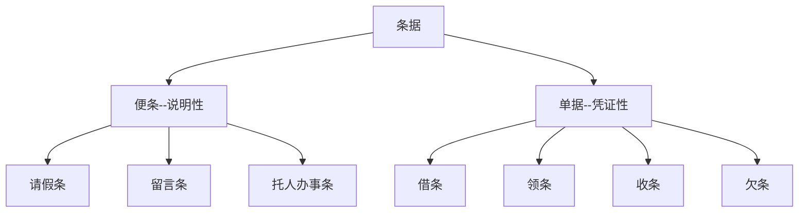

> 高光内容表示==客套话==
>
> 方括号中的内容表示`代补充内容`

# 条据

## 请假条：

请假条

写给谁的：

​		因为`什么事`请假，`起始时间`，特请假`几`天。==请予批准==。

​		==此致==

==敬礼==

​		（如果因病请假：附医院病假证明一张）

身份：姓名

x年x月x日

## 留言条：

写给谁的：

​		正文……请不要担心。

身份：姓名

x年x月x日

## 托人办事条：

写给谁的：

​	 	正文……谢谢。

身份：姓名

x年x月x日

## 借条：

借条

​		今<u>借</u>到`什么物品`，`多少个(钱则用大写中文数字，无小数位则要写'整')`，`干什么用`，于`什么时候`归还。

​		==此据==

身份：姓名

(写条据的时间) x年x月x日

## 领条(单位发的)：

领条

​		今<u>领</u>到`什么物品`，`多少个(钱则用大写中文数字，无小数位则要写'整')`，`干什么用`

身份：姓名

(写条据的时间) x年x月x日

## 收条(个人给的)：

收条

​		今<u>收</u>到`什么物品`，`多少个(钱则用大写中文数字，无小数位则要写'整')`，`干什么用`

​		==此据==

身份：姓名

(写条据的时间) x年x月x日

## 欠条：

欠条

​		原借`从谁那借的`  `什么物品`，`多少个(钱则用大写中文数字，无小数位则要写'整')`，今已还`多少`，尚欠`多少`，`多久`还清。

​		==此据==

身份：姓名

(写条据的时间) x年x月x日

