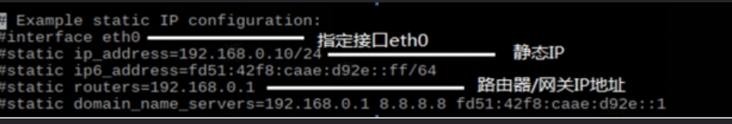
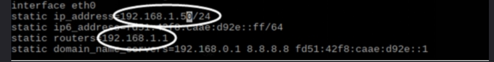
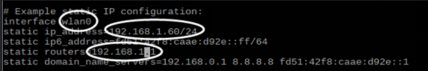

## 固定IP

sudo nano /etc/dhcpcd.conf

进入文件后，在文件最下方找到如下图所示代码：

 如果你需要固定树莓派使用网线时的IP，你可以将注释符号“#”去掉，并将静态IP改为使用网线时的树莓派IP，路由器/网管IP地址也进行修改：

如果你需要固定树莓派使用无线时的IP，你需要将`eth0`改为`wlan0`，并将注释符号`“#”`去掉，将`静态IP`改为`连接无线时的树莓派IP`：

修改完成后按`ctrl+x`，`“y”`，`“enter”`保存并退出文件。==重启==树莓派。再次在终端使用`“ifconfig”`命令您会发现IP地址已经发生改变。