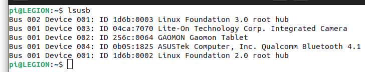
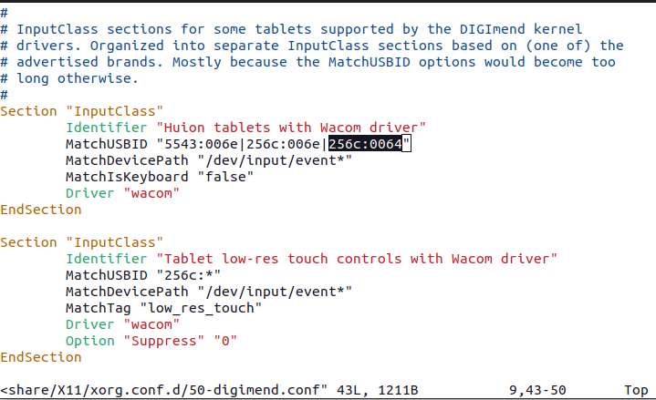

首先lsusb，看插上数位板后多出来的设备名ID

<div align=left></div>

这里就是256c:0064

打开数位板项目官网地址https://digimend.github.io/tablets/，看这个ID是否在支持列表中

若支持：

1. 安装内核头文件：

> sudo apt-get install -y "linux-headers-$(uname -r)"

2. 安装DKMS (Dynamic Kernel Module Support) 

> sudo apt-get install -y dkms

3. 打开https://github.com/DIGImend/digimend-kernel-drivers/releases/tag/v10，下载digimend-dkms_10_all.deb
3. 安装即可

> sudo dpkg -i xxx.deb

sudo modprobe -r hid-kye hid-uclogic hid-polostar hid-viewsonic

***

虽然高漫m5的usb ID不在支持列表里，但可以搞搞强制支持，hack一下

>  vim /usr/share/X11/xorg.conf.d/50-digimend.conf 
>
> <div align=left></div>
>
> 光标选中的地方原来是256c:006d，这边给他改成高漫m5的USB ID
>
> 这个时候应该就能用了，不过方向错了，需要修改一下
>
> 1.使用如下指令查看是否识别插上的数位板
>
> pi@LEGION:~$ xsetwacom --list
> GAOMON Gaomon Tablet stylus     	id: 10	type: STYLUS    
> GAOMON Gaomon Tablet eraser     	id: 16	type: ERASER  
>
> 2.设置方向，引号中的名字是上面的stylus那个
>
> pi@LEGION:~$ xsetwacom set 'GAOMON Gaomon Tablet stylus' rotate CCW


***

arch linux系列：

yay -S digimend-kernel-drivers-dkms-git


## wayland

注：上述方法只能用于基于X11的linux系统上面，不能用于新版图形渲染系统wayland

怎么知道用的是什么图形内核：

 echo $XDG_SESSION_TYPE

wayland暂时无解，不过将wayland显示服务器改回x11很简单，

```
sudo vim /etc/gdm3/custom.conf
```

将WaylandEnable=true改为WaylandEnable=false