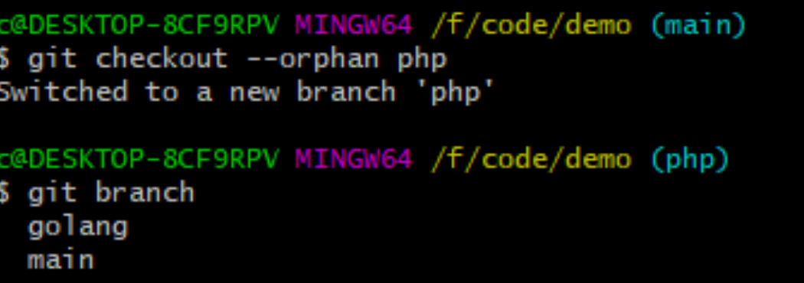

## 对比差异

查看当前没有add 的内容修改

`git  diff`

查看已经add 没有commit的改动

`git diff --cached`

获取全面信息：

`git  status`


## 查看历史版本及对应的commit信息

`git log`

或简要输出

`git log --pretty=oneline --abbrev-commit`


## 版本回退

#### 如果写了一些代码，写错了，并且commit掉了，怎么回退

现在我想使用版本回退操作，我想把当前的版本回退到上一个版本，要使用什么命令呢？可以使用如下2种命令，第一种是：`git reset –-hard HEAD^` 那么如果要回退到上上个版本只需把HEAD^ 改成 HEAD^^ 以此类推。那如果要回退到前100个版本的话，使用上面的方法肯定不方便，我们可以使用下面的简便命令操作：`git reset –-hard HEAD~100` 即可。

需注意`git reset`不仅只是让你的工作区回到那个状态，同时还会删除掉所回退版本前的那些版本库。

reset 完成后通过若想让远程服务器的版本也消失，需要用

```
git push --force origin "master"
```

------

#### 如果写了一些代码，写错了，并且==没==commit掉，怎么回退

 如果你要吧本地的代码回到最新的并且你回退的版本==没有提交到远程== 就用

`git checkout "master"`


## 省的输入密码

解决每次git pull、git push都需要输入账号和密码的问题
每次git pull 或者git push 的时候，都要提示你输入账号和密码，很麻烦。于是在网上找到了解决办法。这j里记录下来，以便以后解决此类问题。

首先进入你的git 工作目录下。
在终端执行一下命令：git config --global credential.helper store
然后再重新执行一次git pull,这次它还是提示你输入账号和密码：
示例：

```bash
git pull
Username for 'https://isource-sh.dajiahao.com': s00558157
Password for 'https://stxgs123@isource-sh.dajiahao.com':*******
这次之后，它就会记录下账号和密码。以后再pull 或者push的时候，再也不用输入账户和密码了，节省时间，提高效率！！！
```


## .gitignore

首先，在你的工作区新建一个名称为`.gitignore`的文件。
 然后，把要忽略的文件名填进去，Git就会自动忽略这些文件。
 不需要从头写.gitignore文件，GitHub已经为我们准备了各种配置文件，只需要组合一下就可以使用了。所有配置文件可以直接在线浏览：[https://github.com/github/gitignore](https://link.jianshu.com?t=https://github.com/github/gitignore)

```
空格不匹配任意文件，可作为分隔符，可用反斜杠转义
开头的文件标识注释，可以使用反斜杠进行转义
! 开头的模式标识否定，该文件将会再次被包含，如果排除了该文件的父级目录，则使用 ! 也不会再次被包含。可以使用反斜杠进行转义
/ 结束的模式只匹配文件夹以及在该文件夹路径下的内容，但是不匹配该文件
/ 开始的模式匹配项目跟目录
如果一个模式不包含斜杠，则它匹配相对于当前 .gitignore 文件路径的内容，如果该模式不在 .gitignore 文件中，则相对于项目根目录
** 匹配多级目录，可在开始，中间，结束
? 通用匹配单个字符
* 通用匹配零个或多个字符
[] 通用匹配单个字符列表
```

```
bin/: 忽略当前路径下的bin文件夹，该文件夹下的所有内容都会被忽略，不忽略 bin 文件
/bin: 忽略根目录下的bin文件
/*.c: 忽略 cat.c，不忽略 build/cat.c
debug/*.obj: 忽略 debug/io.obj，不忽略 debug/common/io.obj 和 tools/debug/io.obj
**/foo: 忽略/foo, a/foo, a/b/foo等
a/**/b: 忽略a/b, a/x/b, a/x/y/b等
!/bin/run.sh: 不忽略 bin 目录下的 run.sh 文件
*.log: 忽略所有 .log 文件
config.php: 忽略当前路径的 config.php 文件
```

.gitignore只能忽略那些原来没有被track的文件，如果某些文件已经被纳入了版本管理中，则修改.gitignore是无效的。

解决方法就是先把本地缓存删除（改变成未track状态），然后再提交:

```bash
git rm -r --cached .
git add .
git commit -m 'update .gitignore'
```

另一种方式：https://blog.csdn.net/webhack/article/details/73614355

## Gitee,Github 图片转直链

gitee转之前：
https://gitee.com/nmydt/picture-bed/blob/master/img/97a8eacc9ea407bb.jpg
转之后
https://gitee.com/nmydt/picture-bed/raw/master/img/97a8eacc9ea407bb.jpg
即将blob换成raw

github转之前：
https://github.com/yourusername/test/blob/master/img/3.jpg

转之后
https://github.com/yourusername/test/raw/master/img/3.jpg
即将blob换成raw


## git 彻底删除历史记录中的大文件

www.cnblogs.com/suanec/p/9207803.html


## Git删除当前分支下的所有历史版本与log并同步至GitHub

https://blog.csdn.net/COCO56/article/details/95109142

```
git checkout --orphan latest_branch
git add -A
git commit -am "deleted all history versi"
git branch -D master
git branch -m master
git push -f origin master
```


## orphan分支

假如你想把A项目和B项目都放在同一个git仓库下管理，但是又怕项目间的文件相互混淆了，这时候就可以使用git的orphan分支。

orphan分支可以实现切换到某个分支就只显示当前分支的文件。

下面通过具体需求来演示一下使用方法，比如我有一个demo仓库，里面包含了php、golang等编程语言的demo，来看看我是怎么通过git orphan分支方式来进行管理的。
简单来说有三个步骤
①创建demo项目
②分别创建名叫golang、php的orphan分支
③写不同语言的demo的时候切换到该语言的分支

#### 创建orphan分支

```bash
git checkout --orphan golang
git checkout --orphan php
```

这里我分别创建了一个名叫golang和php的分支，如下图所示



注意，如果没有在该分支下提交东西，则该分支其实并没有创建，下面随便改一点东西提交上去

#### 提交文件到分支

其实提交到orphan分支和普通的提交并没有太大的区别，只是push的时候需要指定分支。命令如下

```bash
git add .
git commit -m "test"
git push origin php
```

#### 切换分支

上面已经成功提交到php分支上了，当我们想写golang的demo的时候，可以切换到golang分支下，使用以下命令

```bash
git checkou golang
```

#### 总结

总的来说orphan分支的简单使用有以下几个命令

```bash
# 1.创建orphan分支(注意创建了分支必须提交文件到该分支下，否则其实没有创建成功)
git checkout --orphan php
# 2.提交到orphan分支下
git add .
git commit -m"desc"
# 提交三步曲只有这步不一样,需要指定分支
git push origin php
# 3.切换分支，比如切换到golang分支（切换了文件会发生变化，只会显示该分支下的文件）
git checkout golang
```

