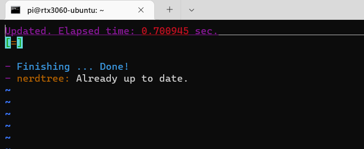
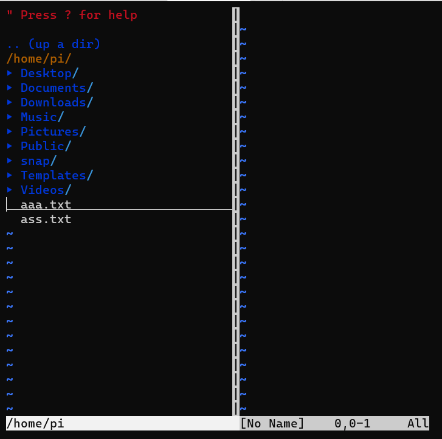
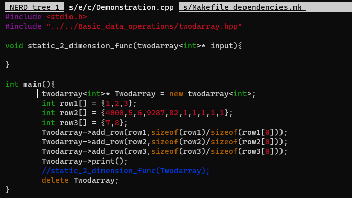

## 	vim-plug
1. 安装vim-plug插件管理器

[下载](https://github.com/junegunn/vim-plug)后放到~/.vim/autoload目录中(这个目录可能不存在，需要手动新建)

不过这个时候开vim可能看不到安装完vim-plug的差别，需要在home目录里新建一个.vimrc，告诉vim-plug你需要管理的插件列表

------

先随便写点，call plug#begin()和call plug#end()中间的内容是插件名称，nerdtree是一个知名插件，就先拿它举例

```
call plug#begin()
Plug 'preservim/nerdtree'
Plug 'vim-airline/vim-airline'
Plug 'vim-airline/vim-airline-themes'
call plug#end()
```

保存，再重启vim，在底线命令模式里敲:PlugUpdate应该会有反应，如下是已经更新成功时的消息截图

<div align=left></div>


## NERDtree

终端输入vim进入编辑器后，输入:NERDTree进入NERDTree的界面

<div align=left></div>

上下移动光标，`enter`打开文件夹，文件打开可以用`enter`（在上图的右侧打开并且将光标移动到右侧的文件），也可以敲`go`（在上图的右侧打开但光标保持在目录树上）， 也可以用`t`（新建"标签页"，在其中打开）

输入:q退出至单纯的文件树界面，再输入:q彻底退出

标签页效果：

<div align=left></div>

按`ctrl`+`PgUp`与`ctrl`+`PgDn`直接切换标签页，退出标签页还是`:q`，移动某个标签页到最后：`:tabm`

------

刷新列表：

按`r`

| 功能                | 快捷键 | 解释                                                         |
| ------------------- | ------ | ------------------------------------------------------------ |
| 新建文件            | ma     | 在要创建文件的目录中按命令 ma然后键入你要创建的文件名称即可。 |
| 删除文件            | md     | 在要删除的文件上按命令md然后输入y回车即可。                  |
| 移动文件/修改文件名 | mm     | 在要修改的文件上按命令mm然后输入对应的目录和名称回车即可。   |

## YouCompleteMe自动补全插件

1. 安装git、cmake

2. 安装vim-plug（见前）

3. 安装Vundle

```bash
git clone https://github.com/VundleVim/Vundle.vim.git ~/.vim/bundle/Vundle.vim
```

3. 编辑~/.vimrc:

开头添加：

```lua
set nocompatible
filetype off
set rtp+=~/.vim/bundle/Vundle.vim
```

在call plug#begin()与call plug#end()中加入：

```lua
call vundle#begin()
Plugin 'VundleVim/Vundle.vim'
call vundle#end()
```

结尾插入：

```lua
filetype plugin indent on
```

5. 启动vim, 并输入
   :PluginInstall

6. 克隆YCM项目

```bash
cd ~/.vim/bundle
git clone https://github.com/ycm-core/YouCompleteMe.git
cd ~/.vim/bundle/YouCompleteMe
git submodule update --init --recursive
```

7. 编译（要依赖python）

```
./install.py
```

8. 编译完成后，在刚才call vundle#begin()与call vundle#end()中添加

```
Plugin 'ycm-core/YouCompleteMe'
```

9. 再次运行:PluginInstall

   

## VIM-Plug安装插件时，频繁更新失败，或报端口443被拒绝等

因为中国地区访问像 **github** 这种国外网站很不稳定, 所以在一般都是采用镜像网站的方式间接访问. 而 **vim-plug** 下载时都是用的实际网站, 我们可以修改 **plug.vim** 来将实际网站变为镜像网站, 提高下载成功率.

在 **plug.vim** 中搜索 [github](https://so.csdn.net/so/search?q=github&spm=1001.2101.3001.7020), 修改两条语句，即可成功下载GitHub资源。 

1 将该行

```Lua
let fmt = get(g:, 'plug_url_format', 'https://git::@github.com/%s.git')
```
 改为
```Lua
let fmt = get(g:, 'plug_url_format', 'https://git::@hub.fastgit.xyz/%s.git')
```

2 将改行

```Lua
\ '^https://git::@github\.com', 'https://github.com', '')
```
改为
```Lua
\ '^https://git::@hub.fastgit\.xyz', 'https://hub.fastgit.xyz', '')
```

> 注：先在浏览器里测试下这网站能不能登，可能这网站改域名了！

