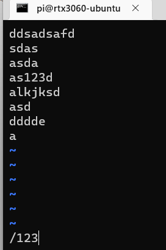
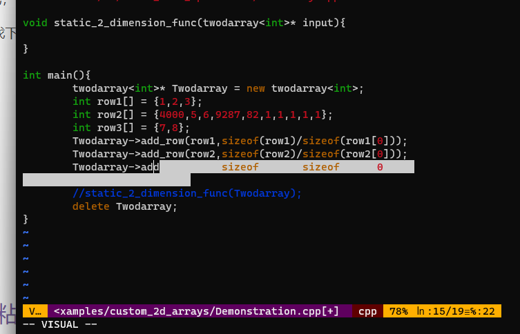

## 搜索

无需进入底线命令模式，普通模式下按`/`然后敲想找的内容，如我想寻找123，就如下图，摁回车就会寻找

摁回车后直接摁`n`寻找下一个，按`CAPS`后再按`n`，即输入大写n，寻找前一个

## 选中、复制、粘贴

普通模式下按v进入visual模式，这个时候移动光标会选中文字

然后按y复制选中的内容同时退出visual模式进入普通模式

除了用上述方法复制以外，还可以在普通模式下：双击y复制一整行，双击d剪切一整行

普通模式下按p进行黏贴

## 撤销、重做

普通模式下u撤销，ctrl+r重做

## 显示行号

方法一：
1、显示当前行行号，在VI的命令模式下输入

:nu
2、显示所有行号，在VI的命令模式下输入

:set nu

方法二：
使用vi编辑~/.vimrc文件或者/etc/vimrc文件，在该文件中加入一行"set nu"，添加内容不含引号， 命令如下：

vi ~/.vimrc

## 运行一些shell命令

1. ctrl+z

（其实这个不是vim的技能，是shell的）

在任意进程中按下ctrl+z以挂起当前的任务，进入一个新的shell，可以做一些指令，然后按fg回到原先的进程

适合暂时离开 Vim 但需要执行多条命令的场景。 例如暂时挂起 Vim 去创建一个新的文件

2. 底线命令模式中:!+命令

如:!ls -al

## 代码折叠

:set foldmethod=indent

然后在normal模式下`zo`打开折叠，`zc`关闭折叠