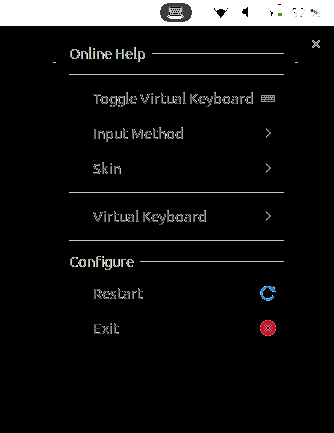
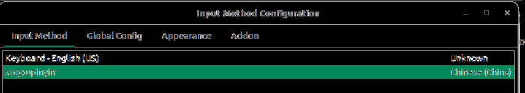

先开Software & Updates，修改Download From选项框，选择China里的mirrors.aliyun.com

再去自带的应用商店，搜索fcitx，下载Fcitx，Fcitx Configuration

sudo apt purge ibus

打开语言&输入法(language support)，选择keyboard imput method system 为fcitx4或fcitx

重启，右上角应该会出现一个键盘

sudo apt install libqt5qml5 libqt5quick5 libqt5quickwidgets5 qml-module-qtquick2

sudo apt install libgsettings-qt1

[下载](https://pinyin.sogou.com/linux)

sudo dpkg -i 刚才下载的搜狗输入法.deb

重启

装完后去应用列表里找fcitx configuration(拿笔的linux企鹅)

应该里面已经出现sogou了

如果没有，就去点下面的加号，把only show current language反选掉，然后搜索sogou，应该会出现的