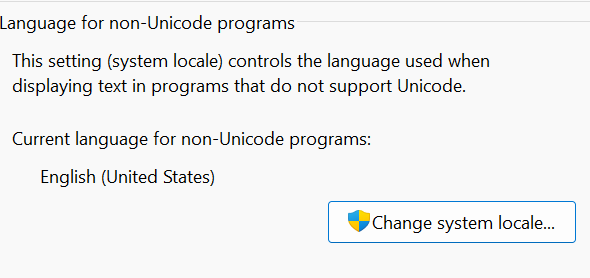
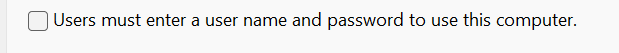

> 删除win+w出现的小组件
>
> winget uninstall MicrosoftWindows.Client.WebExperience_cw5n1h2txyLewy

> 开启/关闭hibernate
>
> powercfg.exe /hibernate on
> 
> powercfg.exe /hibernate off

> 神他妈微软默认不支持H265，还要买，其实这H265解码器是免费的
> 只是免费版有个非常奇葩以至于一般人搜不到的名字“**来自设备制造商的 HEVC 视频扩展**”
>
> https://apps.microsoft.com/store/detail/hevc-video-extensions-from-device-manufacturer/9N4WGH0Z6VHQ

> win+e file explorer

> vscode写c++第一个花括号不要换行
>
> https://blog.csdn.net/qq_43657442/article/details/112302740

> 搜索软件包名：get-appxpackage \*软件包部分名称\*
>
> 搜索并删除：get-appxpackage \*软件包部分名称\* | remove-Appxpackage 
>
> 那个星号输入命令的时候是要打的

> 提升系统文件夹权限
>
> www.izshi.cn/article/1265676

>英文版windows部分中文乱码
>
>设置->language&region->Administrative Language Settings->
>
>

> 强制取消登录密码：
>
> win+r，netplwiz，取消勾选如下，要求输入新密码时什么都不写就能取消
>
> 