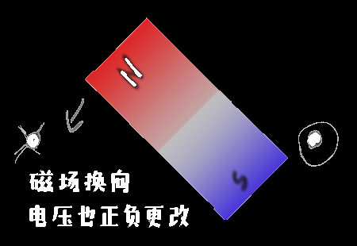

## 附：大手子定则

## 为什么输出电压的与发电机旋转的角频率相等？

设设电机转动角速度 $\omega=4\pi/s$，即0.5秒能转一圈，则 $t时刻的角度为\psi=t\omega$

| 时刻 $t$                    | 角度 $\psi$ | 图示                                                         | 输出电压u |
| --------------------------- | ----------- | ------------------------------------------------------------ | --------- |
| 0.0000                      | 0π/4=0°     |  | 5v        |
| 0.0625                      | 1π/4=45°    |  | 3.54v     |
| 0.1250                      | 2π/4=90°    |  | 0v        |
| 0.1875                      | 3π/4=135°   |  | -3.54v    |
| 0.2500                      | 4π/4=180°   |  | -5v       |
| 0.3125                      | 4π/4=225°   |  | -3.54v    |
| 0.3750                      | 5π/4=270°   |  | 0v        |
| 0.4375                      | 6π/4=315°   |  | -3.54v    |
| 0.5000（相当于回到原点t=0） | 7π/4=360°   | 同1                                                          | 5v        |

描点法作出上图t-u的图像，发现与 $u=\sin(4\pi t)$的图像吻合，函数的角频率正好等于电机的角速度

 **电机旋转**一圈 即对应 输出电压完成一个**正负周期**，因此电机旋转一周的时间 等于 输出电压(理想波形应该为正弦波)完成一个周期的时间

t相同，转过总角度都为2π，故角速度为同一个值

## 为什么是三相交流？不能是二相或单向吗？

这是单向交流发电机，根据左手定则可得磁铁同时切割了线圈左右两侧，因此产生了电压

------

但是交流电机这么大，只塞一个线圈有点太空了，不妨相隔90°再塞一个，此时就引出了两组交流电压

蓝色线圈在磁铁旋转到0°时的电压 等于 黄色线圈在磁铁旋转到90°时的电压

蓝色线圈在磁铁旋转到20°时的电压 等于 黄色线圈在磁铁旋转到110°时的电压

蓝色线圈在磁铁旋转到40°时的电压 等于 黄色线圈在磁铁旋转到130°时的电压

因此黄色线圈上的电压总是比蓝色线圈的电压晚90°，这个结论表现在电压的`正弦表达式`中则为：两函数相位角相差90°

------

不过塞两个线圈还是有点空，不妨再加一个，使各个线圈间的夹角为120°

蓝色线圈在磁铁旋转到0°时产生的电压 等于 黄色线圈在磁铁旋转到120°时的电压

……

蓝色线圈在磁铁旋转到0°时产生的电压 等于 黄色线圈在磁铁旋转到240°时的电压

……

同理，三个电压的`正弦表达式`的相位差为120°

## 三相交流的`相电压`

发电厂使用的交流发电机一般为三相交流发电机，三相交流发电机那就有三个线圈在里面

一个线圈有两极，三个线圈有六个引出电极，要怎么接才是三相交流？

三相交流发电机大概就长这样，只不过真实的线圈会密集一些

可以把三个线圈共地，然后这根引出的线就叫`零线(null line或earth line)`，其余的三根叫`火线(fire line)`

则若想知道`火线`的电位，则应把电压表的负极/com口接在`零线`上，电压表正极接在对应的火线上，这样测的电压值可以叫以零线为参考点的电位，也可以称作`相电压`，而火线与火线之间的电位差，被称作`线电压`

若像如下连接电压表

则测得的电压（u关于t的图像）应形如：

或者使用向量图表示（因为实际上的电压值只取向量的纵轴高度，浪费了x轴维度的信息，因此只能再加上时间维度，即用动图的表现电压随着时间的变化）

## 三相交流的`线电压`

三相交流电中火线之间的==电压差==，即`线电压`，因此这个电压也是个向量，值为两个火线电压向量的差，长度为任意火线向量的 $\sqrt3$倍，夹角为30°

> 可以借助向量减法的几何意义帮助理解，向量相减即两个向量尾部相连，差向量由减数向量==指向被减数==向量，然后将它移动回原点就行
>
> 

>
> 此图组成了一个顶角为120°三角形，故(初中学的三角形顶角120°，三边比为 $1,1,\sqrt3$)差向量的长度为原火线电压向量长度的 $\sqrt 3$倍，夹角根据平行线可以推得。

## 三相电的实际用途

如果上图所示的发电机说能产生220v的`相电压`，则可以把一个工作电压为220v的电器接在AB间，CB间或DB间，或者把一个工作电压为380v的电器接在AC间，AD间或CD间