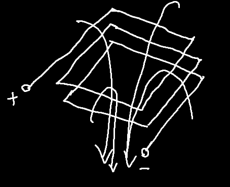
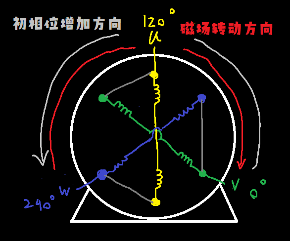

## 三相电机接线盒

## 线圈简化、电机定子抽象化

以下是一个普通的线圈：

如果通入电流，则根据`右手导线磁场定则`，可画出磁场

当然，上图的磁场也可以使用`右手通电螺线管磁场定则`画出，画完后会惊奇地发现，用`右手导线磁场定则`画出的磁场同向叠加起来就是`右手通电螺线管磁场定则`的磁场

所以`右手定则`能同时使用于导电和通电螺线管的原因就是同向的磁场能相互叠加

------

通常，交流电机有三个线圈，六个接线头

但是这样画起来会很麻烦，因此可以使用刚才的方法将平行的一扎线抽象为一根

虽然是抽象为一根导线，但是它的意义是为了制造磁场，因此将每对“导线”抽象为一对电感，因此电动机的抽象电路表达是这么得来的

> 上图已经默认给电机接好△连接了，因为这种连接方式实际使用的比较多

## 定子内的磁场如何随时间转动？

$$
绿v(t)=220\sqrt2\sin(100\pi t)\\
黄u(t)=220\sqrt2\sin(100\pi t+\dfrac23\pi)\\
蓝w(t)=220\sqrt2\sin(100\pi t-\dfrac23\pi)\\
$$

> 注：
>
> U~max~为最大压差
> 下表的示图中粗线表示流经的电流较强（线圈间电压差越大，流经电流越大）
> 电位值是以零线为参考点的

| 时间                                                         | 周期  | 事件                               | V~u~黄 | V~v~绿 | V~w~蓝 | U~max~ | 电机                                                         | 综合磁场方向                                                 |
| ------------------------------------------------------------ | ----- | ---------------------------------- | ------ | ------ | ------ | ------ | ------------------------------------------------------------ | ------------------------------------------------------------ |
| $t=\dfrac {0T}{4}+\dfrac{\psi_v}{\omega}=\dfrac{0\times\dfrac{1}{50}}{4}+\dfrac{0}{100\pi}\\=0.0000$ | 0/12  | V~v~为0                            | 269    | 0      | -269   | 538    |  |  |
| $t=-\dfrac T4+\dfrac{\psi_w}{\omega}=-\dfrac{\dfrac{1}{50}}{4}+\dfrac{\dfrac{2}{3}\pi}{100\pi}\\\approx0.00167$ | 1/12  | V~w~最小 | 156    | 156    | -311   | 467    |  |  |
| $t=-\dfrac {2T}4-\dfrac{\psi_u}{\omega}=-\dfrac{\dfrac{1}{50}}{2}-\dfrac{\dfrac{2}{3}\pi}{100\pi}\\\approx0.00333$ | 2/12  | V~u~为0                            | 0      | 269    | -269   | 538    |  |  |
| $t=\dfrac T4+\dfrac{\psi_v}{\omega}=\dfrac{\dfrac{1}{50}}{4}+\dfrac{0}{100\pi}\\=0.00500$ | 3/12  | V~v~最大   | -156   | 311    | -156   | 467    |  |  |
| $t\approx0.00667$                                            | 4/12  | V~w~为0                            | -269   | 269    | 0      | 538    |  |  |
| $t\approx0.00833$                                            | 5/12  | V~u~最小 | -311   | 156    | 156    | 467    |  |  |
| $t=0.01000$                                                  | 6/12  | V~v~为0                            | -269   | 0      | 269    | 538    |  |  |
| $t\approx0.01167$                                            | 7/12  | V~w~最大   | -156   | -156   | 311    | 467    |  |  |
| $t\approx0.01333$                                            | 8/12  | V~u~为0                            | 0      | -269   | 269    | 538    |  |  |
| $t=0.01500$                                                  | 9/12  | V~v~最小 | 156    | -311   | 156    | 467    |  |  |
| $t\approx0.01667$                                            | 10/12 | V~w~为0                            | 269    | -269   | 0      | 538    |  |  |
| $t\approx0.01833$                                            | 11/12 | V~u~最大   | 311    | -156   | -156   | 467    |  |  |

由此可见，当交流电正好走过一个周期时，电机也旋转了一圈。由于上图中一根火线对应着两根线圈（三根火线就是六根线圈），所以这种简易的三相交流电动机称为“`磁极对数为1`的电动机”，普通工频交流为50Hz，因此三相交流定子产生测磁场旋转速度也为50圈/秒，不过业内一般说圈/分，也就是旋转磁场速度为3000r/min

## 调换电源线以调整转向？

除此之外，从上表中还可以发现，三相异步电机定子产生磁场的方向是 接入三相电初相位增加方向 的==反方向==

因此将电机的==任意两相电源线互换就能== 调换接入三相电初相位增加方向，因此能改变==电机转动方向==

上图是黄绿两相对调，实现了旋转方向的更改，下表展示了蓝绿两相对调时旋转方向具体是怎么变化的

图示（左图是未经对调的，右图是经过对调的）

