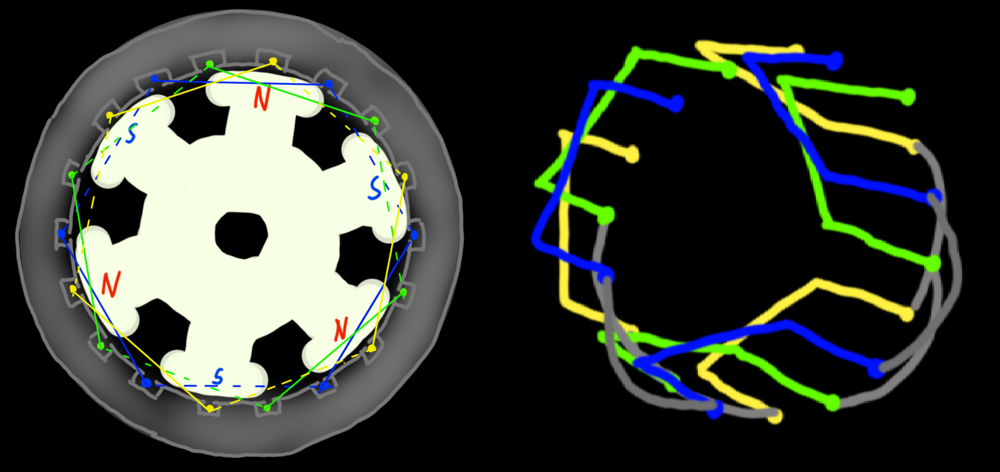
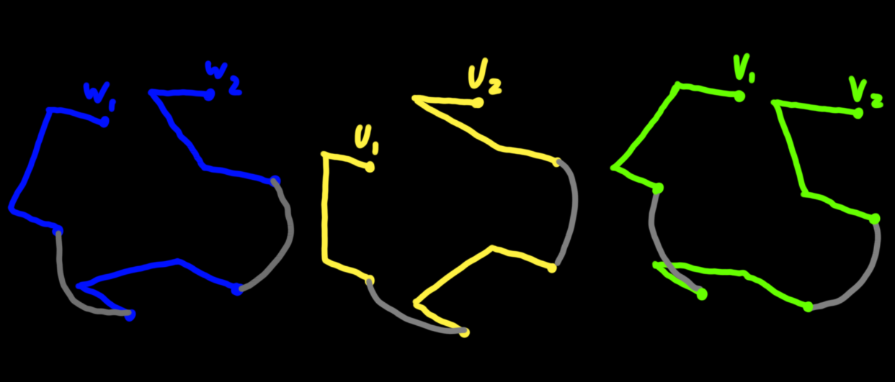
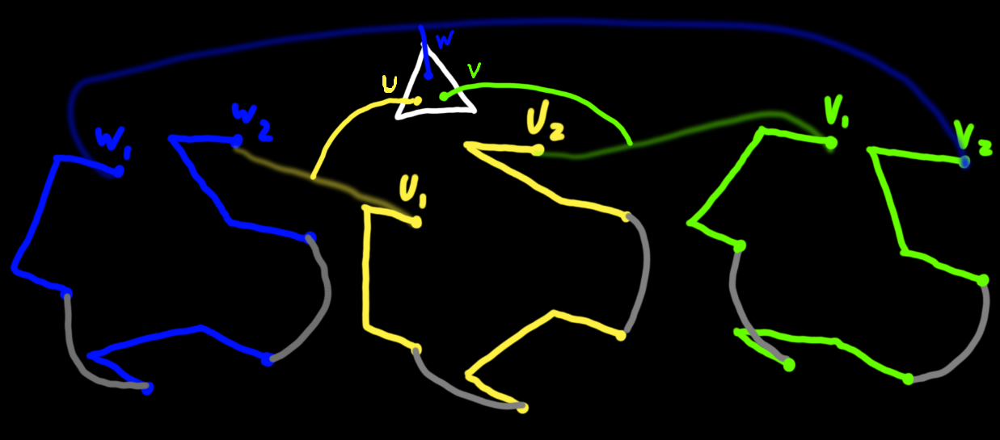
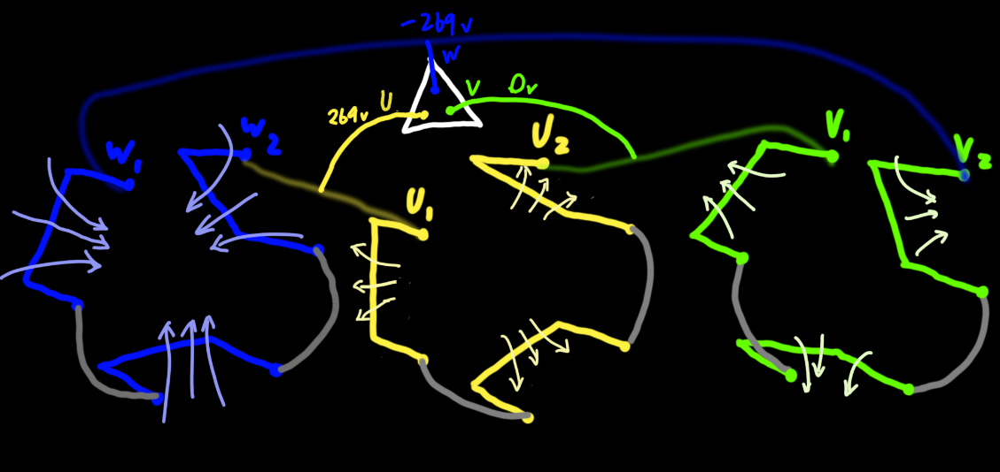
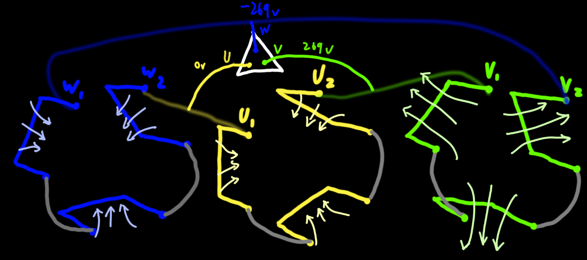
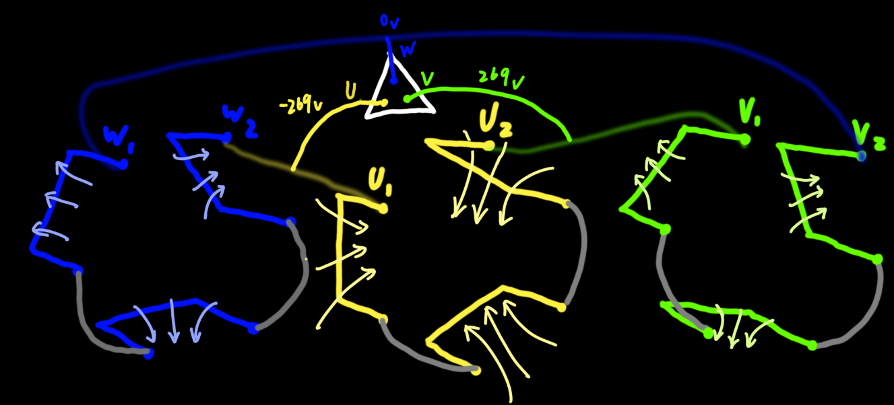
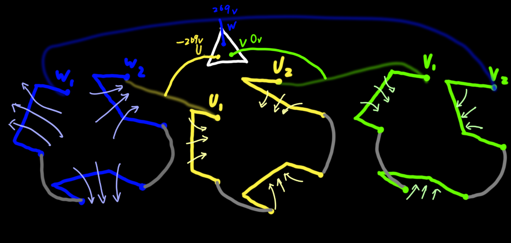
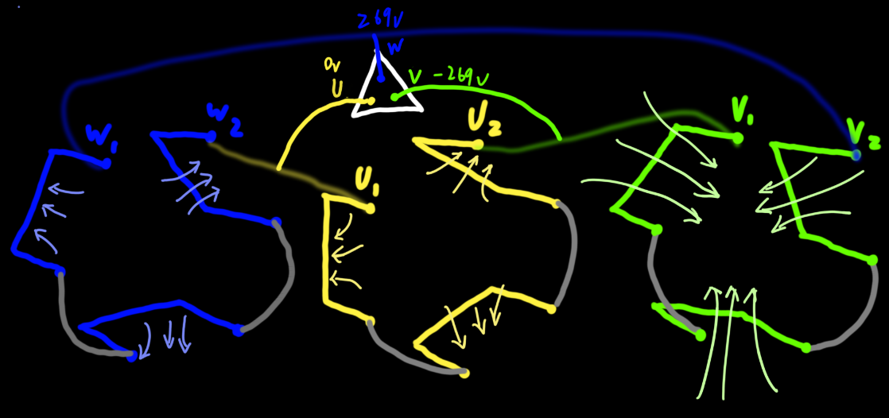
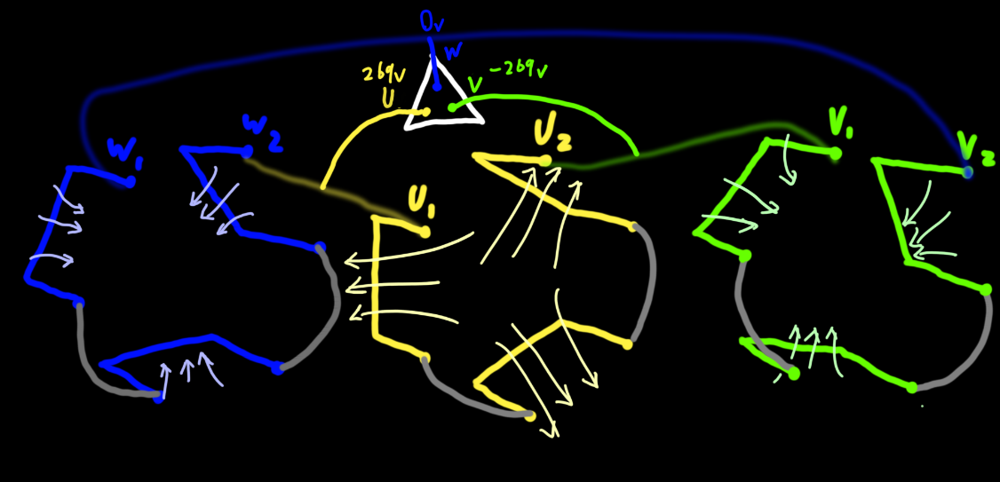

## 磁极对数为3的电机如何旋转？

> 注：下左图为三相3极交流发电机的剖面图，不为三相异步交流电机的剖面图，不过区别只在于转子，这两种电机的定子是差不多的

这是一个磁极对数为3的电机抽象图，故总共有3\*2\*3=18个线圈，每个线圈之间的夹角为20°，拆开来就是下图

如果按照△连接：

|             | 周期 | W线圈              | U线圈              | V线圈              |
| ----------- | ---- | ------------------ | ------------------ | ------------------ |
| $t=0.00000$ | 0/12 | 磁场向内，强度很大 | 磁场向外，强度一般 | 磁场向外，强度一般 |

|                   | 周期 | W线圈              | U线圈              | V线圈              |
| ----------------- | ---- | ------------------ | ------------------ | ------------------ |
| $t\approx0.00333$ | 2/12 | 磁场向内，强度一般 | 磁场向内，强度一般 | 磁场向外，强度很大 |

|                   | 周期 | W线圈              | U线圈              | V线圈              |
| ----------------- | ---- | ------------------ | ------------------ | ------------------ |
| $t\approx0.00667$ | 4/12 | 磁场向外，强度一般 | 磁场向内，强度很大 | 磁场向内，强度一般 |

|                   | 周期 | W线圈              | U线圈              | V线圈              |
| ----------------- | ---- | ------------------ | ------------------ | ------------------ |
| $t\approx0.01000$ | 6/12 | 磁场向外，强度很大 | 磁场向内，强度一般 | 磁场向内，强度一般 |

|                   | 周期 | W线圈              | U线圈              | V线圈              |
| ----------------- | ---- | ------------------ | ------------------ | ------------------ |
| $t\approx0.01333$ | 8/12 | 磁场向外，强度一般 | 磁场向外，强度一般 | 磁场向内，强度很大 |

|                   | 周期  | W线圈              | U线圈              | V线圈              |
| ----------------- | ----- | ------------------ | ------------------ | ------------------ |
| $t\approx0.01667$ | 10/12 | 磁场向内，强度一般 | 磁场向外，强度很大 | 磁场向内，强度一般 |

## 总结

当输入的各相交流电经过一个周期时，每个线圈产生的磁场方向、强度的周期为：

向内一般 -> 向内很大 -> 向内一般 -> 向外一般 -> 向外很大 -> 向外一般 ->

同时，当输入交流电经过一个周期，整个磁场旋转的角度为120°（1/3圈），当交流电频率为50Hz时，能转 $50\times\dfrac13$圈，即转速为1000r/min

## 对于任意磁极数量的电机的结论

$$
n_0=\dfrac{60f_1}{p}(r/min)
$$

式中：

$n_0$——旋转磁场的转速

$p$——电机的磁极对数

$f_1$——电机的转速