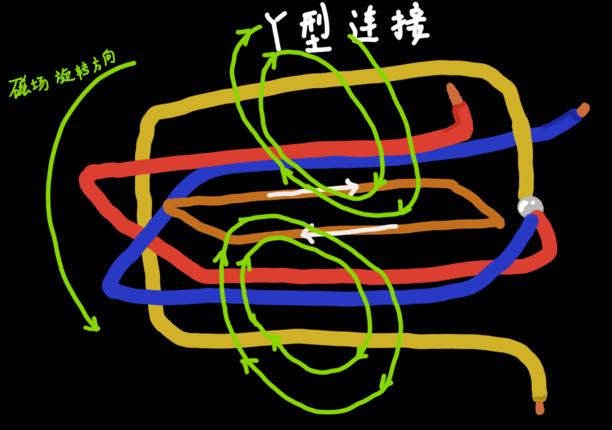
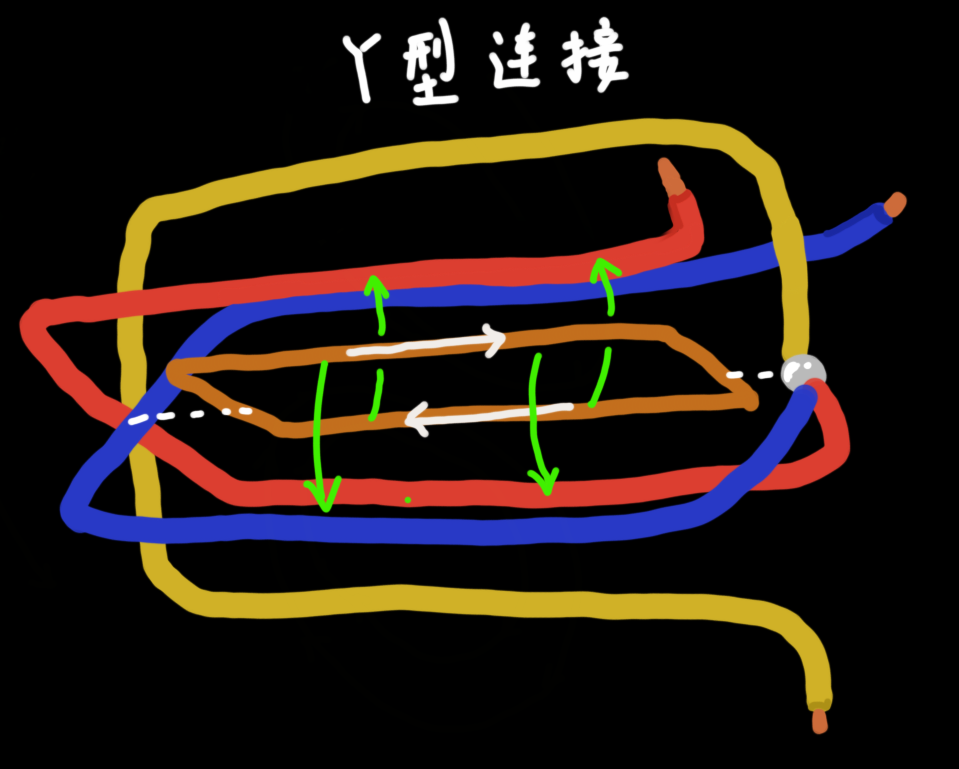
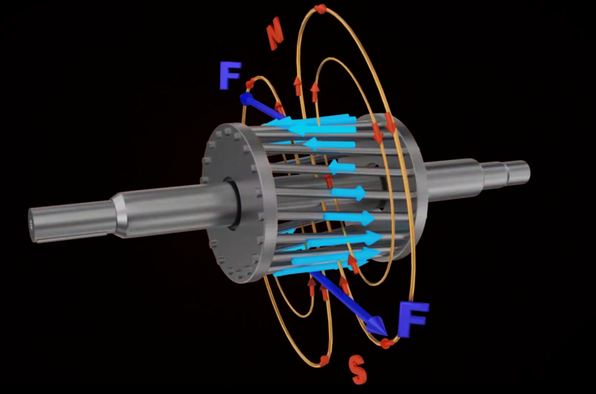

## Three-Phase Induction Motor

The induction motor has three main parts: The `Stator定子`(the stationary part) and The `Rotor转子`(Rotating part).

#### The Stator:

When a three-phase current passes through the winding shown below，it will create a rotating magnetic field, which has the acronym of `RMF`. This `RMF` is the stuff that causes the rotor to turn.

See how the rotating magnetic field is generated through this chapter [《三相电机(1磁极)-转子.md》](三相电机(1磁极)-定子.md) and [《三相电机(3磁极)-定子.md》](./三相电机(3磁极)-定子.md)

The rotational speed of the magnetic field is known as the `Synchronous speed`(同步转速$N_s$)

#### The Rotor：

Assume that you are putting a close conductor inside the magnetic field. According to Faraday's law, because the magnetic field is varying, thus an `EMF`(感应电动势) is generated in the loop. And the `EMF` produces current.

Thus, the situation has become like a current-carrying loop situated in the magnetic field. 

According to the `Lorentz's force Law`, an electric magnetic force will be produced on the loop. 

So  then, the loop will start to rotate. (Personally thinking, this phenomenon can also be explained by the `Lenz's Law`?)

The same phenomena occurs in an `induction motor` as well. Here, instead of a simple loop, something very similar to a squirrel cage is used `即鼠笼式转子`.

So as in the previous case, current will be induced in the bars of the cage. 

 

And the current is ==shorted== by end rings, so the `Rotor` will start to rotate.

> that's why the motor is called "Induction motor". Electricity is induced on the rotor with the help of `electromagnetic induction`, rather than direct connection
>
> And to aid such electromagnetic induction, `isolated iron core laminae`(绝缘硅钢片) are pacted inside the rotor. Such small pieces of iron ensures that any current loss in minimized.

## Determination of rotation speed

As you can see, both magnetic field and the `Rotor` is spinning. But what speed will the `Rotor` rotate? 

> `Rotor` speed=N~Rotor~ A.K.A `Asynchronous speed`

To obtain the answer of this answer, let's consider different cases.

#### assume: N~s~=N~Rotor~

Consider a case where the rotor speed(N~Rotor~) is the same as that of the magnetic field(N~s~). Due to the fact that both of them are rotating at the same speed, The magnetic field will never have the chance to cut the <u>rotor loop</u>(Squirrel cage bar). Hence, there will not be any induced `EMF` and current.

This translates to ZERO force on the <u>rotor bar</u>, and the `Rotor` will gradually slow down. When it slows down, the magnetic field will cut the <u>rotor loop</u>. Therefore, the induced current and force will rise again. The rotor will again speed up.

#### conclusion:

The rotor will never be able to catch up with the speed of the magnetic field. (N~s~<N~Rotor~)

It rotates at a specific speed which is ==slightly less== than the `Synchronous speed`

The difference between the synchronous and the rotor speed is known as the `Slip`(转差率), and is usually around 2-6%
$$
Slip=\dfrac{N_s-N_{Rotor}}{N_s}
$$
当电动机空载运行时，转速 $N_{Rotor}$ 迅速增大至同步转速 $N_s$ ，转差率达到最小。

但是，当电机刚启动时发生堵转，转差率就会达到最大（Slip=1），旋转磁场与转子导体的切割速度达到最大，因此转子和定子之间的电流也达到了最大，通常为额定值的 4\~7倍，会引起电机烧毁