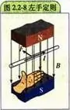
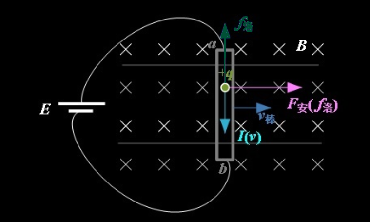

## 法拉第电磁感应定律

> 注：Magnetic Flux磁通量 $\phi=B(特)\times S(m^2)$

电路中感应`电动势`的大小，跟穿过这一电路的`磁通变化率`成正比，若感应电动势用 $\varepsilon$ 表示，则 $\varepsilon(伏)=\dfrac{d\phi(韦伯)}{dt(秒)}$，这就是法拉第电磁感应定律。

若闭合电路为一个 $n$ 匝的线圈，则 $\varepsilon(伏)=n\dfrac{d\phi(韦伯)}{dt(秒)}$ 

## 楞次定律(基于法拉第电磁感应)

简单来说就是：感应电流产生的磁场总要 ==**阻碍**== 引起应电流的磁场的磁通量的变化

或：感应电流的效果总是反抗引起感应电流的原因

> 楞次定律可以理解为是`能量守恒定律的一种体现`，如果将一个磁铁毫无费力地推入线圈，然后产生电能，点亮了一颗小灯，如果不存在楞次定律，那小灯是怎么亮的，能量凭空出现了？？但是在有楞次定律存在的情况下，就会产生对推入磁铁的阻力，这份阻力所做的负功（也就是推入磁铁时消耗的力气）就是小灯的能量来源。

#### 增反减同

所以，原磁场增大，电流就会产生一个和原来磁场 ==**相反**== 的磁场以 **==阻碍==** 原磁场的扩大。（因为是阻碍，所以这里不能抵消原磁场的变化，但是能够减慢其变化。）这个就是 **==增反==** 。

同理，原磁场减小，电流就会产生一个和原来磁场 **==相同==** 的磁场以 **==阻碍==** 原磁场的减小。这个就是减同。

#### 空载线圈不存在楞次反应

注意楞次定律所说的是感应电流要反抗磁场，比如说当一个大磁铁经过一个两极没有任何负载的线圈时，是不会产生任何阻力的。虽然根据`法拉第电磁感应定律`，能在线圈的两极产生电压，但是由于什么也没有接，相当于阻抗=∞，根据欧姆定律 $I=\dfrac UR$，电流为0，因此不会产生阻力。

但是在短接线圈后，电流达到最大，因此就产生了阻力。

## 安培力

`安培力`是通电导线在磁场中受到的作用力

可表述为：以电流强度为$I$的长度为$L$的直导线，置于磁感应强度为$B$的均匀外磁场中，则导线受到的安培力的大小为$f=IBL\sinα$，式中$α$为导线中的电流方向与$B$方向之间的夹角，f、L、I及B的单位分别为N、m、A及T

> 因此磁场方向垂直于导体棒所在的平面时 安培力可以达到最大

而`安培力`的方向由`左手定则`判定。

## 洛伦兹力

洛仑兹力是指带电粒子在磁场中受的力且==永远不做功==，即磁场对运动电荷的作用力。表达式：$F=qvB\times \sin(v,B)$

其中，$F$是洛伦兹力， $q$是带电粒子的电荷量 ，$E$是 电场强度 ， $v$是带电粒子的速度， $B$是 磁感应强度

方向判断：将`左手`掌摊平，让磁感线穿过手掌心，四指表示`正电荷` `运动方向`，则和四指垂直的大拇指所指方向即为洛伦兹`力的方向`。

> 但须注意，运动电荷是正的，大拇指的指向即为洛伦兹力的方向。反之，如果运动电荷是负的，仍用四指表示电荷运动方向，那么大拇指的指向的反方向为洛伦兹力方向。

* 安培力是洛伦兹力的`宏观表现`，洛伦兹力是安培力的`微观本质`

## 洛伦兹力与安培力的实际关系

洛伦兹力对运动电荷 ==不做功== 的特点是显而易见的，安培力的微观解释又是 ==大量运动电荷== 所受洛伦兹力的 ==合力==，然而安培力却<u>可以对通电的导线做功</u>。这该如何解释？

假设上图的导体中有一些正电荷，电荷量为 $q$。正电荷在电源 $E$ 的作用下，正电荷的定向移动速度为 $v$ ，同时设导体棒的质量为 $m$ ，均匀磁场的强度为 $B$ ，不计算导体棒与滑动条的摩擦，则：

> 注：$I=\dfrac qt$

$$
F_安=qvB(因为假设了整个导体中只有这些正电荷，因此导体棒受到的洛伦兹力就是安培力)\\
a_棒=\dfrac{F_安}{m}=\dfrac{qvB}{m}(牛顿定理，力转加速度)\\
v_棒=a_棒\times t=\dfrac{qvBt}{m}\\
P_安=F_安\times v_棒=\dfrac{q^2v^2B^2t}{m}\\
$$

你以为这个 $P_安$ 就是洛伦兹力所做的功？不完全是。难道你没发现导体棒向右运动起来后，棒内的正电荷q不也得随棒一起运动么？这个运动对于正电荷来说不也得导致其受到一个洛伦兹力么？这个派生的洛伦兹力（严格的说，是`洛伦兹力分量`）大小以及所对电荷所作的功为
$$
f_洛=qv_棒B=\dfrac{q^2vB^2t}{m}\\
P_洛=-f_洛v=-\dfrac{q^2v^2B^2t}{m}
$$

> 注：由于 $f_洛$ 的方向必然是与电荷真正的运动方向相反的，因此做负功，所以 $P_洛$ 计算时是带了负号的

计算结果清楚地显示了这两个分量的功率一正一负、大小相等！

所以正电荷q真正受到的洛伦兹力肯定是没有对它做功的，而我们说安培力对导体棒做功，其实是洛伦兹力的一个分量在做功。但是洛伦兹力的另一个分量一定在做等量的、符号相反的功，只是我们没有关注而已。

