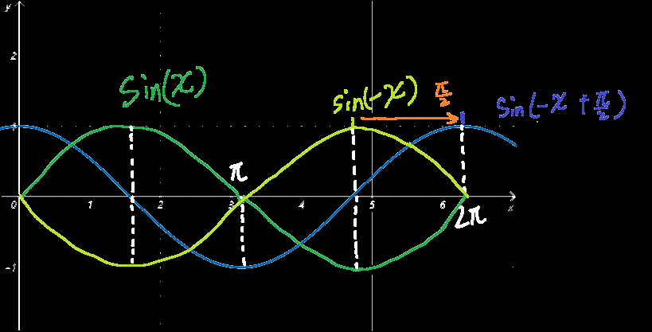
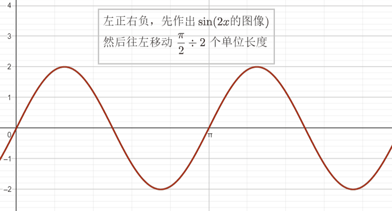
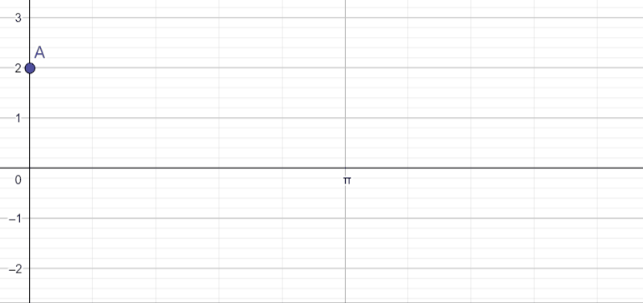
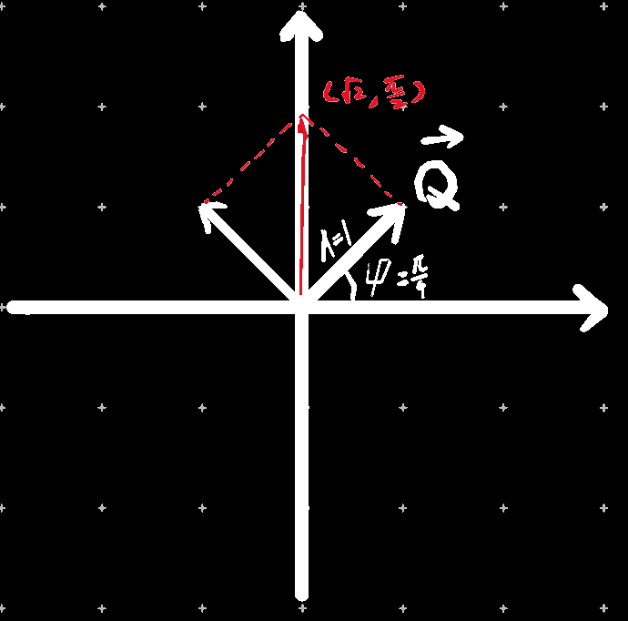
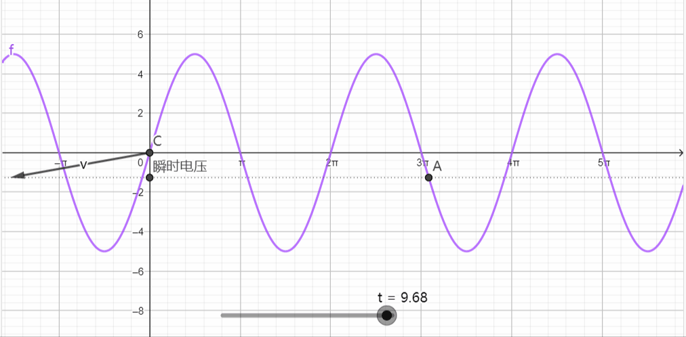
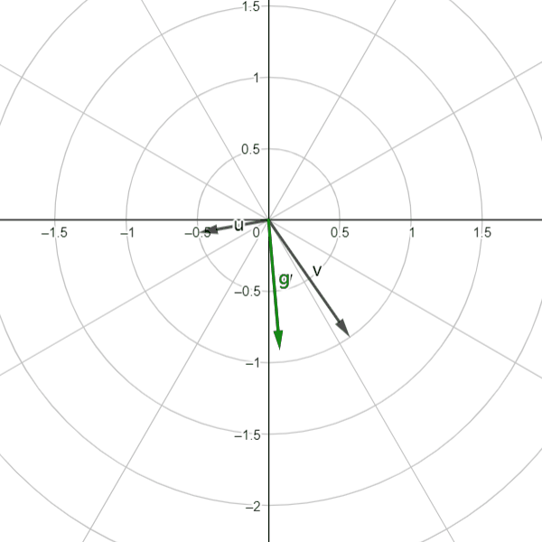
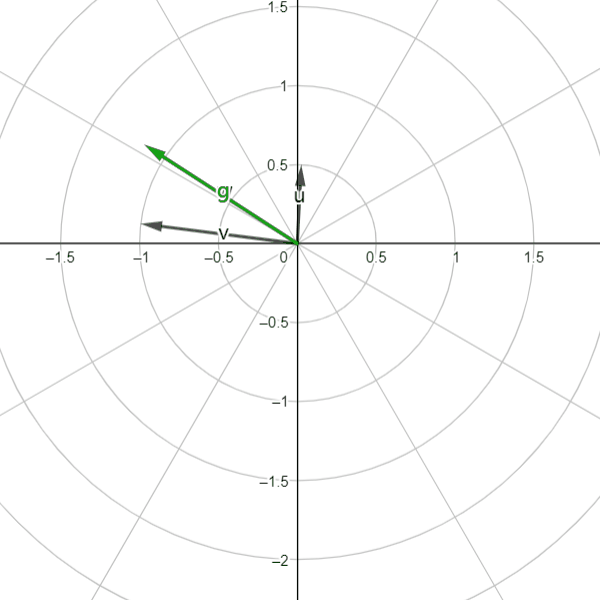

## 正弦函数

$$
y=A\sin \left( \omega x+\psi \right)
$$

  

> $A$——振幅，即波的最高处为A，最低处为-A
>
> $ω$——周期长度 $T=2π/ω$，即$ω$越大，波越密集，完整地一上一下称之为一个周期，即上图绿色部分
>
> 同时，当ω为负时，需要沿x轴翻转图像
>
> $\psi$ ——初始相位，应将图像沿着x轴左右平移，平移φ/ω单位长度，φ/ω为==正向左平移，为负向右平移==
>
> $f$——频率，等于$1/T$

原生的 $sin(x)$为奇函数

注意值域为-A==≤==y==≤==A，用的是小于等于号

## 余弦函数

  

默认图像可以记一下，其余其实跟正弦函数时同理的

因为 $cos(x)$根据诱导公式可以转换为 $sin(-x+π/2)$，也就是 $ω=-1，φ=π/2$的正弦函数，

即把 $sin(x)$的图像沿$x$轴方向翻转一下，然后往右移动 $π/2$个单位长度

> 之后我发现好像 $cos(x)=sin(-x+π/2)=sin(x+π/2)$，所以不用像上图一样解释的那么复杂，就是$sin(x)$往左移$π/2$即可得到$cos(x)$

## 正弦交流电的三要素

1. `频率` $f$，我国电力工业标准频率 为 $50Hz$，少数发达国家为 $60Hz$

2. `周期` $T$，与频率互为倒数

3. `角频率` $\omega$，为正弦量在1秒内经历的弧度数 $\omega=\dfrac{2\pi}{T}=2\pi f$
   如果按照数学课学的，当 $\omega$=0.5时，周期为 $4\pi(秒)$，即过这么久，相当于（转了一圈？），因为三角函数是跟角度挂钩的，函数图像过了一个周期就相当于某种意义上“转了一圈，即 $2π$弧度”
   既然过 $4\pi(秒)$后经历$2\pi$弧度，那么 $1(秒)$后经历 $\dfrac{2\pi}{4\pi}=0.5弧度$，这样好理解 $\omega=\dfrac{2\pi}{T}$的含义了吧

4. `初相角`$\psi$，为了方便理解，最好配合图像，而作出三角函数的图像又有两种方法

   其中一种是配合角频率，然后按**图像平移**的方法作出函数图像

   如下：按"图像平移法"作出 $u=2\sin(2 t+\dfrac{\pi}{2})$的图像

   

   另外一种是：先假设 $t=0$ ,此时计算得到的 $u$ 则为函数的起点，然后后再往后画n个周期即可

   如下：按 "先画起始点再补全周期" 的方法作出 $u=2\sin(2 t+\dfrac{\pi}{2})$的图像

   

   由此可看出`初相角`决定了**正弦量计时初始的状态**

5. `相位差`$\varphi$，为了比较两个==同频率==的正弦量在变化进程中的相位关系，我们引入相位差的概念

   两个同频率正弦量的相位差等于它们的`初相角`之差，与时间无关

   

## 正弦量的瞬时值、最大值和有效值：

1. `瞬时值`

交流电电压随时间变化，因此要用小写字母，电压和电流的瞬时值可分别表示为 $u,i$，如果想要准确地描述瞬时值的电压，需要使用`解析式/正弦量瞬时值表达式`表示
$$
正弦量瞬时值表达式：u=U_m\sin(\omega t+\varphi)，也就是把横轴设为秒，纵轴设为电压
$$

2. `最大值`

   最大值恒为正值，一般用大写斜体字母加下标m组成，$U_m$正好等于`正弦量瞬时值表达式`中的 $U_m$

3. `有效值`

   正弦交流瞬时值是变量，无法确切地反映`正弦量`的做工能力，因此引入了有效值的概念。让两个相同的电阻R分别通过`正弦交流电` $i、u$和`直流电` $I、U$，如果在相同时间内，两种电流在两个相同的电阻上产生的**热量相等**，则把 $I$ 定义为 $i$ 的有效值，则把 $U$ 定义为 $u$ 的有效值

   实验结果和数学分析都可证明，正弦交流电的`最大值`和`有效值`之间存在着一定的**数量关系**
   $$
   I_m=\sqrt2I,\ \ U_m=\sqrt2U
   $$
   在电工技术中，通常所说的交流电一般均指交流电的`有效值`、仪表上展示的一般也是`有效值`

## 代数方法合并两个角频率相同的三角函数~(自己推算的,谨慎参考,可能有误)~

$$
A_1\sin(\omega x+\phi_1)+A_2\sin(\omega x+\phi_2)\\
=A_1\sin \omega x\cos \phi_1+A_1\cos \omega x\sin \phi_1+A_2\sin \omega x\cos \phi_2+A_2\cos \omega x\sin \phi_2\\
=(A_1\cos\phi_1)\sin \omega x+(A_1\sin\phi_1)\cos \omega x+(A_2\cos\phi_2)\sin \omega x+(A_2\sin\phi_2)\cos \omega x\\
=(A_1\cos\phi_1+A_2\cos\phi_2)\sin \omega x+(A_1\sin\phi_1+A_2\sin\phi_2)\cos \omega x\\
设a=\sqrt{(A_1\cos\phi_1+A_2\cos\phi_2)^2+(A_1\sin\phi_1+A_2\sin\phi_2)^2}\\
原式=a(\dfrac{A_1\cos\phi_1+A_2\cos\phi_2}{a}\sin\omega  x+\dfrac{A_1\sin\phi_1+A_2\sin\phi_2}{a}\cos\omega  x)\\
=a\sin(\omega x+\arccos(\dfrac{A_1\cos\phi_1+A_2\cos\phi_2}{a}))\\
=\sqrt{(A_1\cos\phi_1+A_2\cos\phi_2)^2+(A_1\sin\phi_1+A_2\sin\phi_2)^2}\sin(\omega x+\arccos(\dfrac{A_1\cos\phi_1+A_2\cos\phi_2}{a}))\\
$$

## 极坐标转换

极坐标系中的一个**点**转换为笛卡尔坐标系中的一个**点**

（单位长度不变的情况下将笛卡尔坐标系的点映射在极坐标系中）

| 笛卡尔坐标系        | 极坐标系                     |
| ------------------- | ---------------------------- |
| （Acos(φ), Asin(φ)) | (A, φ)                       |
| (x, y)              | (√(x^2^+y^2^), tan^-1^(x/y)) |

## 几何方法合并两个角频率相同的三角函数

$$
设有一个向量\vec{a}，它的平面直角坐标系坐标为(A_1\cos(\omega x+\phi_1),A_1\sin(\omega x+\phi_1))\\
根据平面直角坐标系坐标可得：A_1\sin(\omega x+\phi_1)的值等于向量\vec{a}在y轴上的数量投影\\
\#既然这个向量只有y轴坐标发挥了作用，那我x轴为什么不随便取个数？答:因为x设置为这样能更方便地转为极坐标形式\\
\left< \vec{a},\vec{i} \right>=\arctan\left(\dfrac{A_1\sin(\omega x+\phi_1)}{A_1\cos(\omega x+\phi_1)}\right)=\arctan\left(\dfrac{\sin(\omega x+\phi_1)}{\cos(\omega x+\phi_1)}\right)
=\arctan(\tan(\omega x+\phi_1))=x+\phi_1\\
|\vec a|=\sqrt{(A_1\cos(\omega x+\phi_1))^2+(A_1\sin(\omega x+\phi_1))^2}=\sqrt{A_1^2\cdot(\cos^2(\omega x+\phi_1)+\sin^2(\omega x+\phi_1))}=\sqrt{A_1^2}=A_1\\
由上可得\vec a的极坐标系坐标为(A_1,\omega x+\phi_1)\\
故证明得：A_1\sin(\omega x+\phi_1)的值等于极坐标向量\vec{a}(A_1,\omega x+\phi_1)在y轴上的数量投影
$$

------

$$
设有一个向量\vec{b}，它的平面直角坐标系坐标为(A_2\cos(\omega x+\phi_2),A_1\sin(\omega x+\phi_2))\\
A_2\sin(\omega x+\phi_2)的值等于向量\vec{b}在y轴上的数量投影\\
同理得\vec b的极坐标系坐标为(A_2,x+\phi_2)\\
再设\vec{c}=\vec{a}+\vec{b}\\
则\vec{c}=(A_1\cos(\omega x+\phi_1)+A_2\cos(\omega x+\phi_2),A_1\sin(\omega x+\phi_1)+A_2\sin(\omega x+\phi_2))\\
∵\vec c在y轴上的数量投影等于A_1\sin(\omega x+\phi_1)+A_2\sin(\omega x+\phi_2)\\
-------\\
故证明得：A_1\sin(\omega x+\phi_1)+A_2\sin(\omega x+\phi_2)=\\
\#极坐标向量(A_1,\omega x+\phi_1)+(A_2,\omega x+\phi_2)在y轴上的投影=\\
\#平面直角坐标系向量(A_1\cos(\omega x+\phi_1)+A_2\cos(\omega x+\phi_2),A_1\sin(\omega x+\phi_1)+A_2\sin(\omega x+\phi_2))在y轴上的投影
$$

## eg

假如要计算sin(x+3π/4)+sin(x+π/4)，可转换为向量Q(1,π/4)+向量Q'(1,3π/4)

这边计算可以用平行四边形法则计算，也可以用化成普通直角坐标系里的向量计算（见三角函数-极坐标系）

计算得到和向量为(√2,π/2)

即sin(x+3π/4)+sin(x+π/4)=√(2)sin(x+π/2)，与带入上方`代数方法合并两个角频率相同的三角函数`的公式化简出的结果是一样的

>  注意这里的有序数对不代表横纵坐标，代表极坐标对(r,θ)

## 将上述思想运用于正弦量中

普通正弦电压 $u$（说实话我感觉这个表述很不严谨，因为这个电压的值是随时间变化的，应该将正弦电压记作一个关于时间的函数）可以通过如上方法转化为`复电压`$\dot{U}_m$，称作相应正弦交流电电压的`最大值向量`

假设正弦电压 $u=U_m\sin(\omega t+\psi)$，

则`复电压最大值向量`的有序数对形式为 $\dot{U}_m=(U_m\cos(\omega t+\psi),U_m\sin(\omega t+\psi))$

复数形式为 $\dot{U}_m=U_m\cos(\omega t+\psi)+j(U_m\sin(\omega t+\psi))$

极坐标系形式为 $\dot{U}_m=\sqrt{(U_m\cos(\omega t+\psi))^2+(U_m\sin(\omega t+\psi))^2}\ang\arctan\left(\dfrac{U_m\sin(\omega t+\psi)}{U_m\cos(\omega t+\psi)}\right)=化简得=U_m\ang(\omega t+\psi)$

上图展示了为什么正弦电压的值可以用`复电压最大值向量`在y轴上的投影表示

## 为什么只能同频率的正弦量相加？(图形理解)

如图所示，v与u是两个可以表达正弦量的向量，其向量坐标的定义选用刚才的$U_m\ang(\omega t+\psi)$（使用极坐标方便向量相加）

可见随着t的推移，这个向量在绕着圆心在不断旋转，已知两个正弦量v与u的 $\omega$相等，因此旋转速度是一样的。

可以看到它们这两个向量的和：g向量，也在进行与v与u同速度的旋转

既然用于描述普通正弦量的向量是匀速旋转的，那么匀速旋转的向量多半就代表一个普通的正弦量

* 因此不严格地得出结论：两同频率的正弦量相加得到的正弦量（准确地表达应该是正弦函数）仍然是正弦量，并且这个和的角频率等于加数正弦量的角频率

但当u与v的角频率不相等时，强行相加得到的和向量g一会长一会短，行为非常叛逆，一点也不像一个良好的用于表示正弦量的向量，故

* 两个非同频率的正弦量相加后和不是正弦量，要是实在想加可以使用和差化积公式
