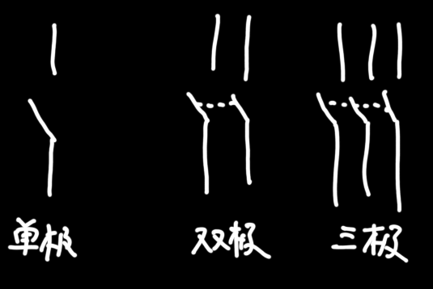
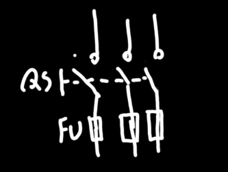
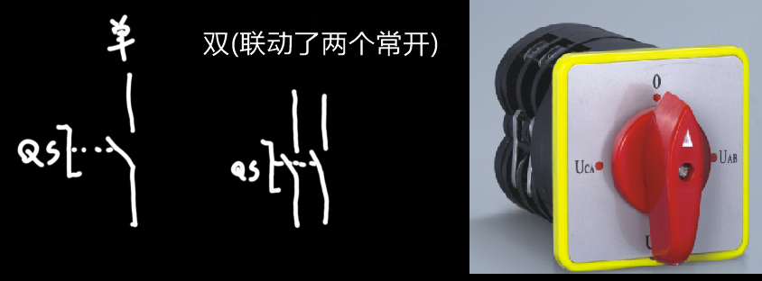
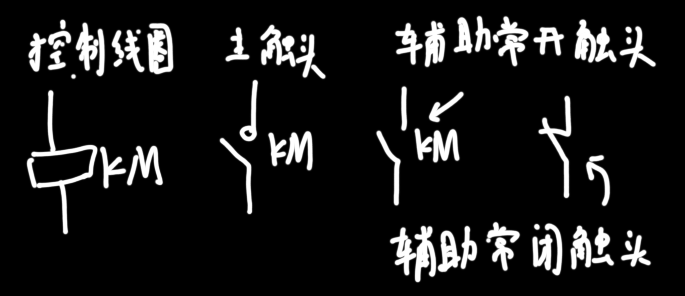
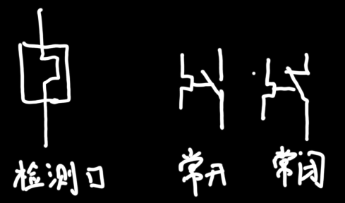
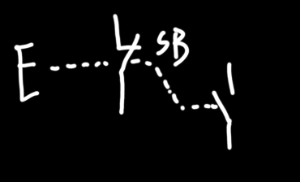

| 名称                           | 字母代号 | 符号                                                         | 描述                                                         |
| ------------------------------ | -------- | ------------------------------------------------------------ | ------------------------------------------------------------ |
| 刀(负荷)开关                   | QS       |  | 非频繁开关电路，总闸                                         |
| 封闭式刀(负荷)开关(自带保险丝) | QS       |  | 比较安全的刀闸                                               |
| 组合开关/转换开关              | QS       |  | 转一下就打开                                                 |
| 低压断路器/空气开关/自动开关   | QF       |  | =闸刀+过电流继电器+失压+热继电器。通过电流的磁效应和热效应防止电流过大时烧毁主要电路。 |
| 熔断器/保险丝                  | FU       |  | 利用电流热效应保护主电路。短路时大量电流流经熔体，产生高温，熔体短时内融化，电路断开。$I_R$熔断器额定电流，$I_e$控制电路额定电流 |
| 交流接触器                     | KM       |  | 属于同一元件编号的交流接触器默认属于同一个元件，互相联动。所以电路图中可能交流接触器的各个组件没放在一起，但并不代表不联动。线圈通电，闭着的触头先断开，开着的触头后关闭。 |
| 继电器                         |          |                                                              | 交流接触器的控制线圈通交流电，继电器的通直流                 |
| 热继电器                       | FR       |  | 主电路的供电线流经检测口，若过流，导致检测口中的双金属片中其中一个弯曲，另外一个不弯曲，因此双金属片产生弧度。弯曲的金属片先顶开闭着的触头，然后接到开着的触头上。 |
| 按钮                           | SB       |  | 按钮，控制小电流的，不建议直接控制主电路（先控制交流接触器，交流）。按钮间也可以联动，常闭按钮与常开按钮间也可以联动。 |

