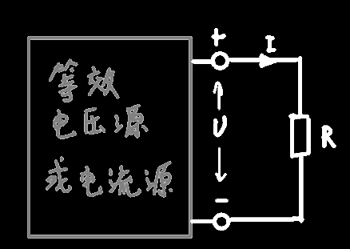
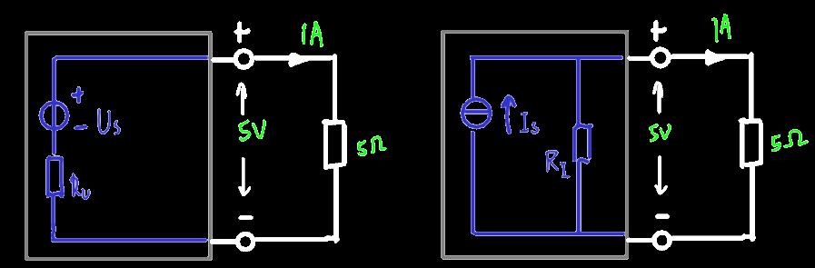

## 定义

理想`电压源`提供的电压值恒定，其提供的电流由它和外电路共同觉定

实际**电压源**的电路模型应是一个理想电压源和一个电阻元件**串联**组合，电阻越**小**越理想

> 为什么是串联一个电阻？因为从常识上看，肯定是电压源输出电流越大，发热越大
> 
> 如果内阻是并联的，则就算输出电流再大，流过内阻的电压都是相同的，故内阻发热不随输出电流增加而增加，不符合上面的常识，故电压源内阻是串联的

------

理想`电流源`提供的电流值恒定，其端电压由它和外电路共同决定

实际**电流源**的电路模型应是一个理想电流源与一个电阻元件**并联**组合，电阻越**大**越理想

> 为什么是并联一个电阻？因为从常识上看，肯定是电流源输出电压越大，发热越大
>
> 如果内阻是串联的，因为发热只跟电流有关系，电流源电压的上升只会导致内阻分得的电压越高，因为是恒流源，因此电流是恒定的，故内阻发热不随输出电压增加而增加，不符合上面的常识，故电流源内阻是并联的

## 等效电压/电流源

定义：当电压源或电流源能给同一个负载输出一样的电压电流时，电压源和电流源就互相等效

