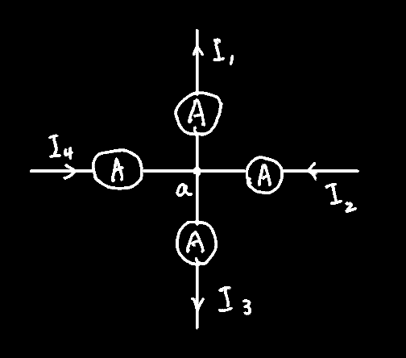

## 电流

导体内部存在**大量自由电子**，当导体两端处在外电场作用下时，导体内的自由电子就会**定向移动形成电流**。

电流的定义式：
$$
i(安培)=\dfrac{dq(库伦)}{dt(秒)}
$$
电流的大小和方向均随时间变化时称为`直流电`

> 电学中不随时间变动的参量用大写英文字母，如："$U、I$"，
>
> 随时间变动的参量用小写英文字母如："$u、i$"

#### 参考方向的概念：

注意电流的实际流向由：参考方向和电流正负实际决定，如下图

假设有这么一个R~1~，先**假设**电流的流动方向为箭头所指方向，然后按照假设的电流方向放一个电流表（箭头尾巴为电流表正，箭头头部为电流表负）

测得电流为-5A，推测U~1~的哪端为正？

由于-5A是个负值，则电流的**实际**方向为**假设**的**反向**方向，因此U~1~上方为负，下为正

## 基尔霍夫电流定律(KCL)

#### 定律内容：

任意时刻流入`节点`的支路电流的代数和恒等于0，式中$I$可正可负，但正负遵循：`参考方向`指向节点的电流取正号，背离节点的电流取负号，==不是电流用电流表测出来多少就往里面带多少！==
$$
\sum I=0
$$

同时，基尔霍夫电流定律还有一种更为简单的理解方法，电路中任一时刻，**流入**节点的代数和恒等于**流出**节点的代数和（其实跟上面就一个意思，只不过从等号左边移到右边而已，正负还是需要参考`参考方向`）
$$
\sum I_入=\sum I_出
$$
扩展：对电路中的任意封闭曲面，都可视作是一个`广义节点`，对广义节点而言，汇集到其上的各电流同样遵循KCL

因为圈出的部分是封闭的，反正电流进去了还是从那两个点出来，因此可以将圈出的部分直接简化为一个点

------

#### 例1：

下图中a点为某一复杂电路中的一个连接点，该点汇集了4个电流，按照参考方向测得的3个电流分别为：$I_1=-6mA,I_2=4mA,I_3=15mA,求I_4$

如果使用公式(2)，可列出方程式：
$$
-I_1+I_2-I_3+I_4=0
$$
然后带入测得的电流数值：（注意也是需要带正负的，不是因为刚才标了正负这边带入数据就不需要正负了）
$$
-(-6)+4-15+I_4=0\\
I_4=5mA
$$

## 电位

电路中`电位v`的高低，同样也要涉及`电路参考点`，因此跟`电压`不是一码事，电压是**绝对**的，`电位`是**相对**的

只有电路参考点确定了，电路中点的电位才是唯一和确定的，电力系统中，通常将大地作为参考点

数值上，电位等于 电场力将 单位正电荷 从某点转移到参考点时所作的功
$$
v_a=\dfrac{dw_a(焦耳)}{dq(库伦)}
$$

#### 电压与电位的联系：

电压与电位的单位相同（伏），(实际上，电位也是一种电压，为某点到电路参考点的电压)

为了区别电位和电压，电压的符号用$U_{xy}$表示(第一个字母表示电压的高极性端，第二个表低极性端)，电位用$V_x$表示

电学中规定电压的**实际方向**为：高极性端(电压高的那端)指向低极性端(电压低的那端)，即电压降低的方向，因此电压又经常称作`电压降`

## 基尔霍夫电压定律(KVL)

> 几个名词解释：
>
> * 支路：一个或几个二端元件串联形成的无分叉电路
>
> * 节点：**3条或3条以上**的支路交汇连接处
>
> * 回路：电路中任意闭合路径，里面可以包含其它回路，
>
>   如下图，最大那圈红色可以称作回路，蓝色的小圈也可以叫回路
>
> 

>
> * 网孔：内部**不含有其它支路**的单一回路。**网孔都是回路，但回路不一定是网孔**，
>
>   如上图蓝色小圈可以叫网孔，但红圈里面还有包含R~1~的支路，因此不能叫网孔

#### 定律内容：

任意时刻，沿电路中任意回路绕行一周（顺时针方向或逆时针方向），回路上各段电压的代数和恒等于0
$$
\sum U=0\\
或\sum U_{与绕行同向}=\sum U_{与绕行反向}
$$
使用KVL对回路电压列写方程式时约定：沿回路绕行方向，**凡元件端电压从"+"到"-"的方向与绕行方向**一致时==取正==，相反时==取负==

注意上述的"取正"与"取负"不是指真正的值的正负，而是未知电压的正负，和KCL定律一样，这里所讲的"正负"只是决定了这个未知电压应该放在等号左边还是右边

> 对于电阻来说，元件端电压从"+"到"-"的方向其实又是由假设的`电流参考方向`决定的（因为U=RI，阻值又只能是正的，那肯定就是由电流决定的）
>
> 对于电源来说，得看电源标好的正负极，"+"到"-"的方向为绕行箭头方向时视作"与绕行同向"，反之"与绕行反向"

#### 例1：

使用KVL进而列出两回路（左侧的回路假设绕行方向为红圈，右侧回路假设绕行方向为蓝圈）的方程
$$
I_1R_1+I_2R_2-U_1=0\\
-I_2R_2-I_3R_3+U_2=0
$$

## 电能/功率

`电功`的计算公式为，单位为`焦耳`和`千瓦时`
$$
W(焦)=U(伏)I(安)t(秒)
$$
`电功率`的计算公式为，单位为`瓦`和`千瓦`
$$
P=\dfrac{W}{t}=\dfrac{UIt}{t}=UI
$$
对于阻性电路，功率为
$$
P=I^2R
$$

------

#### 负载电阻匹配(获取最大功率)：

设电源电压为$U_s$，内阻为$R_s$，可变电阻负载为$RP_1$，则在$RP_1$上耗散的功率为：
$$
先计算电路中的电流：I=\dfrac{U_s}{R_s+R_L}\\
然后是电阻功率P=I^2R_L=\left(\dfrac{U_s}{R_s+R_L}\right)^2R_L=\dfrac{{U_s}^2R_L}{(R_s+R_L)^2}\\
为方便讨论，化简上式P=\dfrac{{U_s}^2}{\dfrac{{R_s}^2+2R_LR_s+{R_L}^2}{R_L}}=\dfrac{{U_s}^2}{\dfrac{{R_s}^2-2R_LR_s+{R_L}^2+4R_LR_s}{R_L}}
=\dfrac{{U_s}^2}{\dfrac{{R_s}^2-2R_LR_s+{R_L}^2}{R_L}+4R_s}\\
=\dfrac{{U_s}^2}{\dfrac{(R_s-R_L)^2}{R_L}+4R_s}
$$
为了将上式的值达到最大，即让分母最小，即让$(R_s-R_L)^2$最小，即让$R_s=R_L$，即：==**负载电阻等于电源内阻**==，因此负载上的最大功率为
$$
P_{\max}=\dfrac{{U_s}^2}{4R_s}
$$

> 不难发现，当负载获得最大功率时，电源内部消耗了同样多的功率，这在 **电力系统** 中是不允许的，因此电源内阻必须 **远小于** 负载电阻
>
> 但在 **微信号放大技术** 中，不用担心电源发热的事，放大器中负载能获得最大功率时人们所期望的，因此要求负载电阻与放大器输出端电阻(即电源内阻)相匹配

