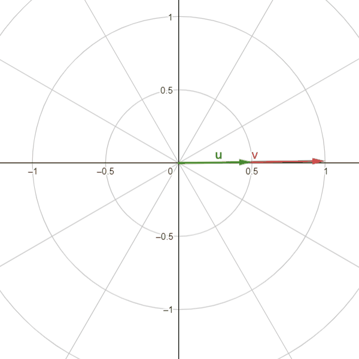
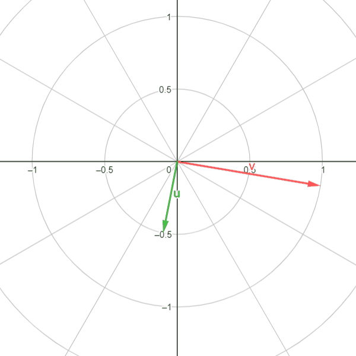
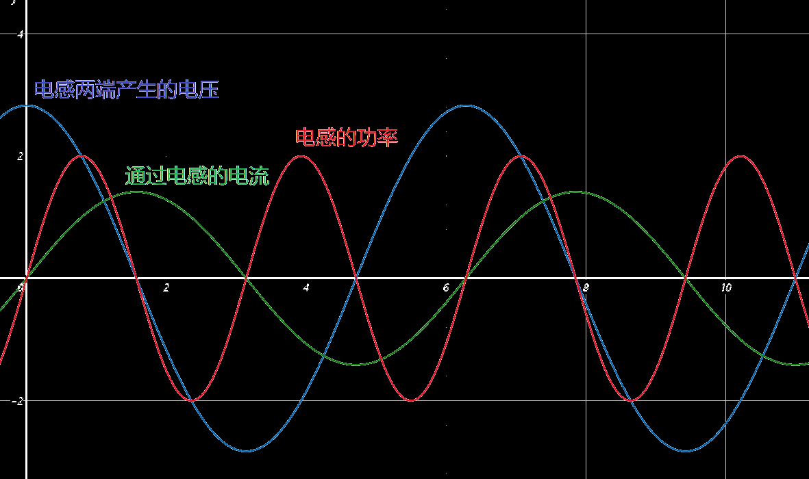
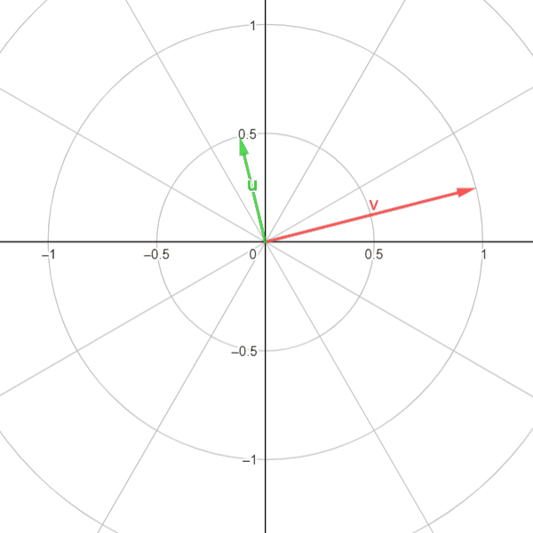

## 电阻

实验得：电阻元件两端的`电压最大值`和`电流最大值`符合欧姆定律：
$$
I_{Rm}=\dfrac{U_{Rm}}{R}
$$
上式两端同时除以$\sqrt2$，故电阻元件两端的`电压有效值`和`电流有效值`符合欧姆定律：
$$
I_R=\dfrac{U_{R}}{R}
$$
设加在电阻元件两端的电压为：$u_R=U_{Rm}\sin(\omega t)$，当电压与电流取==关联参考方向==时，`瞬时电压`与`瞬时电流`也符合欧姆定律：
$$
i=\dfrac{u_R}{R}=\dfrac{U_{Rm}\sin(\omega t)}{R}=\dfrac{U_{Rm}}{R}\sin(\omega t)=I_{Rm}\sin(\omega t)
$$
由上可见，通过电阻的瞬时电流、电压总是保持同相位，如下图所示，**向量v为电压最大值向量**,$U_m=1v$，$R=2$，通过上式可推算出**电流的最大值向量**为绿色的那根，$I_m=0.5A$

------

#### 电阻元件的瞬时功率：

瞬时功率：
$$
p=ui=(U_{Rm}\sin(\omega t))\times(I_{Rm}\sin(\omega t))\\
=U_{Rm}I_{Rm}\sin^2(\omega t)\\
=\sqrt2U\sqrt2I\dfrac{1-\cos(2\omega t)}{2}\\
=2UI\dfrac{1-\cos(2\omega t)}{2}\\
=UI-UI\cos(2\omega t)\\
$$
由于 $\dfrac{1-\cos(2\omega t)}{2}$永远为正，因此 **电阻元件上的瞬时功率==永远大于0==，或者说，==电阻是电路中的耗能元件==**。

## 电感

==☆==注：下列所说的电压是"电感两端自己产生的电压"，不是强加在电感上的电源电压！

已知：电感元件上`电压最大值`与`电流最大值`的对应关系为（式中$X_L为感抗(欧姆)，值被定义为X_L=\omega L=2\pi fL$）：
$$
U_{Lm}=I_{Lm}\omega L=I_{Lm}2\pi f L=I_{Lm}X_L
$$
上式两端同时除以 $\sqrt 2$，可得电感元件上`电压有效值`、`电流有效值`之间的数量关系
$$
U_{L}=I_{L}\omega L=I_{L}2\pi f L=I_{L}X_L
$$
设通入电感元件中的电流为 $i_L=I_m\sin(\omega t)$，根据电感元件的伏安关系，可得出电感元件两端的电压（电感元件两端的电压是跟电流变化速率有关的，因此假设电流然后推得电压会让计算比较简单）
$$
u_L=L\dfrac{di_L}{dt}=L\dfrac{dI_m\sin(\omega t)}{dt}=复合函数求导=L\cdot I_m\dfrac{d\omega t}{dt}\dfrac{d\sin(\omega t)}{\omega t}\\
=I_m \omega L \cos(\omega t)=带入式(5)=U_{Lm}\sin(\omega t+90\degree)
$$
由此可发现，电感上电流与电压的相位差为90°，长度的比例为感抗 $X_L$的值，**向量 $u$为电流**，**向量 $v$为电压**

#### 电感元件的瞬时功率：

$$
p=u_Li_L=(U_{Lm}\sin(\omega t+90\degree))(I_{Lm}\sin \omega t)\\
=U_{Lm}I_{Lm}\cos(\omega t)\sin(\omega t)\\
=U_L\sqrt2I_L\sqrt2\dfrac{\sin(2\omega t)}{2}\\
=U_LI_L\sin(2\omega t)
$$

> 这可跟电阻的功率不一样了，电阻的功率永远为正，因此电阻为耗能元件

由上述表达式可看出，电感的功率随着时间变化而**时正时负**。这是什么意思？功率为正时表此元件在消耗能量，功率为负时表示此元件在向外提供能量

在功率变化的一个周期内，功率正负变化两次，由于正功率等于负功率，因此平均功率为0。即：

电感元件上只有能量交换而==**没有能量交换**==。因此电感是==**储能元件**==

#### 电感元件的无功功率：

电感元件虽然不 耗能，但是它与电源之间的能量交换客观存在。电工技术中，为衡量电感元件上`不消耗、只转换能量的能量交换的规模`，引入了`无功功率`的概念。

电感元件的无功功率用 $Q_L(乏)$计量，其数量上等于瞬时功率的最大值。
$$
Q_L=U_LI=I^2X_L=\dfrac{{U_L}^2}{X_L}
$$

## 电容

已知：电容元件上的`极板间最大值`和`电流最大值`的数量关系为（式中$X_C=\dfrac{1}{\omega C}=\dfrac{1}{2\pi fC}$）
$$
I_{Cm}=U_{Cm}\omega C=\dfrac{U_{Cm}}{X_C}=U_{Cm}2\pi fC
$$
上式两端同时除以 $\sqrt 2$，可得电容元件上`电压有效值`、`电流有效值`之间的数量关系
$$
I_{C}=U_{C}\omega C=\dfrac{U_{C}}{X_C}=U_{C}2\pi fC
$$
这跟电感的式子可不太一样，电感是==频率越高感抗越小==，电容是==频率越高容抗越小==，所以说电容`阻直通交`

设电容元件两极的的电压为 $u_C=U_c\sin(\omega t)$，根据电容元件的伏安关系，可得出通过电容的电流（通过电容元件的电流是与电压的变化速率有关的，，因此是假设电压然后推得电流会比较简单）
$$
i_C=C\dfrac{du_C}{dt}=C\dfrac{d(U_c\sin(\omega t))}{dt}\\
=大致计算过程同电感的=U_{Cm}\omega C \cos(\omega t)\\
=I_m\sin(\omega t+90\degree)
$$
由此可发现，电容上电压与电流的相位差为90°，长度的比例为感抗 $C_L$的值，**向量 $u$为电流**，**向量 $v$为电压**

#### 电容元件的瞬时功率：

$$
p=u_ci_c=(U_{Cm}\sin(\omega t))(I_{Cm}\sin(\omega t+90\degree))\\
=U_{Cm}I_{Cm}\sin(\omega t)\cos(\omega t)\\
=U_C\sqrt2I_C\sqrt2\dfrac{\sin(2\omega t)}{2}\\
=U_CI_C\sin(2\omega t)
$$

和电感的功率差不多，都是==**只转换不消耗**==的，因此也为==**储能元件**==

#### 电容元件的无功功率：

数值上电容元件上的无功功率等于其瞬时功率的最大值，即
$$
Q_C=U_CI_C=I^2X_C=\dfrac{{U_C}^2}{X_C}
$$
