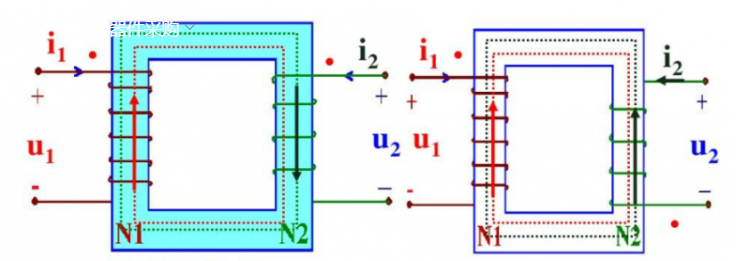
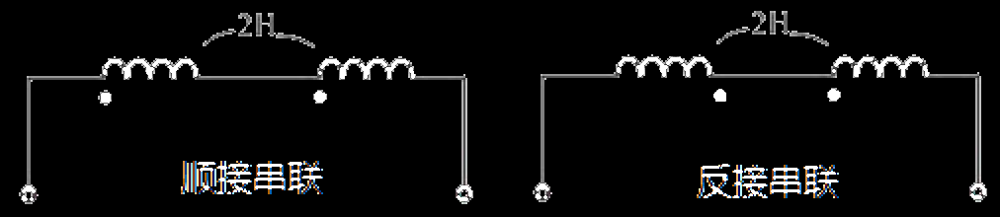
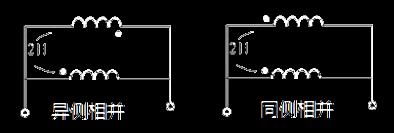

## 伏安关系

在线性电路中，元件的“伏安关系”是线性电路分析中除了基尔霍夫定律以外的必要的==约束条件==

一个电路或一个元件，在它们身上产生的`电压u`和它们中间通过的电流的关系就叫做伏安关系。

各种不同的元件、组件包括电路都有各自特点的伏安关系，每种元件、电路的伏安关系各自的特点就叫伏安特性。

## 电阻

电阻的伏安关系，为一条过原点的直线（即欧姆定律）：

$$
u=R\times i
$$

------

$$
电阻定义式：R=\rho\dfrac{l}{s}\\
电阻串联等效电阻：R_{eq}=\sum R\\
电阻并联等效电阻：\dfrac{1}{R_{eq}}=\sum\dfrac1R
$$

------

电阻作用①之分压&分流公式：
$$
各串联电阻上的电压与其阻值成正比\\
各并联电阻上流过的电流值与其阻值成反比
$$

## 电感

基本工作特性：通低频，阻高频。作用：当线圈中通过电流 $i$，在电感线圈中就会产生磁通量$\phi$，而电感元件产生磁场的能量能力大小用`电感L(亨利)`。

电感的伏安关系：电感元件两端的电压，除了电感量 $L$以外，与电阻元件 $R$不同，它不是取决于电流 $i$本身，而是取决于==电流对时间的变化率== $(di/dt)$。电流==变化==愈快，电感两端的电压愈大，反之则愈小
$$
u=L\times\dfrac{dt}{di}
$$

------

技术参数：衡量一个电感器储存磁场能量本领大小的参数是`电感H(亨)`，还有`品质因数Q`，此值越高，线圈的铜损耗越小，定义式：
$$
Q=\dfrac{\omega_0L}{R}
$$
式中：

ω~0~L——谐振时的感康

R——铜损耗直流电阻

以及电感的并/串联：
$$
电感串联等效电感：L_{eq}=\sum L\\
电感并联等效电感：L_{eq}=\sum \dfrac1L\\
$$

------

`磁导率μ(亨利/米)`：是用来衡量物质导磁性能的物理量

为了便于比较各类物质的导磁性能，通常以真空的导磁率μ~0~=4π×10^-7^H/m为衡量的标准，各种物质的导磁率与真空的导磁率的比值能更好地反映导磁性能

非铁磁物质μ~t~≈1，铁磁物质μ~t~≥1
$$
\mu_t=\dfrac{\mu}{\mu_0}
$$

------

`耦合系数`：两个磁场相互影响越大，称耦合紧密；相互影响小，称耦合松，这个程度用耦合系数k表示，定义：
$$
k=\dfrac{M}{\sqrt{L_1L_2}}
$$
式中：

M(亨)——互感系数，为物理参数，大小取决于两线圈的电感值及相互位置

当一个线圈中的磁场全部穿过另一个线圈时，称为全耦合，耦合系数k=1，为理想情况。因此大多数时候0<k<1。

------

`同名端`：当电流i~1~、i~2~分别从两个线圈对应的端纽流入时，磁通相互加强，则这两个端纽称为同名端

同名端的意义：当电流流入N~1~侧的同名端时，N~2~侧产生的互感电压u~2~的正极在N~2~侧的同名端

工程应用中，为了在小电流情况下获得强磁场，通常将两个耦合线圈`顺接串联`或`同侧相并`。但如果接成`反接串联`或`异侧相并`，则可能会烧毁线圈

$$
顺接串联时，L_{eq}=L_1+L_2+2M\\
反接串联时，L_{eq}=L_1+L_2+2M
$$

$$
同侧相并时，L_{eq}=\dfrac{L_1L_2-M^2}{L_1+L_2-2M}\\
异侧相并时，L_{eq}=\dfrac{L_1L_2-M^2}{L_1+L_2+2M}\\
$$

## 电容

电容的伏安关系：类似电感，是与变化速率有关系的，但是"反过来了"，电感是电压由电流变化速率决定。而电容是电流由电压的变化速率决定。
$$
i_c=C\dfrac{du_c}{dt}
$$
技术参数：`电容量C(法拉)`是衡量电容器储能本领的参数。理想电容元件储存的电荷量与其极间电压呈关系为一条过原点的直线。

$$
电容并联等效电容：C_{eq}=\sum C\\
电容串联等效电容：\dfrac{1}{C_{eq}}=\sum\dfrac1C
$$
